# 计算机体系结构课程笔记

## 一、流水线

### 1.1RISC处理器的五段流水线

RISC指令集执行的五个周期

| 周期 |                     名称                      | 操作                                                         |
| :--: | :-------------------------------------------: | :----------------------------------------------------------- |
|  1   |         IF   (Instruction fetch)         | •发送PC到内存单元，取回下一条指令； •更新PC=PC+4，为取下一条指令做准备。 |
|  2   | ID   (Instruction decode/register fetch) | •根据指令中的源操作数标识符，从寄存器文件中读取源操作数； •对读取的源操作数进行比较，以为可能的跳转做准备；  •对指令中的偏移量进行符号扩展，以防可能用到 •计算可能的跳转目的地址。 |
|  3   |       EX  (Execution/effective address)       | •对于访存指令：将基址寄存器和偏移量相加形成访存地址； •寄存器-寄存器运算指令：对读取的2个源操作数执行指定操作；   •寄存器-立即数运算指令：对读取的第一个源操作数和立即数执行指定的操作。 •分支指令：判断是否跳转，若成功，则把转移目标地址送至PC。 |
|  4   |          MEM   (Memory  access)          | •Load：使用前一个周期计算出的访存地址读取内存；   •Store：将数据写入由前一个周期计算出的访存地址指向的内存。 |
|  5   |            WB   (Write back)             | •对于寄存器-寄存器运算指令和load指令：将结果写入寄存器文件。 |

注意：寄存器可以在ID和WB阶段同时分别进行读和写，因为它的读写分成了两个部分

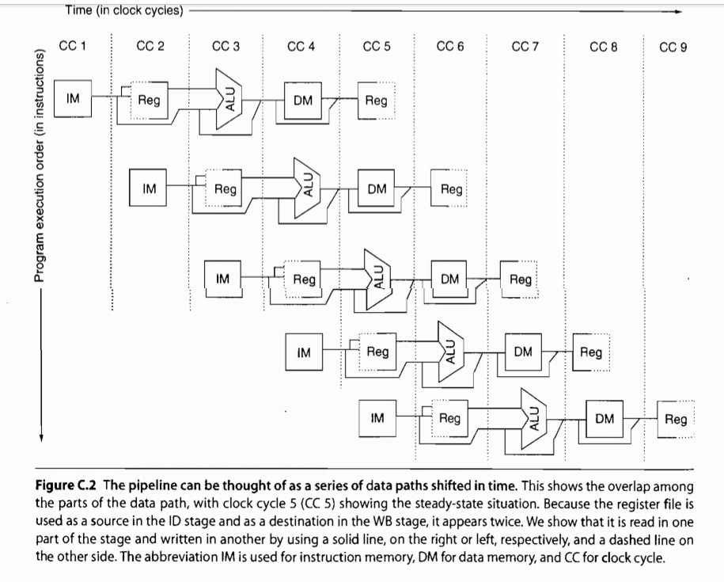

关于分支指令：

RISC指令集的分支指令需要三个时钟周期。

MIPS指令集的分支指令未改进前需要四个时钟周期，改进后只需两个时钟周期，在ID段增加一个加法器，并且将分支判断和目标结果提前到ID/EX站前

减少流水线分支指令的损失还可以通过stall，分支预测，延迟分支(延迟槽)

### 1.2冲突（hazards）

**依赖分类**

- 数据依赖（data dependency）：指令之间有数据流动，也叫真依赖
- 名字依赖（name dependency）：两条指令使用相同的寄存器或引用了相同的内存位置
  - antidependency反向依赖
  - output dependency输出依赖
- 控制依赖（control dependency）：主要是分支指令对后续指令的影响

**冲突分类**

- 结构冲突（structural hazards）：硬件无法支撑并发指令的各种可能组合，资源部件不够。

  解决办法：

  - 停顿

- 数据冲突（data hazards）

  - RAW（read after write）本来是先写后读，读取写入后的值，但先读后写了，读了写入前的值。对应于数据依赖
  - WAW（write after write）写后写，但本来先写入的值变成了后写入的值。对应于输出依赖
  - WAR（wirte after read）先读后写，读取写入前的值，但先写后读了，读了写入后的值。对应于反向依赖

  <u>WAW/WAR冲突只会在乱序执行流水线中出现，WAW能出现在复杂流水线中，但WAR只出现在动态调度的乱序流水线中，因为复杂流水线仍是静态流水线，所有指令都是按序发射的，不可能存在后一条指令执行完毕了，前一条指令还未读取操作数</u>

  解决办法

  - 前送（forwarding/bypassing）
  - 计分板（scoreboarding）
  - Tomasulo

- 控制冲突（control hazards）：分支指令带来的PC取值的不确定性

  解决办法

  - 延迟槽（delayed slot）
  - 分支预测（branch prediction）
  - 高级分支预测（correlating branch predictors, tournament predictors）
  - 跳转地址预测（branch target buffers)
  - 返回地址预测（return address predictors）

加速比的计算：

$Speedup=Pipeline depth/(Ideal CPI+Structural stalls+Data hazard stalls+Control stalls)$

### 1.3 MIPS流水线实现

### 1.4 复杂流水线

### 1.5 动态调度流水线

什么是静态调度流水线？

​	就是完全依赖编译器执行指令调度、硬件完全按照程序顺序（program order）发射指令的流水线。这种流水线中，一旦有指令因资源冲突或数据依赖而停顿，后续指令都不允许发射，即使它们完全不依赖于流水线中的任何指令，如前面所提到的调度。

静态调度流水线所存在的问题

- 对编译器开发人员的要求太高
- 有些依赖关系编译时无法确定
- 编译器的通用性太差
- 代码的通用性太差
- 受cache miss影响太大

动态调度的核心思想

- 乱序执行
- ID阶段按序执行，并将ID阶段分为两个阶段：
  - Issue阶段：对应之前的ID阶段，但精简操作，只做最必要的事：如指令译码、资源冲突检测
  - Read operands阶段：等待数据冲突消除，然后读取操作数

**动态调度流水线中所有类型的冲突都存在**

### 1.6 计分板算法

算法的核心是一个计分板，它记录着所有必要的信息，用来控制以下事情：

- 每条指令何时可以读取操作数并投入运行（对应着RAW冲突的检测）
- 每条指令何时可以写入结果（对应着WAR冲突的检测）

WAW冲突在issue阶段检测，还是会导致整个流水线的停顿。

指令执行的四个阶段

|     阶段      | 操作                                                         |
| :-----------: | ------------------------------------------------------------ |
|     Issue     | 如果指令所需的功能部件空闲，并且与已执行的指令没有相同的目标寄存器，计分板发射指令到功能部件，并更新内部数据结构。  （WAW冲突） |
| Read operands | 计分板检测源操作数是否可用，是否等待前面指令写入。当源操作数可用时，计分板通知功能部件执行，从寄存器中读取操作数，并开始执行。 （RAW冲突） |
|    Execute    | 功能部件在接收到操作数之后开始执行，执行完成出结果后通知计分板。 |
| Write result  | 计分板知道功能部件执行完成后，检查WAR冲突，如果有必要还需stall当前指令。（WAR冲突） |

缺点：

- 计分板算法没有处理控制冲突，乱序执行仅局限在一个基本块内
- 没有消除WAR/WAW冲突，这些冲突仍会导致停顿

### 1.7 寄存器重命名(Tomasulo算法)

核心思想：通过寄存器重命名，可彻底消除WAR/WAW冲突.

- 每个功能部件有自己的保留站
- 保留站中的每一行保存着一条发射到相应功能部件的指令，并缓存了已就绪的操作数，和未就绪操作数的标签（即生产指令所在的保留站行号）
- CDB(common data bus)不仅把结果送到寄存器中，也送到所有正在等待该结果的保留站中
  - 每个结果会附带一个标签（即生产指令所在的保留站行号），用来和保留站中的标签相匹配
  - CDB相当于实现了前送功能

| 阶段         | 操作                                                         |
| ------------ | ------------------------------------------------------------ |
| Issue        | 取出下一条指令，检查资源冲突（即是否还有空闲的保留站），并在有空闲保留站时，将指令连同就绪的操作数发射到一个空闲的保留站中（对于未就绪的操作数，在保留站中记录生产指令所在的保留站编号），否则停顿当前及后续指令的发射。（WAR，WAW） |
| Execute      | 监控CDB，等待所有操作数均就绪，然后开始执行该指令。  •Load/store指令的执行分为两个步骤：1）计算访存地址（各指令按照程序顺序执行这一步，以防止通过内存发生的数据冲突）；2）访问内存（对于load指令），或者等待要写入内存的操作数（对于store指令）。  •为了保证精确例外，任何指令都必须等待前面的分支指令执行完毕后才能开始执行。（RAW） |
| Write result | 当结果产生后，将其连同标签（即生产指令的保留站编号）广播到CDB上，进而写入寄存器文件和所有需要它的保留站和store  buffer中。  •Store指令在这一阶段访问内存。 |

缺点：

- 仍没有处理控制冲突，乱序执行仍局限在一个基本块内

### 1.8 猜测执行

核心思想：为了解决跳转条件及目的地址的计算出结果太晚的问题，提前对跳转指令及目的地址的结果做预测，假设预测正确并直接从预测的目的地址开始取指，就好像这条分支指令不存在一样，为了避免预测错误所造成的影响，指令执行完毕后，先不更新寄存器和内存，而是暂存在一个缓冲区内，直到能够确定预测结果是否正确。

- 暂存指令结果的缓冲区称为**Reorder Buffer(ROB)**；Write Result调整为向ROB写入
- Write Result后面需要增加一个阶段，用来等待分支结果并真正更新寄存器，称为Commit阶段
- ROB也是数据源之一：保存在ROB中的结果数据需要前送给后续指令
- ROB中的结果是按照程序顺序Commit的
- 猜测错误时，通过清除ROB中的相关条目进行回滚

与Tomasulo算法的结构基本相同，区别主要有四点：

- 引入了Reorder Buffer
  - CDB不再直接写寄存器文件，而是写入到ROB中
  - 保留站不仅从寄存器文件中读取源操作数，也从ROB中读取
- 取消了Store Buffer（其功能改由ROB承担）
- CDB上的数据标签有变化
  - 生产指令的保留站编号->生产指令的ROB编号
- 保留站数据结构有变化
  - 需要增加一个字段，记录与之关联的ROB编号，作为将来放置到CDB上的数据标签

| 阶段         | 操作                                                         |
| ------------ | ------------------------------------------------------------ |
| Issue        | 1）从指令队列取出下一条指令  2）分配一个空闲的保留站和ROB（如果没有则停顿整个流水线） 3）将指令信息填入所分配的保留站和ROB 4）从寄存器文件或ROB中读取已就绪的操作数，放入保留站中，或在保留站中记录未就绪的操作数所在的ROB编号 |
| Execute      | 监控CDB，等待所有操作数均就绪，然后开始执行该指令。 •Load指令的执行仍分为两个步骤：1）计算访存地址；2）访问内存   •Store指令只需要计算访存地址   •Load/store指令仍按照程序顺序计算访存地址 |
| Write result | •对于store指令：监控CDB，等待要写入内存的数据，收到后将其写入自身ROB，并释放保留站   •对于其它指令，等待结果产生，将其连同标签（即生产指令的ROB编号）广播到CDB上，进而写入对应ROB和所有需要它的保留站，最后释放保留站 |
| Commit       | 等待此指令到达ROB队列头部，然后根据指令类型分别处理：   •对于分支指令：如果预测正确，释放ROB即可，否则清空所有其它ROB和保留站（相当于放弃所有猜测执行的指令）   •对于store指令：更新内存，并释放ROB   •对于其它指令：更新寄存器文件，并释放ROB |

- WAR/WAW：不存在
  - 当一条store指令提交时，所有前序指令均已提交完毕，不可能存在尚未完成读取的load指令，也不可能存在尚未完成写出的store指令

- RAW：可能存在
  - Load指令在进入Execute阶段第二步之前，需要确认ROB中不存在指向相同内存位置的前序store指令

猜测执行的代价

- 因预测错误导致本不该执行的指令被实际的执行了，带来了无用功耗

- 对不该执行的指令进行回滚，也需要消耗时间和功耗

- 处理猜测执行的指令导致的例外，也可能会引入不必要的开销

代价的度量：misspeculation（因猜测错误导致的本不该执行的指令所占的比例）

**疑问：**

为什么第一条load进入Commit阶段，也就是在Write Back阶段完成后，第二条load才能进入execute阶段？

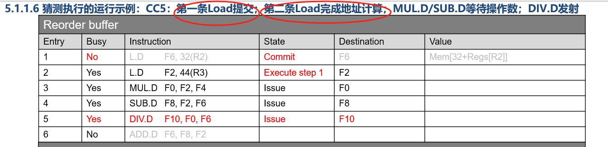

### 1.9 分支预测

（1）静态预测

​	要进行分支预测，就要预测分支跳还是不跳。最朴素的想法是预测一直跳或者一直不跳，这样的方法虽然简单，但是也比完全不预测要高明。完全不预测是100%地要阻断流水线，而预测一直跳或者预测一直不跳还有机会预测对，预测到就是赚到。预想一个1000次的for循环，这个循环前999次都是跳转而最后一次不跳转，如果处理器设置为预测一定跳转，那么在执行这段指令的时候其准确率高达99.9%，性能远远高于不做预测的处理器。

​	基于量化研究方法的思想，HP在他们的著作中说当前世界上大概有20%的代码是分支指令，其中跳转和不跳转的比例是1：1 。把这个数据代入到上一段说的预测方法中去，处理器的CPI = 0.8 + 0.1 × 1 + 0.1 × 4 = 1.3 *，*效果显著优于完全不做预测的机器。

​	在上面的基础上略加思考，我们发现很多分支指令是有规律的，比如for代码段的最后一条分支指令，这条分支指令绝大部分时间是向后跳转的，而for代码又总是出现，因此提出这么一个方法：向后跳转的分支总是执行，向前跳转的分支总是不执行。这样的假设是基于实际代码情景的，事实证明这样做的效果不错。

（2）根据最后一次结果进行预测

​	静态分支预测的方法虽然比不预测要好，但是性能并不能让人满意。比如预测一定跳转，如果碰到分支指令执行情况为NNNNNN（N表示Not taken，不分支），那么错误率就高达100%，这样的情况是有可能发生的。静态就意味着不灵活，我们需要灵活一些的方法来解决问题，灵活的方法可繁可简，简单的方法就是根据上一次分支指令的执行情况来预测当前分支指令，如果上一次指令不跳转，那么下一次碰到这条指令就预测不跳转，用这个方法来预测NNNNNN的话，正确率可能高达100%，这样的结果让人满意。

（3）基于两位饱和计数器的预测

​	根据最后一次结果进行预测确实有一些效果，但是当它碰到TNTNTN这样的情况，正确率又可能会下降到0%，还不如静态预测，静态预测还可能有50%及以上的正确率。

既要满足NNNNNN这样的情况，又要让TNTNTN这样的情况的结果不至于太难看，解决的办法是基于两位饱和计数器的预测。**两位饱和计数器用一个状态机来表示**，状态机如下图。

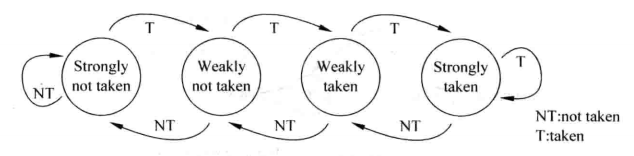

​	两位饱和计数器包含四个状态：00、01、10、11 。其中00、01表示不跳转，10、11表示跳转。00表示强不跳转，当计数器处于这个状态，分支预测不跳转，如果预测正确，计数器保持计数值，如果预测错误，那么状态转换成01，即弱不跳转，此时仍然预测分支不跳转，如果预测正确，状态转变回00，如果预测错误，状态转变为弱跳转10。在弱跳转10的状态下，分支预测跳转，如果预测正确，状态转变为强跳转11，如果预测错误，状态转变为弱不跳转01.在强跳转11的状态下，分支预测跳转，如果预测正确，状态保持不变，如果预测错误，状态转变为弱跳转10.

​	上述的两位饱和计数器只是一种预测方法，其他的预测方法包括修改两位计数器的状态转移情况、增大计数器位数，对于两位饱和计数器自身而言，我们也可以通过设置不同的初始状态来区别别的两位饱和计数器。

（4）基于局部历史的分支预测

（5）基于全局历史的分支预测

（6）竞争的分支预测

详细参考博客：

[分支指令与分支预测_Zkaisen的博客-CSDN博客](https://blog.csdn.net/fencecat/article/details/127427226)

https://zhuanlan.zhihu.com/p/490749315

**精确例外**

指在处理例外的时候，发生例外指令之前所有的指令都已经执行完了，例外指令后面的所有指令都还没执行。

参考博客：[计算机体系结构——精确例外 & ROB详解 - 知乎 (zhihu.com)](https://zhuanlan.zhihu.com/p/586221956#:~:text=上一篇文章提到的Tomasulo算法，是一个非精确的例外，也就是说一旦发生例外，硬件就很难处理，因为是乱序执行，怎么才能给软件一个干净的现场呢？ 所以操作系统就希望动态流水线提供精确例外。,精确例外 ：指在处理例外的时候，发生例外指令之前所有的指令都已经执行完了，例外指令后面的所有指令都还没执行。)

- 2-位预测器：仅利用分支指令自身的历史行为来预测它的未来行为
- 关联预测器：综合考虑不同分支指令的历史行为来进行预测
  - (m, n)关联预测器：利用m个最近执行的分支指令的行为，从2^m个n-bit预测器中选择一个，用来对当前分支指令进行预测
  - 2-bit预测器实际上是一个（0, 2）预测器
- 锦标赛预测器
  - 设置两个预测器，一个使用全局历史进行预测，一个使用局部历史进行预测，再设置一个选择器，用来决定具体使用哪个预测器来对当前分支指令进行预测
  - 全局预测器：使用最近12个分支的跳转情况作为索引，查找一个4096入口的全局预测器，每个入口都是一个标准的2位预测器
  - 局部预测器：分为两层，上面一层是一个1024入口的局部历史记录表，用PC最低10位作为索引，每个入口记录着相应分支最近10次的跳转情况；下面一层是一个1024入口的3位预测器，用上层检索出的10位局部历史索引
  - 选择器：是一个4096入口的2位预测器，用PC最低12位作为索引。预测器的当前取值决定了是采用全局预测器的结果，还是采用局部预测器的结果.
- 返回地址预测器
  - 通常用栈来实现
  - Call指令执行时，将返回地址push到栈中
  - Ret指令执行时，从栈中pop一个返回地址，作为predicted PC
- 分支指令的延时来自两个方面，一是分支条件的计算，二是目的地址的计算
- 分支预测技术（也称为BHT技术）只对第一个问题有所帮助
- 为了快速得到目的地址 ，人们提出了Branch Target Buffer（BTB）
  - BTB的结构类似于cache：每行保存一个分支指令地址和一个预测的PC
  - 用当前PC的低k位作为索引，取出一个表项，然后进行精确匹配，最后得到预测的PC

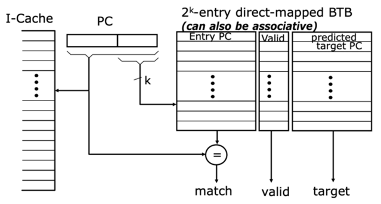

- 在IF阶段，利用当前PC同时检索BHT和BTB，但以BHT的结果为主

|               | BTB命中                 | BTB未命中 |
| ------------- | ----------------------- | --------- |
| BHT预测跳转   | Predicted  PC           | stall     |
| BHT预测不跳转 | PC+4（以BHT的预测为准） | PC+4      |

- 在相应分支指令commit时进行BTB/BHT的更新

### 1.10 超标量

核心：通过多发射来进一步降低CPI

技术路线：

-  静态调度的超标量处理器
  - 每个周期发射多条指令，并使用静态调度流水线执行它们
  - 多用在嵌入式领域：MIPS和ARM，包括ARM Cortex-A8
- VLIW(Very Long Instruction Word)处理器
  - 每个周期发射一个包含多条指令的超长指令包
  - 指令间的依赖关系在指令包中明确给出，不需要硬件进行检测
  - 必须有专用编译器的配合
  - 多用于专用处理器领域，如TI C6x
- 动态调度的超标量处理器
  - 每个周期发射多条指令，并使用动态调度流水线执行它们
  - Intel Core i3, i5, i7; AMD Phenom; IBM Power 7

多发射对流水线控制逻辑的改造主要有两点：

- Issue阶段：每个周期要将多条指令发射到保留站和ROB中

  - 为指令包中的指令分配保留站和ROB入口
  - 分析指令包中各指令之间的依赖关系
  - 根据依赖关系初始化所分配的保留站和ROB

- Commit阶段：每个周期要提交多条指令

  ​	如果提交速度小于发射速度，流水线最终也会堵住。这里难度较小，毕竟不需要分析依赖关系

Issue阶段的处理方式：

- 方式1：在时钟周期上半段发射指令#1，在下半段发射指令#2
  - 简单，但难以实现更多的指令
- 方式2：构建一个能够同时处理多条指令发射的逻辑
  - 能同时处理多条指令，但太复杂
- 方式3：构建一个能同时处理多条指令发射的局部流水线
  - 分为分配资源、分析依赖和更新表格三个阶段

CPI=Ideal CPI + Structural stalls + Data hazard stalls + Control stalls

ILP的极限

## 二、高速缓存结构

1、存储层次结构

2、cache基本结构

3、存储系统的结构模型

- 共享存储系统（多核处理器）
  - 集中式共享存储结构（SMP，也被称为UMA，uniform memory access）
  - 分布式共享存储结构（DSM，也被称为NUMA，non-uniform memory access）多数情况下要优于集中式共享存储结构
- 非共享式存储系统（分布式计算机）

### 2.4 Cache一致性问题（不一致产生的原因）

- I/O操作
  - Cache中的内容可能与由I/O子系统输入输出形成的存储器对应部分的内容不同

- 共享数据
  - 不同处理器的Cache都保存有对应存储单元的内容
  - 如何保持同一数据单元在Cache及主存中的多个备份的一致性，避免获取陈旧数据

**Cache的写机制**

- **Write-back：写回模式：数据被换出cache时，被修改的数据才更新到内存**
- **Write-through：写直达模式：CPU向cache写入数据时，同时向memory写**
- **Write-miss：写失效：所要写的地址不在cache中时**
  - **no write allocate policy:将要写的内容直接写回memory;**
  -  **write allocate policy:将要写的地址所在的块先从memory调入cache中，然后写cache；**

### 2.5 cache一致性协议

**关键：跟踪共享数据块的状态**

跟踪共享数据块状态的cache协议有两种：

**（1）Snooping-based protocols（基于监听的协议）：每个Cache除了包含物理存储器**

**中块的数据拷贝之外，也保存着各个块的共享状态信息。**

实现监听一致性协议的两种策略：Write Update和Write Invalidate

Write Invalidate（写作废策略）：在一个处理器写某个数据项之前保证它对该数据项有唯一的访问权，将共享单元的其它备份作废。

Write Update（写更新策略）：当一个处理器更新某共享单元时，把更新的内容传播给所有拥有该共享单元备份的处理器。

- 协议核心：通过广播维护一致性

  - 写入数据的处理器把新写的值或所需的存储行地址通过总线广播出去

  - 其他处理器监听广播，当广播中的内容与自己有关时，接受新值或提供数据

- 适合多个处理器通过总线相连的集中式共享存储系统
- 局限性
  - 共享总线存在竞争使用问题
  - 在由大量处理器构成的多处理器系统中，监听带宽会成为瓶颈
  - 总线上能够连接的处理器数目有限，难扩展到处理器规模较大的系统
  - 只适用于可伸缩性差的共享总线结构
- 基于监听协议、写作废、写更新策略的实现技术
- 总线是广播的媒介
- Cache控制器监听（snoop）共享总线上的所有事务

**1、Valid/Invalid协议**

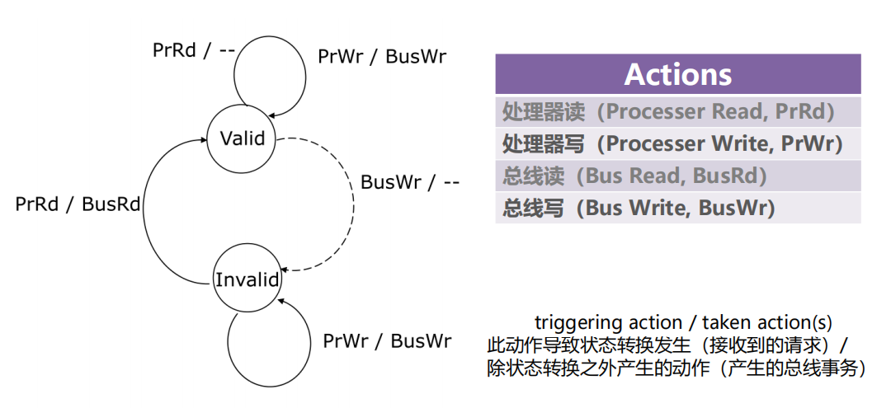

**存在的问题**

- 每次写入都会更新主存

- 每次写入都需要广播和监听共享数据块状态

**2、MSI协议**

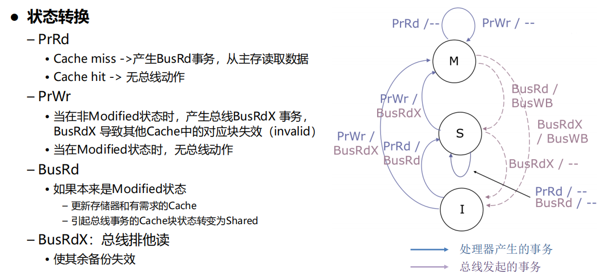

特点：

- 允许cache在不更新内存的情况下为写操作提供服务
- 主存中可能有陈旧的数据
- Cache必须覆盖来自主存的响应

问题：

- 对私有数据执行读-修改-写的序列操作

**3、MESI协议**

- 引入E状态：独占，没有其他处理器缓存了该数据备份，可以直接修改，不必马上同

  步到主存中

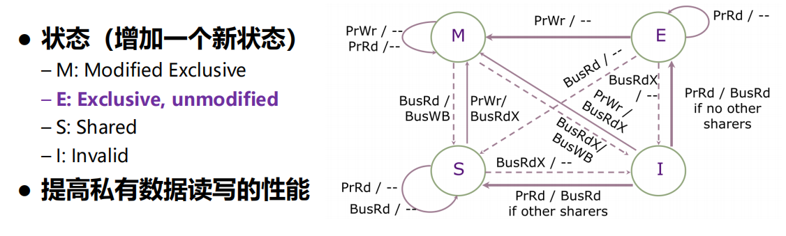

一致性协议所面临的问题：假共享问题，参考：[字节面：什么是伪共享？ (qq.com)](https://mp.weixin.qq.com/s/zeGxBx77TFGtVeMRBVR-Lg)

- Cache一致性是在块级别实现
- 一个Cache块中包含多个数据字
- 多个处理器并发访问同一数据块的不同数据字时
  - 假设处理器P1写字i，处理器P2写字k，且两个字有相同的块地址
  - 由于地址在同一块中，该块可能会产生多次不必要的失效（ ping-pong问题）

解决方案：原子操作

- 代价高、耗费大，严重影响并行计算的性能

**（2）Directory-based protocols（基于目录的协议）：物理存储器中共享数据块的状态及相关信息均被保存在一个称为目录的地方。**

- 为每一存储块维持一目录项，记录所有当前持有此存储行备份的处理器ID以及此行是否已经被改写等信息

- 当某个处理器改写某行时，根据目录内容只向持有此行备份的处理器发送信号，避免了广播。

适用于分布式共享存储系统

**1、MSI目录协议**

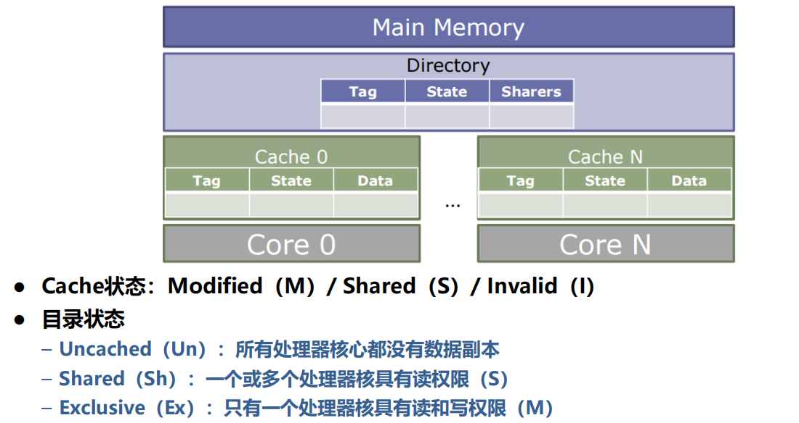

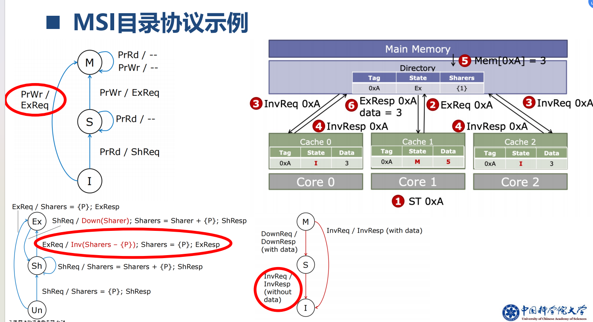

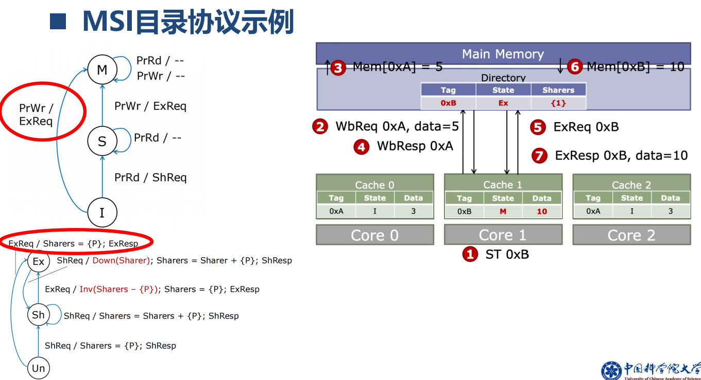

**2、 缺失状态保持寄存器（MSHR）**

MSHR：用于存储缓存未命中（cache miss）的状态信息

- 发起对内存的访问以获取缺失的数据，并在数据返回后将其存储到缓存中

MSHR：在Cache外保持加载失败（load misses）和写入

- 每个MSHR entry对应一个缓存未命中事件，并包含与该事件相关的状态

  和元数据

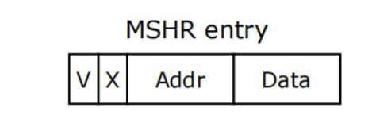

On eviction / writeback

+ 没有空闲的MSHR entry：stall
+ 分配新的MSHR entry

**3、目录结构**

- 基于内存的扁平目录结构（Flat）

  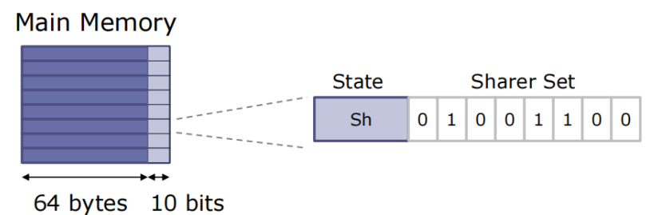

  - 使用主存的少量空间来存储每一个CacheLine的状态和共享者
  - 使用位向量来编码共享者

  实现简单，速度慢，处理器数量多的情况下效率非常低（~P bits/line）

- 稀疏全映射(Full-Map)目录

  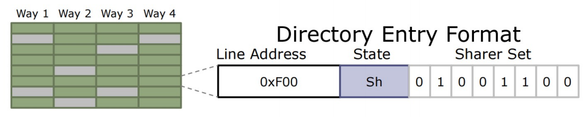

  - 我们不需要记录系统中的每一个Cache line——只需要记录私有缓存的位置
  - 将目录组织成一个Cache

  低延迟，能效更高，扩展性问题-->位向量增长的速度随着处理器核心的数量增长，有限关联度--> 目录引发的失效

- 优化技术：共享者集合的不精确表示

  - 粗粒度位向量（如，每 4 个处理器核心使用1 bit表示）

  - 有限指针：保留有限的共享者指针，在溢出时标记“all"并进行广播（或使其他共享者无效）

  - 多级层次结构中的一致性：可以使用相同或不同的协议来保持跨多个层次的一致性

    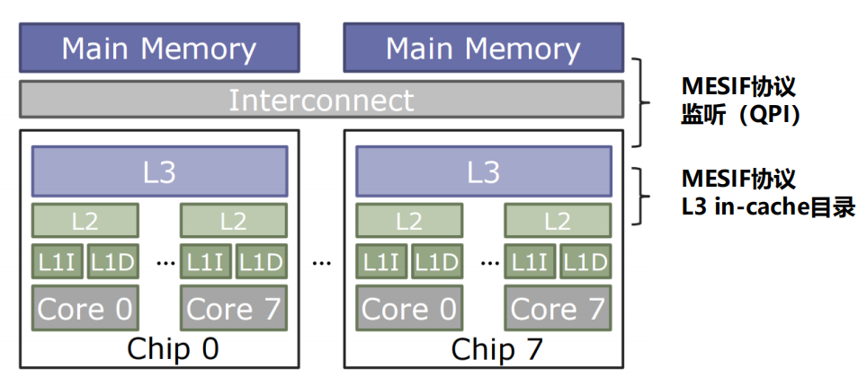

  - In-Cache目录

    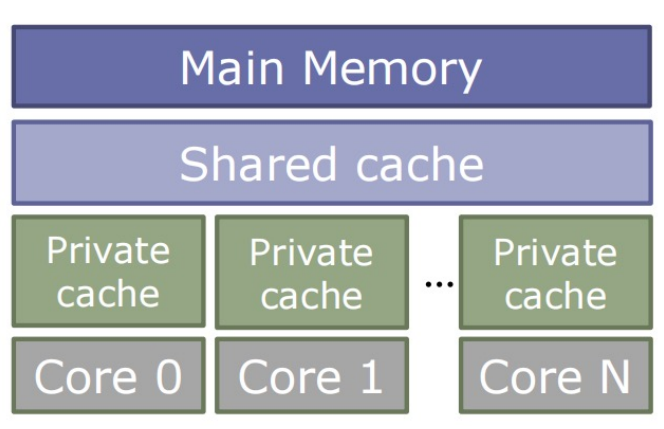

    - 通用的多核内存层次结构：
      - 1+ level 的Private Cache
      -  共享的last-level Cache
      -  需要加强Private Cache之间的一致性
    - 方法：将目录信息嵌入在共享的cache tags中
      - 共享Cache必须inclusive
    - **避免了tag开销和单独的查找，如果共享Cache的大小 >> sum(私有Cache的大小)，效率可能会非常低**

一致性协议面临的问题

即使网络是无死锁的，协议也会导致死锁！

比如，两个节点都通过相互请求让所有的中间缓冲区饱和，阻塞响应进入网络。

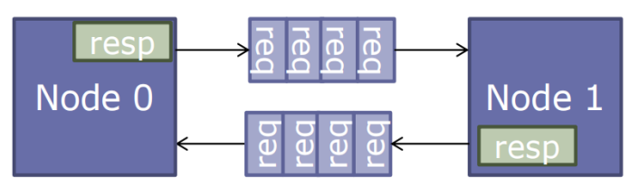

解决方案：独立的虚拟网络

- 不同的虚拟通道集合和endpoint缓冲集合
- 相同的物理路由器和链接

## 三、内存一致性模型

**内存一致性模型是面向多核处理器的共享存储系统**

- 系统设计者与应用程序之间的一种约定, 它给出了正确编写程序的标准, 使得程序员无须考虑具体访存次序就能编写正确程序, 而系统设计者则可以根据这个约定来优化设计提高性能。

- 系统设计者通过对各处理器的访存操作完成次序加以必要的约束来满足内存一致性模型的要求
  - 内存一致性模型对访存事件次序施加的限制越弱, 越有利于提高性能, 但编程越难

**Coherence vs Consistency**

+ 缓存一致性（Cache Coherence）
  + 缓存一致性关注共享存储系统中多个处理器对**同一内存位置**进行读写的情况
  + 软件无需显式地管理私有缓存，这一切都由硬件来处理

- 内存一致性（Memory consistency）
  - 定义：内存一致性模型定义了多处理器系统中的内存访问规则，以确保多个处理器在读写共享内存时能够获得一致的结果
  - 内存一致性模型涉及到对**多个内存位置**的读写操作

### **内存一致性模型分类**

（1） 放松W->R顺序：我们就得到了TSO(total store ordering)模型，它允许CPU先执行读操作然后在执行写操作而不严格按照代码的指示顺序来进行。由于这种模型保持了写入操作之间的顺序，所以很多在Sequential模型下能够运行的代码也能在TSO模型下正常运行。

（2） 放松W->W顺序：我们就得到了PSO(partial store ordering)模型，允许多个写操作也被打乱顺序。

（3） 放松R->W和R->R顺序：将会得到很多模型，包括weak模型，released模型等。

- **顺序一致性模型（Sequential Consistency）**

  - 该模型要求所有处理器的读、写和交换(swap)操作以某种序执行所形成的全局存储器次序、符合各处理器的原有程序次序。即“无论指令流如何交叠执行，全局序必须保持所有进程的程序
  - 所有读写以某种顺序执行，每个处理器看到的操作顺序是相同的
  - 顺序执行指令
  - 对于存储器的访问是是原子级的loads 和stores
  - 容易理解，但架构师和编译器编写人员希望在性能方面有所提升，意味着需要违背顺序一致性模型的要求

  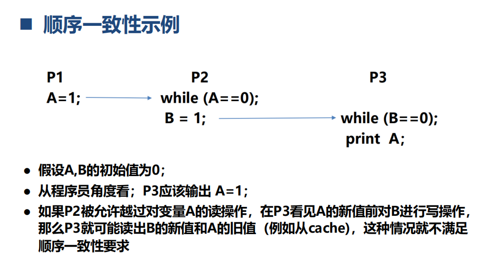

  - 优化技术提交存储缓冲区（Committed store buffer）
    - 当已提交的store指令在内存系统里执行传播时，CPU可以继续执行
    - Local loads can bypass values from buffered stores to the same address

- **完全存储定序模型（Total Store Order）**
  - 全局顺序存储：store操作存在一个全局的顺序
  - Store缓冲：允许处理器使用Store buffer来缓存即将写入内存的数据，但必须确保缓冲中的数据在全局上有序提交
  - load同样按顺序执行，但可穿插到多个store执行过程中
    - 若存在一组store->load操作，如果由同一处理器执行且地址相关，则TSO允许该load操作在store操作完成之前就执行；但如果由多个core执行且地址相关，那TSO要求load指令在store执行完成后才能执行

- **部分存储定序模型（Partial Store Order）**
  - 在TSO的基础上放松访问内存访问限制，允许CPU以非FIFO来处理store buffer缓冲区的指令;
  - 局部存储顺序松散：store操作的顺序可以在全局范围内更加灵活地重排序，这允许更大的并发性；
  - CPU只保证地址相关指令在store buffer中以FIFO的形式进行处理，而其他的则可以乱序处理;
  - 要求
    - 同一core中地址不相关的store->store指令可以互相穿插执行
    - load按顺序执行，但可穿插到多个store执行过程中

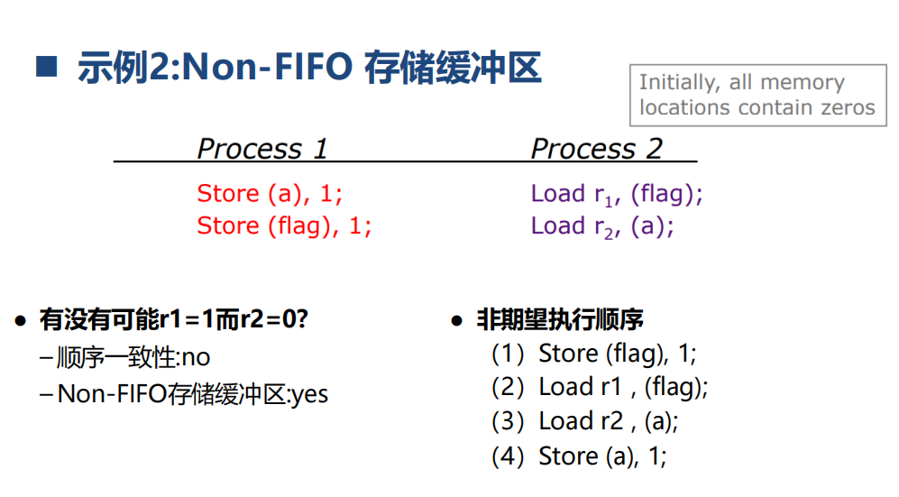

- **弱内存一致性模型（Weak Memory Consistency）**
  - 基本思想：同步操作（synchronization ）和普通访存操作区分开来
    - 通过显式的同步操作来确保对共享数据的一致性，而不是依赖于隐式的规则和顺序
    - 同步操作： 程序员使用特定的同步操作（例如锁、屏障等）来明确指定临界区域，确保在该区域内的对共享数据的访问是互斥的。这样可以避免并发写入引起的问题
    - 普通访存操作： 对于非临界区域的访问，程序员不依赖于隐式的规则，而是通过显式同步来确保一致性。普通访存操作可以按照更灵活的顺序进行，以提高性能。
  - 弱内存一致性模型施加的限制: 
    - 同步操作的执行满足顺序一致性条件; 
    - 在任意普通访存操作被允许执行之前, 所有在同一处理器中先于这一访存操作的同步操作都已完成
    - 在任一同步操作被允许执行之前,所有在同一处理器中先于这一同步操作的普通访存操作都已完成

- **释放一致性模型（ Release Consistency ）**
- 对于临界区域共享数据的访问，弱内存一致性模型有一个问题：就是无法区分进程是准备进入临界区还是已经完成对共享变量的操作而准备退出临界区，其后果就是进程在以下两种情况下都必须采取同步操作：
- 进入临界区：如果一个进程准备进入临界区，其他进程无法确切知道它是否已经完成对共享变量的写入。因此其他进程可能需要采取同步操作以确保它们不会读取到不完整或无效的数据– 退出临界区：当一个进程准备退出临界区时，其他进程无法确切知道该进程是否已经完成对共享变量的操作。因此，其他进程可能需要采取同步操作以确保它们不会在不完整或无效的数据上执行操作
- 如果能将进入和退出临界区这两个动作区分开来，则能实现一种更为高效的存储一致性模型─释放一致性模型
- 这种模型是对弱一致性模型的改进, 它把同步操作进一步分成获取操作 acquire 和释放操作 release
  - acquire 用于获取对某些共享存储单元的独占性访问权
  - release 则用于释放这种访问权
  - 执行的顺序为：acquire-> load/store ->release
- 释放一致性模型施加的限制
  - 同步操作的执行满足顺序一致性条件
  - 在任一普通访存操作允许被执行之前，所有在同一处理器中先于这一访存操作的Acquire操作都已完成
  - 在任一Release操作允许被执行之前，所有在同一处理机中先于这一Release的普通访存操作都已完成
- **注意, 这其中任意一个操作, 都只保证了一半的顺序:**
  - 对于Acquire来说, 并没保证Acquire前的读写操作不会发生在Acquire动作之后.
  - 对于Release来说, 并没保证Release后的读写操作不会发生在Release动作之前.

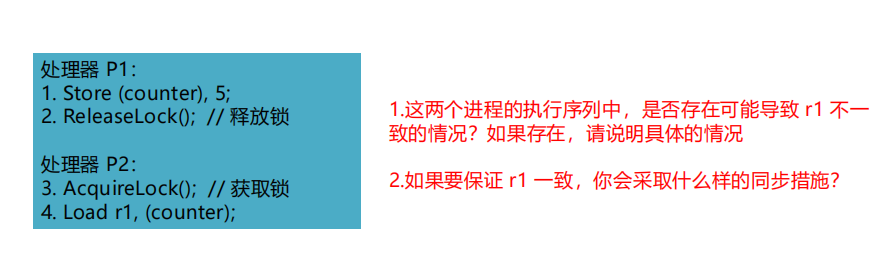

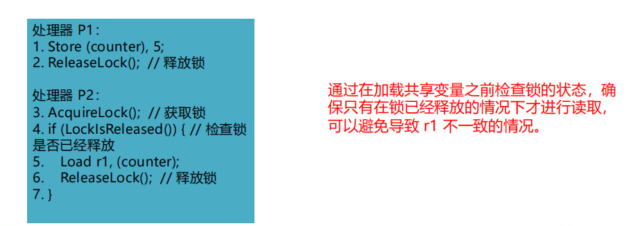

## 四、多线程

#### **并行的分类**

- 指令级并行（ILP Instruction-level Parallelism）
  - 定义：在单个处理器上同时执行多条指令的能力
  - 实现方式：通过在一个时钟周期内执行多个指令的部分，例如流水线处理、超标量处理和乱序执行等技术
- 数据级并行（DLP Data-level Parallelism）
  - 定义：同时处理多个数据元素的能力
  - 实现方式：通过向量处理器、SIMD（单指令多数据）架构等技术，在单个指令下并行处理多个数据元素
- 线程级并行（ TLP Thread-level Parallelism ）
  - 定义：任务被组织成多个线程，在多线程环境中同时执行多个线程的能力
  -  实现方式：通过多核处理器、多处理器系统或者通过超线程技术，在不同的执行单元上并行执行多个线程

#### **系统结构的Flynn分类**

- 单指令流单数据流（Single instruction stream, single data stream ，SISD）
  - 单处理器模式，一条指令处理一条数据

- 单指令流多数据流（Single instruction stream, single data stream ，SIMD）
  - 相同的指令作用在不同的数据，常用语挖掘DLP

- 多指令流单数据流（Multiple instruction streams, single data stream，MISD）
  - No commercial implementation，多用于容错系统

- 多指令流多数据流（Multiple instruction streams, multiple data streams，MIMD）
  - 多个处理器同时执行不同的指令，同时操作不同的数据流
  - 通用性最强的一种结构，可用来挖掘线程级并行、数据级并行…

#### **指令级并行（ILP）：无关的指令重叠执行**

常见技术：流水线处理

依赖关系、数据冲突和控制相关性等问题可能导致一些指令无法同时执行

通过减少数据相关和控制相关，使得CPI = 1( CPI接近1），是否能够使CPI<1？

两种基本方法：Superscalar、VLIW

- Superscalar: 
  - 特点：具有多个执行单元，能够在同一时钟周期内同时发射和执行多条指令
  - 硬件结构复杂：需要支持动态调度和处理指令之间的相关性
  - IBM PowerPC, Sun UltraSparc, DEC Alpha, HP 8000
  - 该方法对目前通用计算是最成功的方法
- Very Long Instruction Words (VLIW）
  - 特点：每个时钟周期流出的指令数是固定的
  - 硬件结构简单：指令的执行顺序在编译时已知，处理器只需要静态调度逻辑

对于大多数应用，大多数执行单元在超标量处理器中处于空闲状态，处理器的有效利用率不足20%！

#### 多线程（Multithreading）

背景：难以从单一线程控制序列中提取指令级并行（ILP）和数据级并行（DLP）

前提：许多工作负载可以使用线程级并行来完成（TLP）

基本思想：多线程使用TLP来提高单个处理器的利用率。针对单个处理器：多个线程以重叠方式共享单个处理器的功能单元

- 多线程策略
  - 如何保证一条流水线上的指令之间不存在数据依赖关系？
  - 在相同的流水线中交叉执行来自不同线程的指令
- 多线程处理器分类
  - Chip Multiprocessing（CMP）
  - Coarse-Grain Multithreading
  - Fine-Grain Multithreading
  - Simultaneous Multithreading

**Chip Multiprocessing（CMP）**

- 同一时钟周期可以运行不同线程的指令
-  由于发射宽度在核间进行了静态分配，导致时间和空间维度浪费减少

**粗粒度多线程（Coarse-Grained MT）**

- 当线程运行时存在较长时间延时时，切换到另一线程，例如：cache失效时，线程等待同步结束。
- 每隔几个周期在线程之间进行一次上下文切换，隐藏较长的stall
- 优点：线程间切换速度快<10cycle
- 缺点：无法应对线程间有很多小的stall

**细粒度多线程（Fine-Grained MT）**

- 多个线程的指令交叉执行,每个周期在线程之间进行上下文切换，即使线程可以连续执行
- 线程切换的频率高、周期短
- 牺牲单线程执行性能，换取多线程吞吐量的提升

**同步多线程（Simultaneous Multithreading (SMT)）**

- SMT 使用OoO Superscalar细粒度控制技术在相同时钟周期运行多个线程的指令，以更好的利用系统资源
- 更好的资源利用：多个线程可以共享同一个核心的执行资源
- 隐藏内存延迟：当一个线程在等待内存访问时，其他线程的指令可以在同一核心上继续执行，从而减少了内存访问的延迟对整体性能的影响
- 更好的响应时间： SMT有助于提高系统对多任务工作负载的响应时间，因为可以同时执行多个线程

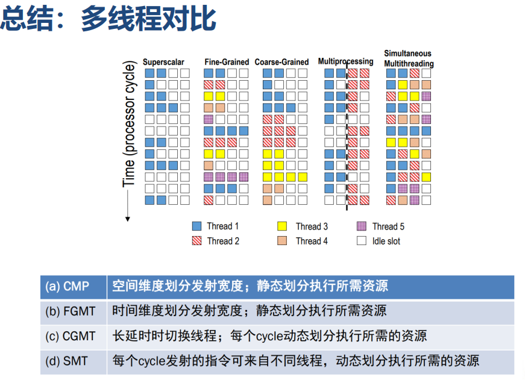

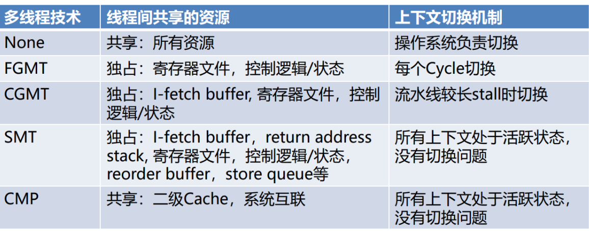

#### 并行计算

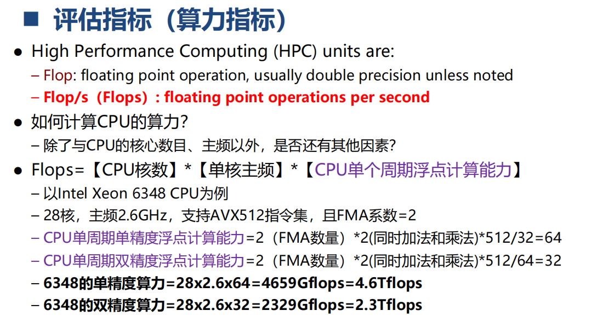

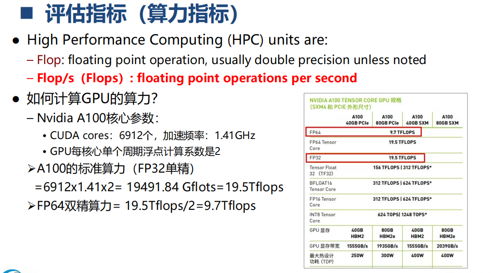

## 五、SIMD和向量处理器

动机：传统指令级并行技术的问题

提高性能的传统方法（挖掘指令级并行）的主要缺陷：

- 程序内在的并行性，有些程序不具备足够的并行性
- 提高流水线的时钟频率，提高时钟频率有时候会导致CPI的增加
- 指令预取和译码，有时候在每个时钟周期很难预取和译码多条指令
- 提高Cache的命中率，在有些计算量较大的应用（如科学计算）中，需要大量的数据，其局部性较差；有些程序处理的是连续的媒体流（multimedia），其局部性也较差

SIMD的优势

- 图形、机器视觉、语音识别、机器学习等新的应用均需要大量的数值计算，其算法通常具有数据并行特征，而SIMD-based结构（vector-SIMD，SIMD/GPUs）是执行这些算法的最有效途径
- SIMD结构可有效地挖掘数据级并行
- SIMD比MIMD更节能
- SIMD允许程序员继续以串行模式思考

SIMD的三种变体

- 向量体系结构

- SIMD/Multimedia指令级扩展

- Graphics Processor Units (GPUs)

### 向量处理器模型

向量处理器具有更高层次的操作，一条向量指令可以同时处理N个或N对操作数（处理对象是向量）

**向量处理器的基本特征**

- 基本思想：两个向量的对应分量进行运算，产生一个结果向量
- 简单的一条向量指令包含了多个操作 -> fewer instruction fetches
- 每一条结果独立于前面的结果
  - 长流水线，编译器保证操作间没有相关性
  - 硬件仅需检测两条向量指令间的相关性
  - 较高的时钟频率
- 向量指令以已知的模式访问存储器
  - 可有效发挥多体交叉存储器的优势
  - 不需要数据Cache（仅使用指令Cache）
- 在流水线控制中减少了控制Hazard
  - 有效利用流水线并发执行指令

**向量处理器的基本结构**

memory-memory vector processors（存储器型）

- 所有的向量操作都是存储器到存储器

- 需要更高的存储带宽
- 多个向量操作重叠执行较为困难
- 启动时间很长
  - CDC Star-100 在向量元素小于100时，标量代码的性能高于向量化代码

vector-register processors（寄存器型）

- Load/Store体系结构
- 除了Load和store操作外，所有的操作是向量寄存器与向量寄存器的操作（目前的向量处理器都是这种结构）

**向量处理器的基本组成单元**

- **Vector Register：**固定长度的一块区域，存放单个向量

  - 至少2个读端口和1个写端口（一般最少16个读端口，8个写端口）

  - 典型的有8-32个向量寄存器，每个寄存器长度为32、64等

- **Vector Functional Units (FUs)：**全流水化的，每一个clock启动一个新的操作
  - 一般4到8个FUs：FP add，FP mult，FP reciprocal (1/X)，integer add，logical，shift；可能有些重复设置的部件

- **Vector Load-Store Units (LSUs)：**全流水化地load或store一个向量，可能会配置多个LSU部件

- **Scalar registers：**存放单个元素用于标量处理或存储地址
  - 用交叉开关连接（Cross-bar）FUs， LSUs， registers

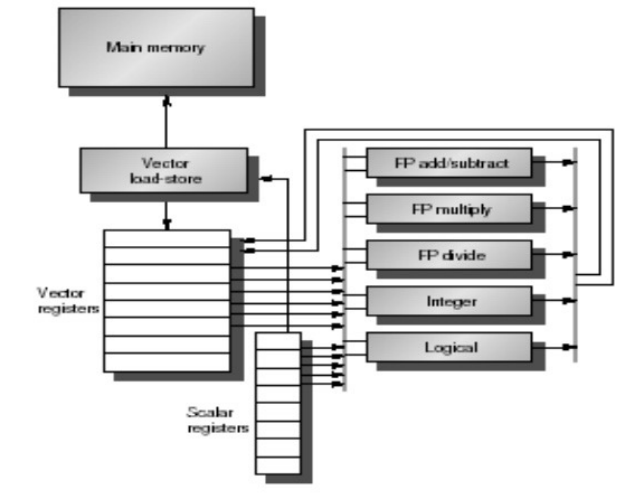

**向量指令集的优势**

- 格式紧凑一跳指令包含N个操作
  - 表达能力强，一条指令能告诉硬件诸多信息
- N个操作之间无相关性
  - 使用同样的功能部件
  - 访问不相交的寄存器
  - 与前面的操作以相同模式访问寄存器
  - 访问存储器中的连续块 (unit-stride load/store)
  - 以已知的模式访问存储器 (strided load/store)
- 可扩展性好
  - 支持在多个并行的流水线上运行同样的代码

**向量处理器的缺点和瓶颈**

- 当并行不规则的时候，向量处理器就会显得效率非常低比如搜索一个链表中的key，大家可以想象一下向量处理器应该怎么运算，实际上此时约等于标量处理器，浪费了大量部件。这一缺点和VLIW有类似之处，当找不到那么多并行的运算的时候，效率自然会降低。
- 向量处理器最典型的性能瓶颈就是Memory（Bandwith）。
  - 1、运算和内存操作的比例没掌控好的情况（比如实际运算量很少，内存操作过多）
  - 2、数据没有放在多个Memory Bank当中

**向量处理器单元结构**

- 采用多流水线lane设计
  - lane：包含向量寄存器堆的一部分和来自每个向量功能单元的一个执行流水线
  - 对于可以存储64个元素的寄存器，6段乘法流水线，计算V3需要多久？ 
  - T=流水线启动时间+N=6+63=69cycles

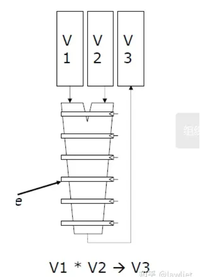

**向量指令执行**

- Memory Banking
  - 独立存储体方式：由多个互相独立的存储体（Bank）构成存储器组织
    - 可独立访问存储器，各存储器共享数据和地址总线（minimize pin cost）
  - 每个周期启动和完成一个bank的访问
  - 如果N个存储器访问不同的bank可以并行执行

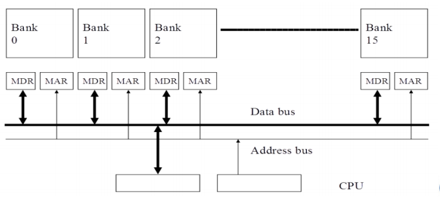

**Interleaved Vector Memory System**

- BANK的数量要大于等Bank busy time（bank准备好接收下一个请求之前的时间）
- 允许N个并行（如果数据在不同的bank中）

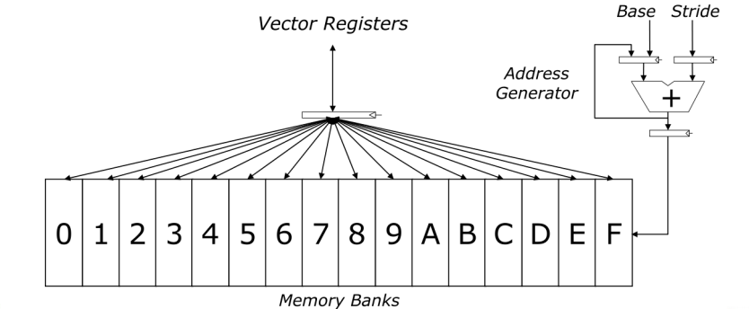

**Vector Opt #1: Vector Chaining**（相当于Vector中的forwarding）

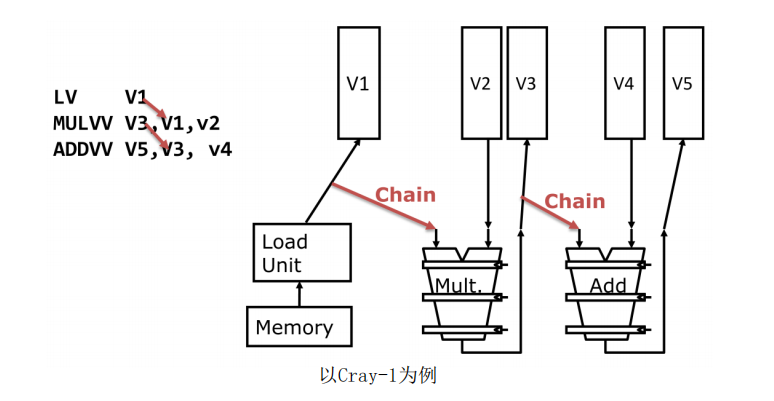

**Vector Opt #2: Conditional Execution**

- 通过增加向量掩码（标志）寄存器和可屏蔽向量指令对使用条件语句的循环进行矢量化
  - vector-mask control 使用长度为MVL的布尔向量控制向量指令的执行
  - 向量运算在掩码位为0的元素处变为NOP ，即仅对vector-mask register对应位为1
    的分量起作用
- 缺陷：
  - 简单实现时，条件不满足时向量指令仍然需要花费时间
  - 有些向量处理器针对带条件的向量执行时，仅控制向目标寄存器的写操作，可能会有除法错误

**Vector Opt #3: 分段开采（Strip mining）**

- 将循环拆解成适合寄存器的片段 -> Strip mining来解决操作的向量长度大于向量寄存器长度的问题
- 比如有527个元素，向量寄存器只有64个Elements，即最大并行度只有64，此时通过8次迭代即可

**Array  Processors vs Vector Processors**

- Array Processor，又称为并行处理机，一个cycle可以同时计算多组元素，也就是并行。
- Vector Processor需要对向量功能单元outstanding成流水线，本文用的是Vector Processor

**SIMD/Multimedia扩展**

- 在已有ISA中添加一些向量长度很短的向量操作指令
- 将已有的64-bit寄存器拆分为2*32b、4*16b、8*8b
- 单条指令可实现寄存器中所有向量元素的操作

## 六、GPU

#### GPU概述

**21世纪以来：时钟频率、单核的性能增加有限；性能提升主要依赖于单片上的“core”的数量；需要探索更加有效的硬件结构**

- 独立显卡
  - 基于PCIe的加速器
  - 拥有独立显存
- 集成显卡
  - 用于处理2D和3D图像的固定功能加速器
    - 三角形设定和光栅化，纹理映射和着色
  - 编程方式：
    - OpenGL 和 DirectX API

GPU与CPU的比较

- GPU的访存带宽明显高于CPU

+ GPU具有更高的能效优势

- 与cpu相比，gpu提供了更高的32位浮点数性能

#### GPU的基本硬件结构

- CPU+GPU异构体系结构

  - 推动异构计算的发展

  - 针对每个任务选择合适的处理器和存储器

  - GPU弱控制强计算，CPU强控制弱计算

- 通用CPU 适合执行一些串行的线程

- GPU适合执行大量并行线程

  - 可扩展的并行执行
  - 高带宽的并行存取

#### GPU编程模型

**GPU基于SIMD引擎**

- 指令流水线类似于SIMD的流水线
  - 不是用SIMD指令编程
  - 基于一般的指令，应用由一组线程构成

- 编程模型：指程序员如何描述应用（从程序员角度看到的机器模型）
  - 例如, 顺序模型 (von Neumann), 数据并行(SIMD), 数据流模型、多线程模型(MIMD, SPMD)

**三种编程模式来挖掘程序的并行性:**

- Sequential (SISD)
- Data-Parallel (SIMD)
- Multithreaded (MIMD/SPMD)

**编程模型1: Sequential SISD**

- 可以采用多种类型处理器执行
- Pipelined processor
- Out-of-order execution processor
  - 就绪的相互无关指令；
  - 不同循环的指令缓存在指令窗口中，多个功能部件可以并行执行；
  - 通过硬件实现循环展开
- Superscalar or VLIW processor
  - 每个周期可以存取和读取多条指令

**编程模型2: Data Parallel（SIMD）**

Realization: 各循环之间相互独立的，没有数据依赖

Idea:程序员或编译器生成SIMD指令，所有的循环执行相同

的指令，处理不同的数据

**编程模型3:多线程**

Realization:各循环之间相互独立的，没有数据依赖

Idea: 程序员或编译器为每次循环生成一个线程。每个线程执行同样的指令流（代码路径），处理不同的数据

**SPMD**

- Single procedure/program, multiple data 
  - 它是一种编程模型而不是计算机组织

- 每个处理单元执行同样的过程，处理不同的数据
  - 这些过程可以在程序中的某个点上同步，例如 barriers

- 多条指令流执行相同的程序
  - 每个程序/过程
    - 操作不同的数据
    - 运行时可以执行不同的控制流路径
    - 多科学计算应用以这种方式编程，运行在MIMD硬件结构上 (multiprocessors)
  - 现代通用 GPUs 以这种类似的方式编程，运行在SIMD硬件上

**GPU编程语言**

- CUDA （Nvidia研制的专用模型）

- OpenCL （开放标准）

**SIMD vs. SIMT Execution Model**

- SIMD: 一条指令流（一串顺序的SIMD指令），每条指令对应多个数据输入（向量指令）
- SIMT: 多个指令流（标量指令）构成线程， 这些线程动态构成warp。一个Warp处理多个数据元素

## 七、硬件加速器

### 加速器概述

**加速器是面向特定领域、针对有限算法定制设计的专用计算架构，其目的是提升特定计算的性能或减少功耗需求**

主要作用如下：

1. **提高性能：** 硬件加速器能够执行特定类型的计算任务比通用处理器更高效。通过将特定工作负载分配给硬件加速器，可以显著提高计算性能，缩短任务执行时间。
2. **降低能耗：** 相对于通用处理器，硬件加速器通常专门优化了某些计算任务，因此在执行这些任务时能够更有效地利用能源，降低整体系统的能耗。
3. **加速特定应用：** 硬件加速器通常设计用于处理特定类型的应用或工作负载，如图形处理单元 (GPU) 用于图形渲染、张量处理单元 (TPU) 用于深度学习任务等。这使得硬件加速器能够在特定领域内取得更好的性能。
4. **并行计算：** 许多硬件加速器是为并行计算而设计的，能够同时处理多个数据点或任务。这种并行性能有助于加速大规模数据处理和复杂计算任务。
5. **支持新技术：** 硬件加速器通常与新兴技术和标准一起推出，以支持特定应用的发展。例如，专门用于机器学习的加速器可能支持新的深度学习框架和算法。
6. **解放CPU资源：** 通过将特定工作负载转移到硬件加速器，可以释放主处理器（通常是CPU）的计算资源，使其能够更专注于执行其他任务。

总体而言，硬件加速器的主要作用是通过专门优化和并行计算，提高特定工作负载的执行效率和性能，从而在各种领域中取得更好的计算结果

加速器的设计和实现主要有两类：

- 设计专用集成电路（ASIC）
  - ASIC 是最高效的

- 基于可重构器件开发（如FPGA）
  - 设计灵活，开发周期更短
  - Xilinx和Altera

### 深度学习加速器

- 卷积神经网络
  - 卷积计算
  - 非线性激活层
  - 池化层
    - 池化层作用：减少数据量，常见的有Average Pooling和Max Pooling

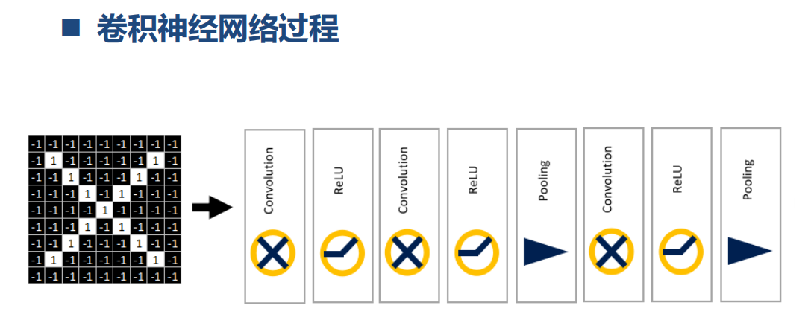

- 稀疏张量（Sparse Tensor）

### 图计算加速器

## 八、微码和超长指令字

### 微码处理器

目前的处理器大多都是硬布线设计（Hardwired）：通过微体系结构直接实现ISA中的所有指令

微码处理器增加了一个解释层：每条ISA指令都采用一系列更简单的微指令表达（被解释为一系列微指令的序列）

部署实施更简单，指令执行灵活、可控

**Microcontrol Unit**

处理器设计可以分为datapath和Control设计两部分

- datapath, 存储数据、算术逻辑运算单元
- control, 控制数据通路上的一系列操作

微指令

- *next* ：increments µPC

- *spin* ：waits for memory
- *fetch* ：jumps to start of instruction fetch
- *dispatch* ：jumps to start of decoded opcode group
- *ftrue/ffalse* *：*jumps to fetch if Cond? true/false

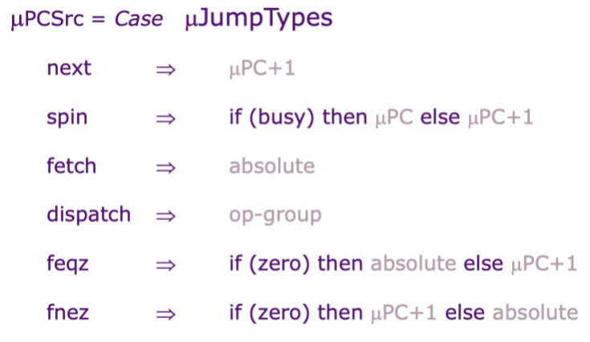

**现代微处理器中微程序控制扮演辅助的角色**

- e.g., AMD Bulldozer, Intel Ivy Bridge, Intel Atom, IBM PowerPC, …
- 大多数指令采用硬布线逻辑控制
- 不常用的指令或者复杂的指令采用微程序控制

**芯片bug的漏洞修复（基于微码的修复和升级）**

- Intel处理器在 bootup阶段可装载微代码方式的patches
- 英特尔不得不重新启用微代码工具，并寻找原来的微码工程师来修补熔断/幽灵安全漏洞

### **超长指令字VLIW处理器**

**提高指令级并行（ILP）的有效方法**

- 流水线，多处理器，超标量处理器，超长指令字VLIW

定义：VLIW指的是一种被设计为可以利用指令级并行（ILP）优势的CPU体系结构，由于在一条指令中封装了多个并行操作，其指令的长度比RISC或CISC的指令要长，因此起名为超长指令集

与超标量处理器的比较

- 相同：一次发射并完成多个操作，提高ILP
- 不同：
  - 超标量：要复杂逻辑发现指令之间的数据依赖关系，以及乱序执行逻辑和超标量架构来实现多指令的并行发射
  - VLIW：通过编译器对并发操作进行了编码，这种显式编码极大地降低了硬件的复杂性

**VLIW: Very Long Instruction Word**

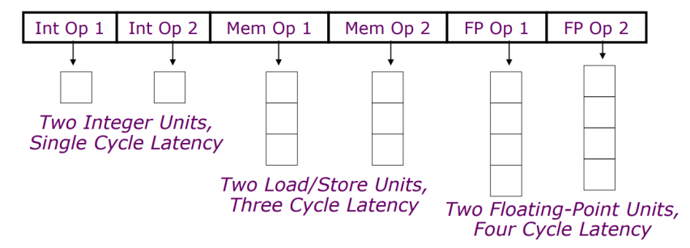

- 定长指令，将多个相互无依赖关系的指令封装到一条超长的指令字中
- 每个操作槽（slot）均用于固定的功能
- 每个功能单元的operation都声明了固定的延迟

**VLIW处理器设计原则**

架构设计

- 允许一个指令内多个Operations的并行执行
- 处理器中需要有对应数量的ALU单元完成相应的Operations
- 为所有Operation提供确定性延迟
  - 在指定的延迟之前不允许使用数据，无需数据互锁

编译器

- 进行依赖性的检查，保证指令内各Operations的并行性
- 通过编译器的调度（重新排序）Operations，以最大限度的提高并行性
- 通过编译器调度以避免数据竞争（无interlocks）
  - 编译器需要找到N个独立的Operations，不足则插入NOP

VLIW  Loop

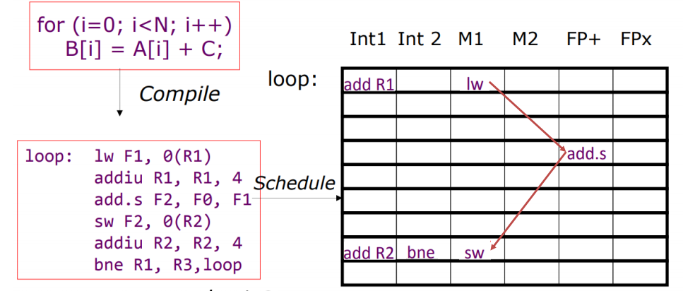

VLIW  Loop Unrolling

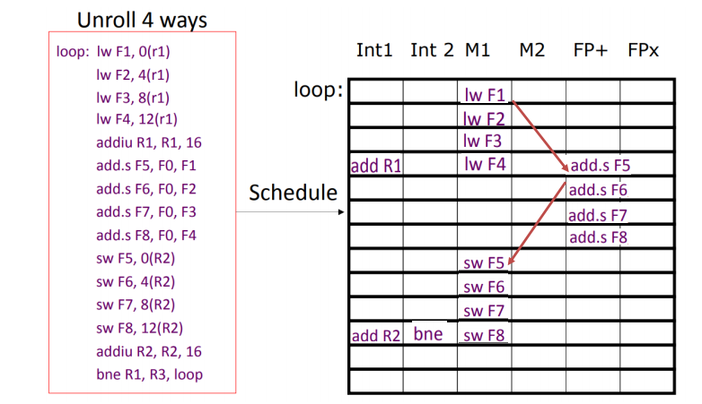

Software Pipeling

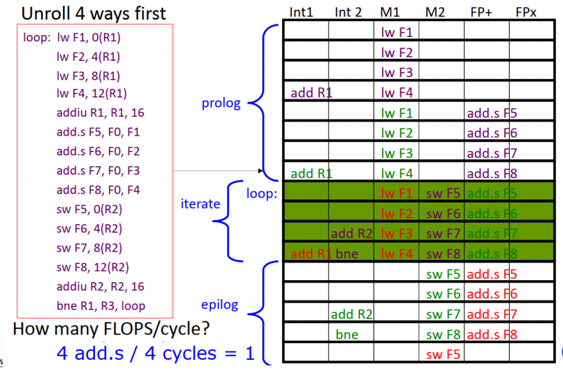

经典VLIW的问题

- 对于分支概率的了解
  - 代码分析需要在构建过程中执行额外的步骤
- 对静态不可预测的分支进行调度
  - 最佳调度方式会因分支路径而不同，增加编译时间
- 增加了目标代码量
  - 指令填充浪费指令内存/缓存（无法找到彼此独立的Operations）
  - 循环展开/软件流水线这些技术需要复制大量代码
- 调度内存操作
  - 缓存和/或内存访问有时候会带来静态不可预测的memory Operation
- 目标代码兼容性
  - 必须为每台机器重新编译所有代码

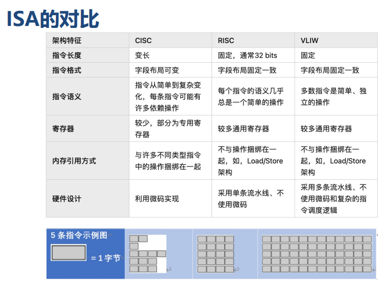

## 九、云计算概述和虚拟化

**Why run applications on cloud and not on “bare metal” servers?**

+ **资源共享：**通过虚拟化，多个虚拟机可以共享系统资源，提高资源的利用率

- **降低维护成本：** 由云服务提供商负责硬件和软件的维护，降低了用户的运维负担

- **灵活性：** 虚拟机可以在需要时迁移到另一台机器，增加了系统的弹性

- **按需付费：** 如果使用较轻，无需投资购买服务器，按使用量付费，节省成本

**Disadvantages of running applications on cloud**

- **性能：** 通过互联网访问服务器可能导致较长的延迟，降低了性能

- **成本：** 在高度使用的情况下，云计算可能成本较高，尤其是大规模的应用

Hypervisor的分类

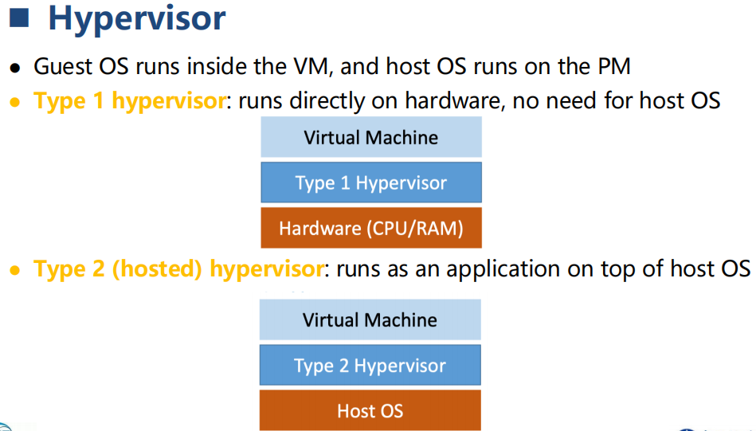

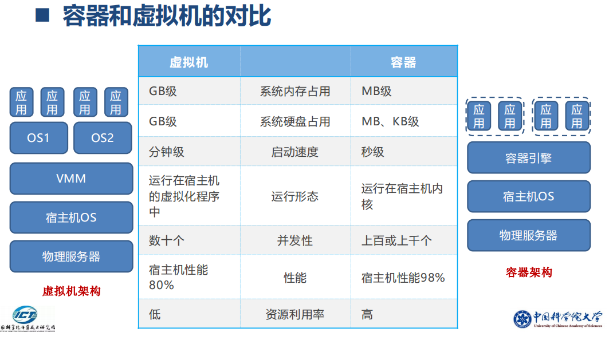

## 十、片上互联网络

**系统设计中的重点问题**

- 拓扑Topology
  - 网络中结点和通道之间的物理布局和连接
  - 会影响路由效率、可靠性、吞吐量、延迟、系统构建难度
- 路由Router
  - 给定拓扑结构，决定从源节点到目的节点的路径，直接影响网络的吞吐量和性能
  - 静态或动态
- 流量控制 Buffering and Flow Control
  - 信号通过网络时如何分配资源，如缓冲和通道带宽
  - 在网络怎样存储数据
  - 拥塞控制

**互联系统的评测指标**

- 关键指标
  - 成本 Cost
  - 延迟 Latency
- 重要指标
  - 能耗 Energy 
  - 带宽 Bandwidth
  - 网络竞争 Contention
  - 整体系统性能 Overall System Performance

### **拓扑结构**

- 总线             Bus（Simplest）
- 点对点         Point-to-point connection (Ideal and most costly)
- 交叉开关     Crossbar (Less costly)
- 环                 Ring
- 树                 Tree
- 网格             Mesh

- 环面             Torus
- 超立方          Hypercube
- 欧米伽网络  Omega

**拓扑结构的基本概念**

- 路径多样性 Path Diversity

在给定源节点和目的节点的前提下，如果这个节点对在某个拓扑中拥有多条最短路径，而在另一个拓扑中只有一条最短路径，则认为前者的拓扑具有更大的路径多样性。拓扑中的路径多样性使路由算法在处理负载均衡问题时具有更大的灵活性，从而通过减小通道负载，提高了网络吞吐量。路径多样性还使得数据包能够拥有绕过网络中故障的潜力。影响性能的因素

- 对分带宽（Bisection Bandwidth）

将网络划分为两个相同部分后，两部分之间的通信带宽

- 直连网络和间接网络
  - 比如mesh，所有节点都有一个endpoint和一个switch

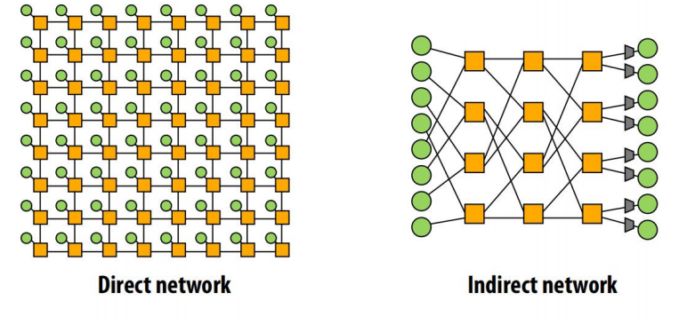

- 阻塞型和非阻塞型

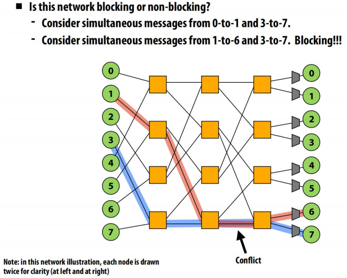

**总线Bus**

所有节点都连在一个连接上

- 简单，Simple
- 小规模下低成本，Cost effective for a small number of nodes
- 一致性保持成本低，Easy to implement coherence (snooping and serialization)
- 扩展性差，Not scalable to large number of nodes (limited bandwidth)
- 网络竞争高，High contention -> fast saturation

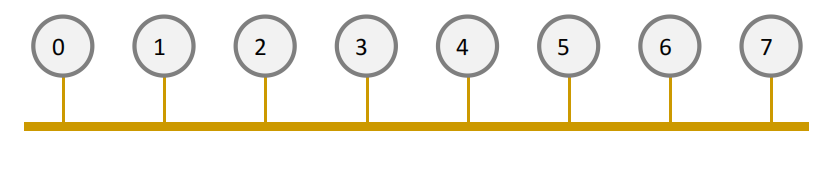

**点对点网络Point-to-Point**

所有节点与其他节点直接连接

- 低竞争 Lowest contention
- 低延迟 Potentially lowest latency

- 非常理想，Ideal 
- 最高的成本，Highest cost
  - Connections/node：O(N)
  - inks：O(N2)

- 扩展性差 Not scalable

- 布线难度大 How to lay out on chip?

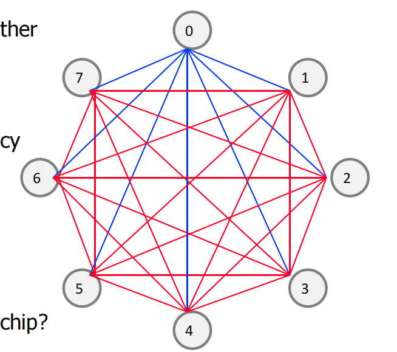

**交叉开关Crossbar**

每个节点均通过共享链路相连，Every node connected to every other with a shared link for each destination

不同目的地之间可并行传输，Enables concurrent transfers to non-conflicting destinations

小规模低成本，Could be cost-effective for small number of nodes

- 低延迟高吞吐 Low latency and high througput
- 高成本 Expensive
- 扩展性差 Not scalable ->O(N^2) cost
- 大规模仲裁困难 Difficult to arbitrate as N increases
- 比如IBM POWER5、Sun Niagara I/II

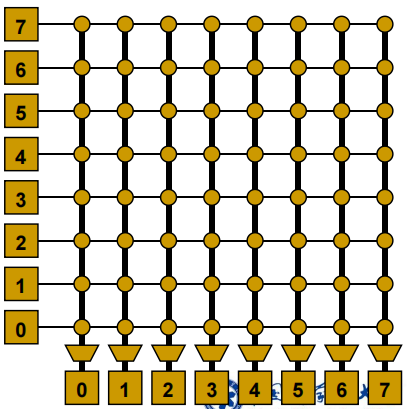

**环Ring**

- 简单
- 便宜 O(N) cost
- 高延迟：O(N)
- 对分带宽在添加节点时保持不变 （扩展性问题）

- 比如Core i7

单向Ring：Unidirectional Ring

双向Ring：Bidirectional Rings

层次Ring：Hierarchical Rings

**网格Mesh**

- 直连网络
- 在基于网格的应用中有局部性
- O(N) cost

- 平均延迟 O(sqrt(N))

- 易于布线
- 具有路径多样性

- 比如：Tiera processor，prototype Intel chips

**圆环面** **Torus**

- Mesh is not symmetric on edges: performance very sensitive to placement of task on edge vs. middle
- Torus avoids this problem
  - Higher path diversity (and bisection bandwidth) than mesh
  - Higher cost 
    - Harder to lay out on-chip
    - Unequal link lengths

**树** **Trees**

平面、分层的拓扑结构

- 延迟 O(logN)
- 利于局部通信
- 便宜：O(N) cost
- 易于布线

- 根节点将成为瓶颈，但Fat Tree能解决这个问题

**超立方** **Hypercube**

- “N-dimensional cube” or “N-cube”
- Latency: O(logN)
- links: O(NlogN)
- Low latency
- Hard to lay out in 2D/3D

**多级网络Multistage Networks**

Indirect networks with multiple layers of switches between terminals/nodes

- 成本: O(NlogN)， 延迟：O(logN)
- Many variations (Omega, Butterfly, Benes, Banyan, …)

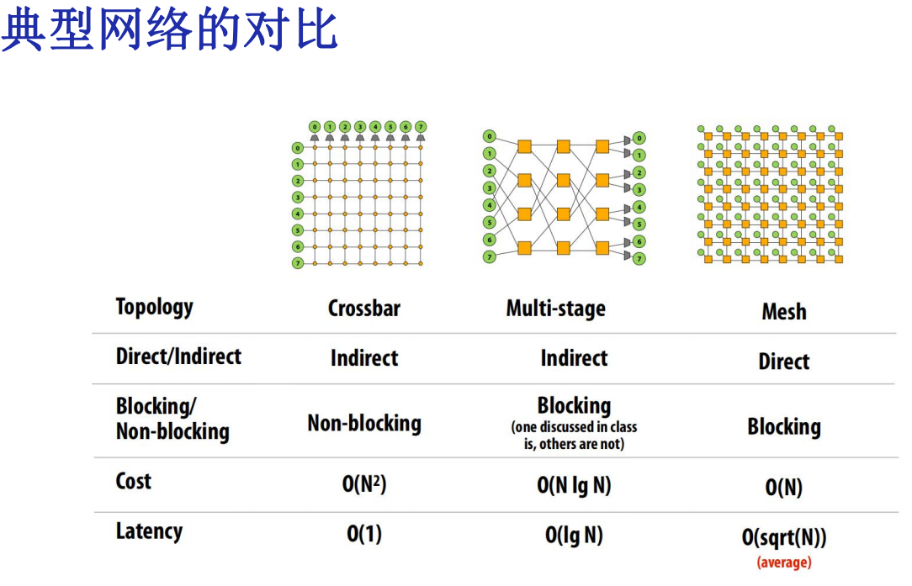

### **路由Routing**

路由算法（三种类型）

- 确定性路由 Deterministic：所有相同的源-目标对选择相同路径
  - 简单
  - 无死锁
  - 可能会有高竞争
  - 不能利用路径多样性

- 流量无关路由 Oblivious：选择不同的路径，无需考虑网络状态
  - Valiant 算法： An example of oblivious algorithm
  - 目标: Balance network load
  - 基础思路: Randomly choose an intermediate destination,route to it first, then route from there to destination
  - Randomizes/balances network load
  - Non minimal (packet latency can increase)
  - Optimizations:
    - Do this on high load
    - Restrict the intermediate node to be close (in the same quadrant)
- 无缓冲偏转路由 Bufferless Deflection Routing
  - Key idea: Packets are never buffered in the network. When two packets contend for the same link, one is deflected
  - Input buffers are eliminated: packets are buffered in pipeline latches and on network links
- 自适应路由 Adaptive：能选择不同的路径，适应网络的状态
  - 最小化自适应路由 Minimal adaptive
    - Router uses network state (e.g., downstream buffer occupancy) to pick which “productive” output port to send a packet to
    - Productive output port: port that gets the packet closer to its destination
    - Aware of local congestion
    - Minimality restricts achievable link utilization (load balance)
  - 非最小化方案 Non-minimal (fully) adaptive
    - “Misroute” packets to non-productive output ports based on network state
    - Can achieve better network utilization and load balance
    - Need to guarantee livelock freedom

**死锁问题** **Deadlock**

- 没有转发进程 No forward progress
- 由资源的循环依赖所导致 Caused by circular dependencies on resources
- 每个包都等待另一个包释放所占有的缓冲区 Each packet waits for a buffer occupied by another packet downstream

**解决方案**

- 在路由中避免循环 Avoid cycles in routing
  - 维度顺序路由 Dimension order routing
    - Cannot build a circular dependency
  - 转向记录与限制 Restrict the “turns” each packet can take

- 加缓冲 Avoid deadlock by adding more buffering (escape paths)

- 监测和打破死锁 Detect and break deadlock
  - 可抢占缓冲区 Preemption of buffers
- 转向模型 Turn Model to Avoid Deadlock
  - Idea
    - 分析数据包在网络中可以转向的方向 Analyze directions in which packets can turn in the network
    - 确定这些转向可以形成的循环 Determine the cycles that such turns can form
    - 禁止足够数量的转向以阻止可能的循环 Prohibit just enough turns to break possible cycles

### **流量控制 Buffering and Flow Control**

**流量控制的基础思路**

- Circuit switching
- Bufferless (Packet/flit based)
- Store and forward (Packet based)
- Virtual cut through (Packet based)
- Wormhole (Flit based)

## 十一、仓库级计算机和分布式文件系统

### Warehouse-scale computer (WSC)

+ Provides Internet services
  + Search, social networking, online maps, video sharing, online
  + hopping, email, cloud computing, etc. 

- Differences with HPC “clusters”:
  - Clusters have higher performance processors and network
  - Clusters emphasize thread-level parallelism, WSCs emphasize request-level parallelism

- Differences with datacenters:

  - Datacenters consolidate different machines and software intoone location

  - Datacenters emphasize virtual machines and hardware heterogeneity in order to serve varied customers

WSC的分布式系统和软件

- 编程框架Program Framework：MapReduce（Google）

-  文件系统File systems: GFS（Google）

- 数据库Database: Dynamo（Amazon） 、BigTable（Google）、Haystack（Facebook）

- 缓存系统Cache：Memcache（@Facebook）

  Google WSC “三驾马车”：MapReduce、bigTable、GFS，其开源版本：Hadoop、Hbase（Java）、HDFS

### 分布式文件系统

**GFS系统架构**

- GFS中有三种节点：GFS client，GFS master，GFS chunkserver
- GFS client：维持专用接口，与应用交互
- GFS master：维持元数据，统一管理chunk位置与租约
- GFS chunkserver：存储数据

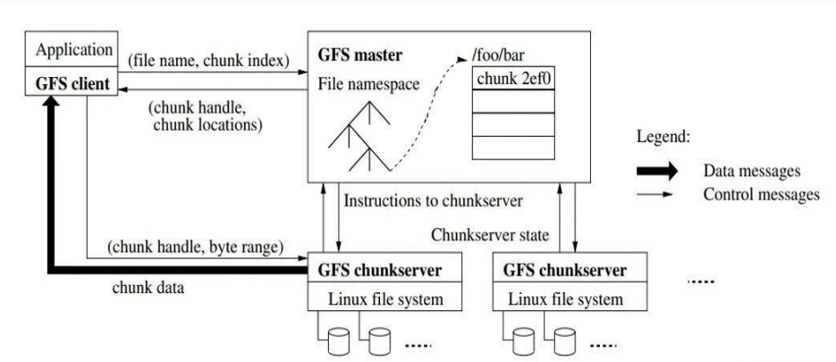

**GFS存储设计**

- 考虑到Google业务需要存储的文件(几个GB)可能非常大，并且大小不均，GFS没有选择直接以文件为单位进行存储，而是把文件分为一个个的chunk来存储，每个chunk为64MB
  - 较大的chunk可以有效减少系统内部的寻址和交互次数
  - 较大的chunk也意味着client可能在一个chunk上执行多次操作，这样可以服用TCP连接，节省网络开销
  - 更大的chunk也可以减少chunk的数量，从而节省元数据存储开销，相当于节省了系统内最珍贵的内存资源
- 系统通过分割存储来将文件分散存储在多台服务器上
- 采用更大的chunk以及配套的一致性策略来支持大文件存储

**GFS的Master设计**

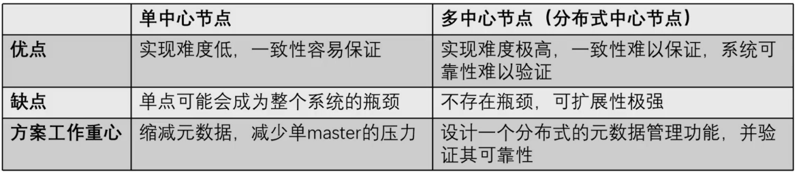

GFS采用单Master节点，用来存储整个文件系统的三类元数据

+ 所有文件和chunk的namespace【持久化】
+ 文件到chunk的映射【持久化】
+ 每个chunk的位置【不持久化】
  + 为什么位置不需要持久化，因为master在重启的时候可以从各个chunkserver处收集chunk的位置信息

GFS采取的一系列措施来确保master不会成为整个系统的瓶颈

- GFS所有的数据流不经过Master，而是直接由client和chunkserver直接交互（数据流和控制流分离）
- GFS的client会缓存master的元数据，在大部分情况下，都无需访问master
-  采取一系列手段来节省master的内存，包括增大chunk的大小以节省chunk的数量、对元数据进行定制化的压缩等

如何实现自动扩缩容？-->在master节点上增减、调整chunk的元数据即可

怎样知道一个文件存储在哪台机器上？-->根据master中文件到chunk再到chunk位置的映射来定位具体的chunkserver

**考试重点，题目应该是64B，打错了**

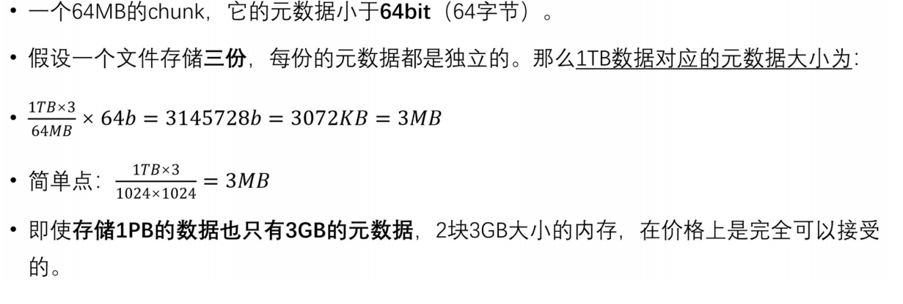

**GFS的高可用设计**

- master的高可用设计

  - 除了primary master以外，还维持一个shadow master作为备份master
  - master在正常运行时，对元数据所做的所有修改操作，都要先记录日志(WAL)，再真正去修改内存中的元数据
  - 同时primary master会实时向shadow master同步WAL，只有shadow master同步日志完成，元数据修改操作才算成功

  如何实现自动切换

  - 如果master宕机，会通过Google的Chubby(本质时共识算法)来识别并切换到shadow master，这个切换时秒级的

- chunk的高可用设计

  - 文件被拆为一个个的chunk来进行存储的，每个chunk都有三个副本，由master维持副本信息
  - 对一个chunk的每次写入都必须保证在三个副本中的写入都完成，才算写入完成
  - 如果一个chunkserver宕机，还有两个副本保存这个chunk的信息
  - 如果宕机的副本在一段时间后没有恢复，那么master会在另一个chunksever重建一个副本，从而将chunk的副本数目维持在3个
  - master对副本位置的选择策略要遵循以下三点
    - 新副本所在的chunkserver的资源利用率要低
    - 新副本所在的chunkserver最近创建的chunk副本不多，防止其瞬间成为热点
    - 不能和chunk其它副本在同一机架

**GFS的读写流程**

GFS的写入

- 采用流水线技术
- 数据流与控制流分离的技术

GFS的写入流程

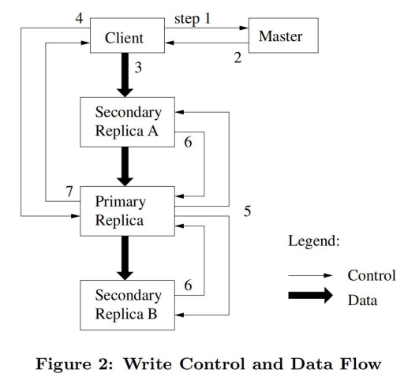

- 1,2.Client向Master询问要写入chunk的租约在哪个chunkserve上(Primary Replica)，以及其他副本(Secondary Replicas)的位置(通常Client中直接就有缓存)
- 3.Client将数据推送到所有的副本上，这一步就会用到流水线技术，也是写入过程中唯一的数据流操作。
- 4.确认所有副本都收到了数据之后，client发送正式写入的请求到Primary Replica。Primary Replica接收到这个请求后，会对这个Chunk上所有的操作排序，然后按照顺序执行写入。

`这里很关键，Primary Replica唯一确定写入顺序，保证副本一致性。`

- 5.Primary Replica把Chunk写入的顺序同步给SecondaryReplica。

`注意，如果执行到这一步，Primary Replica上写入已经成功了.`

- 6.所有的Secondary Replica返回Primary Replica写入完成·7.Primary Replica返回写入结果给Client。

`所有副本都写入成功: Client确认写入完成`

`一部分Secondary Replica写入失败 (没有响应) :Client认为写入失败，并从第3步开始重新执行。`

`如果一个写入操作涉及到多个chunk，client会把它们分为多个写入来执行。`

改写的问题在于一个改写操作可能涉及到多个chunk而如果部分chunk成功，部分chunk失败，我们读到的文件就是不正确的。

改写大概率是一个分布式操作，如果要保证改写的强致性，代价就要大很多了。论文中一再强调，GFS推荐使用追加的方式写入文件并且Google内部使用GFS的应用，它们的绝大多数写入也都是追加。

GFS的读取流程

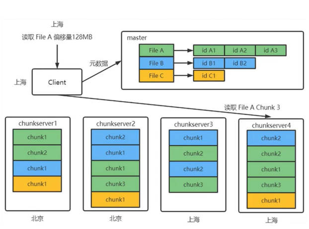

- 1. client收到读取一个文件的请求后，首先会查看自身的缓存中有没有此文件的元数据信息。如果没有，则请求master(或shadow master)获取元数据信息并缓存。
- 2. client计算文件偏移量对应的chunk。
- 3. 然后client向离自身最近的chunkserver发送读请求。如果在这个过程中，发现这个chunkserver没有自己所需的chunk，说明缓存失效，就再请求master获取最新的元数据

- 4. 读取时会进行chunk校验和的确认如果校验和验证不通过，选择其他副本进行读取
- 5. Client返回应用读取结果

**总体上GFS是三写一读的模式。写入采用了流水线技术和数据流与控制流分离技术保证性能;追加对一致性的保证更简单，也更加高效，所以写入多采用追加的形式。读取则所有副本都可读在就近读取的情况下性能非常高**

**GFS的一致性模型**

GFS把文件数据的一致性大体上分为三个层次：inconsistent，consistent，defined

- consistent：一致的，表示文件无论从哪个副本读取，结果都是一样的
- defined：已定义的，文件发生修改操作后，读取时一致的，且client可以看到最新修改的内容

串行改写成功: defined。因为所有副本都完成改写后才能返回成功，并且重复执行改写也不会产生副本间不一致，所以串行改写成功数据是defined。

写入失败:inconsistent。这通常发生在重试了一定次数仍无法在所有副本都写入成功时意味着大概率有个副本宕机了，这种情况下一定是不一致的，Client也不会返回成功。

并发改写成功: consistent but undefined。对于单个改写操作而言，成功就意味着副本间是一致的。但并发改写操作可能会涉及多个chunk，不同chunk对改写的执行顺序不一定相同，而这有可能造成应用读取不到预期的结果。

追加写成功: defined interspersed with inconsistent (已定义但有可能存在副本间不一致interspersed with inconsistent，追加的重复执行会造成副本间的不一致。

### NoSQL数据库 BigTable

### **分布式编程框架**MapRedue****

### **数据中心网络Data Center Networks**

### 云计算安全

**安全计算模式一：可信计算**

**可信计算的含义**

- 可信计算组织TCG：如果一个实体的行为是以预期的方式，符合预期的目标，则该实体是可信的
- ISO/IEC 15408标准：参与计算的组件、操作或过程在任意的条件下是可预测的，并能够抵御病毒和一定程度的物理干扰
- 沈昌祥院士：可信≈安全+可靠，可信计算系统是能够提供系统的可靠性、可用性、信息和行为安全性的计算机系统

**工作原理**

- 建立信任根：信任根的可信性由物理安全、技术安全与管理安全共同确保
- 建立信任链：从信任根开始到硬件平台，到操作系统再到应用，一级认证一级，一级信任一级

**局限性**

可信计算对数据的保护偏弱，仅限密钥和关键数据

**安全计算模式二：机密计算**

**机密计算的定义**

- IBM：机密计算是一种云计算技术，它在处理过程中将敏感数据隔离在受保护的CPU Enclave中
- 机密计算联盟CCC：机密计算是通过在基于硬件可信执行环境中执行计算来保护使用中的数据
- 冯登国院士：机密计算是一种保护使用中的数据安全的计算范式

**工作原理**

- 机密计算利用基于硬件的可信执行环境将数据、特定功能或整个应用程序与操作系统、虚拟机管理程
  序、虚拟机管理器以及其他特权进程隔离开来，从而保护敏感数据

**局限性**

- 机密计算支撑技术SGX等存在侧信道攻击，依赖对硬件厂商的信任，且机密计算缺乏统一的技术标准

**可信执行环境TEE**

- TEE 是一种具有运算和储存功能，能提供安全性和完整性保护的独立处理环境

- 在硬件中为敏感数据单独分配一块隔离的内存，所有敏感数据的计算均在这块内存中进行

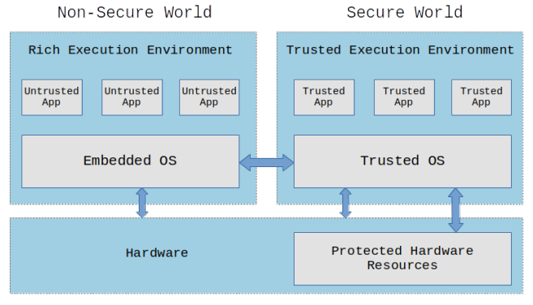

**安全计算模式三：密态计算**

以密文为计算对象，其安全性不依赖于隔离和访问控制、不依赖于硬件和软件安全性

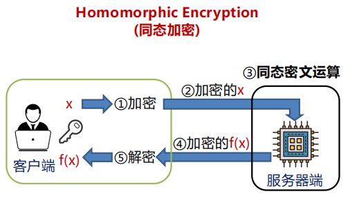

