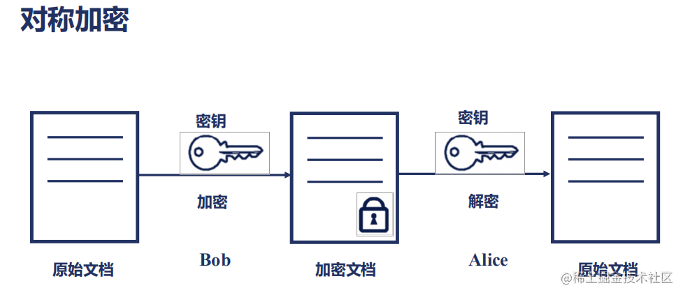
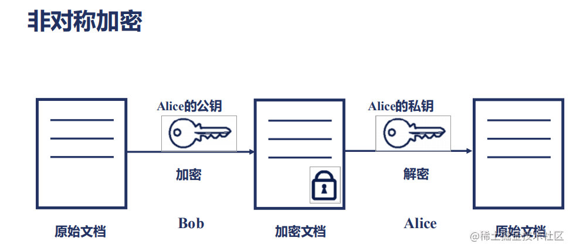

# 加密算法调研报告

## 美密算法

### 对称加密

对称加密又叫做私钥加密，即信息的发送方和接收方使用同一个密钥去加密和解密数据。对称加密的特点是算法公开、加密和解密速度快，适合于对大数据量进行加密。

> **加密过程如下**：明文+加密算法+私钥=>密文
>
> **解密过程如下**：密文+解密算法+私钥=>明文



### 非对称加密

非对称加密也叫做公钥加密。非对称加密与对称加密相比，其安全性更好。对称加密的通信双方使用相同的密钥，如果一方的密钥遭泄露，那么整个通信就会被破解。而非对称加密使用一对密钥，即公钥和私钥，且二者成对出现。私钥被自己保存，不能对外泄露。公钥指的是公共的密钥，任何人都可以获得该密钥。用公钥或私钥中的任何一个进行加密，用另一个进行解密。

> **被公钥加密过的密文只能被私钥解密，过程如下**：
>
> 明文+加密算法+公钥=>密文，密文+解密算法+私钥=>明文



### 常见加密算法

#### MD5算法

> MD5用的是哈希函数，它的典型应用是对一段信息产生信息摘要，以防止被篡改。严格来说，MD5不是一种加密算法而是摘要算法。无论是多长的输入，MD5都会输出长度为128bits的一个串(通常用16进制表示为32个字符)。

#### SHA1算法

> SHA1是和MD5一样流行的消息摘要算法，然而SHA1比MD5的安全性更强。对于长度小于2^64位的消息，SHA1会产生一个160位的消息摘要。基于MD5、SHA1的信息摘要特性以及不可逆(一般而言)，可以被应用在检查文件完整性以及数字签名等场景。

#### HMAC算法

> MAC是密钥相关的哈希运算消息认证码（Hash-basedMessageAuthenticationCode），HMAC运算利用哈希算法(MD5、SHA1等)，以一个密钥和一个消息为输入，生成一个消息摘要作为输出。HMAC发送方和接收方都有的key进行计算，而没有这把key的第三方，则是无法计算出正确的散列值的，这样就可以防止数据被篡改。

#### AES算法

ES、DES、3DES都是对称的块加密算法，加解密的过程是可逆的。常用的有AES128、AES192、AES256。

> DES加密算法是一种分组密码，以64位为分组对数据加密，它的密钥长度是56位，加密解密用同一算法。DES加密算法是对密钥进行保密，而公开算法，包括加密和解密算法。这样，只有掌握了和发送方相同密钥的人才能解读由DES加密算法加密的密文数据。因此，破译DES加密算法实际上就是搜索密钥的编码。对于56位长度的密钥来说，如果用穷举法来进行搜索的话，其运算次数为2^56次。3DES是基于DES的对称算法，对一块数据用三个不同的密钥进行三次加密，强度更高。

#### RSA算法

> RSA加密算法是目前最有影响力的公钥加密算法，并且被普遍认为是目前最优秀的公钥方案之一。RSA是第一个能同时用于加密和数字签名的算法，它能够抵抗到目前为止已知的所有密码攻击，已被ISO推荐为公钥数据加密标准。

RSA加密算法基于一个十分简单的数论事实：将两个大素数相乘十分容易，但想要对其乘积进行因式分解却极其困难，因此可以将乘积公开作为加密密钥。

#### ECC算法

> ECC也是一种非对称加密算法，主要优势是在某些情况下，它比其他的方法使用更小的密钥，比如RSA加密算法，提供相当的或更高等级的安全级别。不过一个缺点是加密和解密操作的实现比其他机制时间长(相比RSA算法，该算法对CPU消耗严重)。

## 国密算法

### 概述

国密即国家密码局认定的国产密码算法。主要有SM1，SM2，SM3，SM4。密钥长度和分组长度均为128位。

国密算法是指国家密码管理局认定的一系列国产密码算法，包括SM1-SM9以及ZUC等。其中

- SM1、SM4、SM5、SM6、SM7、SM8、ZUC等属于对称密码，
- SM2、SM9等属于公钥密码(非对称加密)
- SM3属于单向散列函数。


目前我国主要使用公开的SM2、SM3、SM4作为商用密码算法。

> 其中SM1、SM7算法不公开，调用该算法时，需要通过加密芯片的接口进行调用

- SM2是基于椭圆曲线的公钥密码算法，包括用于数字签名的SM2-1、用于密钥交换的SM2-2和用于公钥密码的SM2-3。
- SM3是能够计算出256比特的散列值的单向散列函数，主要用于数字签名和消息认证码。
- SM4是属于对称密码的一种分组密码算法，分组长度和密钥长度均为128比特。

国密算法从SM1-SM4分别实现了对称、非对称、摘要等算法功能，目前已普遍应用于日常工作生活中的各个方面，如工作中使用的VPN，金融业务中的资金流转、刷卡支付，以及门禁设施、身份认证等。

------

### SM1

SM1算法是分组密码算法，分组长度为128位，密钥长度都为128比特，算法安全保密强度及相关软硬件实现性能与AES相当，算法不公开，仅以IP核的形式存在于芯片中。

采用该算法已经研制了系列芯片、智能IC卡、智能密码钥匙、加密卡、加密机等安全产品，广泛应用于电子政务、电子商务及国民经济的各个应用领域（包括国家政务通、警务通等重要领域）。

------

### SM2

可以理解为国产RSA。非对称加密，基于ECC。该算法已公开。由于该算法基于ECC，故其签名速度与秘钥生成速度都快于RSA。

SM2椭圆曲线公钥密码算法是我国自主设计的公钥密码算法，包括SM2-1椭圆曲线数字签名算法，SM2-2椭圆曲线密钥交换协议，SM2-3椭圆曲线公钥加密算法，分别用于实现数字签名密钥协商和数据加密等功能。SM2算法与RSA算法不同的是，SM2算法是基于椭圆曲线上点群离散对数难题，相对于RSA算法，256位的SM2密码强度已经比2048位的RSA密码强度要高，但运算速度快于RSA。

### SM3

可以理解为国产MD5。消息摘要。可以用MD5作为对比理解。该算法已公开。校验结果为256位。

### SM4

可以理解为国产AES。无线局域网标准的分组数据算法。对称加密，密钥长度和分组长度均为128位。

### SM9

一种标识密码(IBE)算法，由国家密码管理局于2016年3月28日发布，相关标准为“GM/T0044-2016SM9标识密码算法”。主要用于用户的身份认证。SM9的加密强度等同于3072位密钥的RSA加密算法。

------

### 使用经验

一般数据发送端都是用SM4对数据内容加密，使用SM3对内容进行摘要，再使用SM2对摘要进行签名。

一般接收端，先用SM2对摘要进行验签，验签成功后就做到了防抵赖，对发送过来的内容进行SM3摘要，看下生成的摘要和验签后的摘要是否一致，用于防篡改。

------

另外SM4在加密解密需要相同的密钥，这个我们可以通过编写密钥交换模块实现生成相同的密钥。用于SM4对称加密。

关于非对称还要注意几点：

（1）公钥是通过私钥产生的；

（2）公钥加密，私钥解密是加密的过程

（3）私钥加密，公钥解密是签名的过程；

由于SM1、SM4加解密的分组大小为128bit，故对消息进行加解密时，若消息长度过长，需要进行分组，要消息长度不足，则要进行填充。

------

### 国密算法的安全性

国密算法，作为国家层面推广的密码算法标准，其安全性经过了严格的审查和评估。

以下是对SM2、SM3和SM4算法安全性的进一步分析：

#### SM2算法的安全性

SM2算法是一个基于椭圆曲线的公钥密码算法，其安全性主要依赖于椭圆曲线离散对数问题的难度。与RSA算法相比，SM2算法在相同的安全强度下，所需的密钥长度更短，因此，在加密和签名速度上具有一定的优势。此外，SM2算法在设计时也考虑了多种攻击手段，并采用了相应的防护措施，从而确保了其在实际应用中的安全性。

#### SM3算法的安全性

SM3算法是一个密码杂凑算法，主要用于数字签名和消息认证等场景。其安全性主要体现在以下几个方面：

1. 输出长度：SM3算法的输出长度为256比特，相比MD5（128比特）和SHA-1（160比特）算法，其输出长度更长，因此具有更高的安全性。
2. 碰撞攻击：SM3算法在设计时考虑了碰撞攻击的问题，并采用了相应的防护措施。目前，尚未有公开的针对SM3算法的碰撞攻击方法。
3. 雪崩效应：SM3算法具有雪崩效应，即输入数据的微小变化会导致输出结果的巨大差异。这一特性使得攻击者难以通过猜测或穷举的方式来破解SM3算法。

#### SM4算法的安全性

SM4算法是一个分组密码算法，主要用于数据的加密和解密。其安全性主要体现在以下几个方面：

1. 密钥长度：SM4算法的密钥长度为128比特，与AES算法相同。这一长度的密钥足以抵抗目前已知的所有密码攻击方法。
2. 分组长度：SM4算法的分组长度也为128比特，这意味着每次加密或解密的数据块大小为128比特。这一分组长度可以确保数据的机密性和完整性。
3. 加密轮数：SM4算法采用了多轮加密的方式，每轮加密都使用了不同的密钥和加密函数。这种加密方式可以使得攻击者难以通过分析加密过程来破解算法。
4. 安全性评估：SM4算法已经经过了多轮的安全性评估和审查，其安全性得到了广泛的认可。目前，尚未有公开的针对SM4算法的有效攻击方法。

综上所述，国密算法中的SM2、SM3和SM4算法都具有较高的安全性，可以满足不同场景下的密码应用需求。在实际应用中，可以根据具体的需求和场景选择合适的算法进行使用。

## 实验过程

> 本实验使用北京大学自主开发的国产商用密码开源库GmSSL，这个库实现了对国密算法、标准和安全通信协议的全面功能覆盖，支持包括移动端在内的主流操作系统和处理器，支持密码钥匙、密码卡等典型国产密码硬件，提供功能丰富的命令行工具及多种编译语言编程接口。

### 下载

- GmSSL的主分支版本为 [GmSSL-3.1.1](https://github.com/guanzhi/GmSSL/releases/tag/v3.1.1)，主要增加跨平台特性，特别是对Windows/Visual Studio的支持，Windows、Android、iOS平台的开发者需要使用该版本。

```bash
git clone https://github.com/guanzhi/GmSSL.git
```

### 编译与安装

```bash
mkdir build
cd build
cmake ..
make
make test
sudo make install
```

**安装gmssl-python**

```bash
pip install gmssl-python
```

**验证安装成功**

注意`gmssl-python`包中只包含一个`gmssl`模块（而不是`gmssl_python`模块）。

可以在Python交互环境中做简单的测试

```
>>> import gmssl
>>> gmssl.GMSSL_PYTHON_VERSION
>>> gmssl.GMSSL_LIBRARY_VERSION
```

### gmssl基本指令

#### **SM4加密解密**

环境变量

`KEY`：加密和解密使用的密钥，长度为16字节（128位）。

`IV`：初始化向量，用于某些加密模式（如 CBC 和 CTR），长度为16字节（128位）。

```bash
root@ecs-5123:~# KEY=11223344556677881122334455667788
root@ecs-5123:~# IV=11223344556677881122334455667788
```

 使用 CBC 模式加密

```bash
root@ecs-5123:~# echo hello | gmssl sm4_cbc -encrypt -key $KEY -iv $IV -out sm4.cbc
```

 使用 CBC 模式解密

```bash
root@ecs-5123:~# gmssl sm4_cbc -decrypt -key $KEY -iv $IV -in sm4.cbc
hello
```

使用 CTR 模式加密

```bash
root@ecs-5123:~# echo hello | gmssl sm4_ctr -encrypt -key $KEY -iv $IV -out sm4.ctr
```

使用 CTR 模式解密

```bash
root@ecs-5123:~# gmssl sm4_ctr -decrypt -key $KEY -iv $IV -in sm4.ctr
hello
```

#### **SM3摘要**

**计算 SM3 哈希值**

```bash
root@ecs-5123:~# echo -n abc | gmssl sm3
66c7f0f462eeedd9d1f2d46bdc10e4e24167c4875cf2f7a2297da02b8f4ba8e0
```

**生成 SM2 密钥对**

`gmssl sm2keygen`：生成一个 SM2 密钥对。

- `-pass 1234`：指定用于加密私钥的密码为 `1234`。
- `-out sm2.pem`：将生成的私钥保存到 `sm2.pem` 文件中。
- `-pubout sm2pub.pem`：将生成的公钥保存到 `sm2pub.pem` 文件中。

```bash
root@ecs-5123:~# gmssl sm2keygen -pass 1234 -out sm2.pem -pubout sm2pub.pem
```

**使用公钥和 ID 计算 SM3 哈希值**

`echo -n abc`：输出字符串 `abc`。

`| gmssl sm3 -pubkey sm2pub.pem -id 1234567812345678`：将字符串 `abc` 通过管道传输给 `gmssl` 工具。

- `sm3`：指定使用 SM3 哈希算法。
- `-pubkey sm2pub.pem`：使用 `sm2pub.pem` 文件中的 SM2 公钥。
- `-id 1234567812345678`：指定 ID（用户标识），在某些加密操作中用于唯一标识用户。

```bash
root@ecs-5123:~# echo -n | gmssl sm3 -pubkey sm2pub.pem -id 1234567812345678
59cf08de46459c87ee8f5f114b09a9fb10900133ad7ceb0cb181c1b617d088e6
```

**使用 HMAC-SM3 进行哈希计算**

`echo -n abc`：输出字符串 `abc`。

`| gmssl sm3hmac -key 11223344556677881122334455667788`：将字符串 `abc` 通过管道传输给 `gmssl` 工具。

- `sm3hmac`：指定使用 HMAC-SM3 算法。
- `-key 11223344556677881122334455667788`：指定用于 HMAC 的密钥，长度为 16 字节（128 位）。

```bash
root@ecs-5123:~# echo -n eab |gmssl sm3hmac -key 11223344556677881122334455667788
a6d4a86e315a097a8981d9943ddf6a5144b1b4e8052ab3eb9534e0b4b0752cf0
```

#### **SM2签名及验签**

**生成密钥对**

`gmssl sm2keygen`: 使用 GMSSL 工具生成 SM2 密钥对。

`-pass 1234`: 指定密钥对加密时使用的密码（1234）。

`-out sm2.pem`: 将生成的私钥保存到 `sm2.pem` 文件中。

`-pubout sm2pub.pem`: 将生成的公钥保存到 `sm2pub.pem` 文件中。

```bash
hacker@LAPTOP-V47UU71B:~$ gmssl sm2keygen -pass 1234 -out sm2.pem -pubout sm2pub.pem
```

**对消息进行签名**

`echo hello`: 输出 "hello" 字符串。

`|`: 管道符，将前一个命令的输出作为下一个命令的输入。

`gmssl sm2sign`: 使用 GMSSL 工具对输入消息进行签名。

`-key sm2.pem`: 指定用于签名的私钥文件 `sm2.pem`。

`-pass 1234`: 私钥文件的密码。

`-out sm2.sig`: 将签名结果保存到 `sm2.sig` 文件中。

`#-id 1234567812345678`: （注释掉的）用户 ID（可选项）。

```bash
hacker@LAPTOP-V47UU71B:~$ echo hello | gmssl sm2sign -key sm2.pem -pass 1234 -out sm2.sig
```

**验证签名**

`echo hello`: 输出 "hello" 字符串。

`|`: 管道符，将前一个命令的输出作为下一个命令的输入。

`gmssl sm2verify`: 使用 GMSSL 工具验证签名。

`-pubkey sm2pub.pem`: 指定用于验证签名的公钥文件 `sm2pub.pem`。

`-sig sm2.sig`: 指定要验证的签名文件 `sm2.sig`。

`-id 1234567812345678`: 用户 ID（与签名时使用的 ID 一致）。

```bash
hacker@LAPTOP-V47UU71B:~$ echo hello |gmssl sm2verify -pubkey sm2pub.pem -sig sm2.sig -id 123467812345678
/home/hacker/secret_test/GmSSL/src/sm2_sign.c:265:sm2_fast_verify():
/home/hacker/secret_test/GmSSL/src/sm2_sign.c:671:sm2_verify_finish():
gmssl sm2verify: inner error
hacker@LAPTOP-V47UU71B:~$ echo hello |gmssl sm2verify -pubkey sm2pub.pem -sig sm2.sig
verify : success
```

#### **SM2加密及解密**

**加密消息**

`echo hello`: 输出 "hello" 字符串。

`|`: 管道符，将前一个命令的输出作为下一个命令的输入。

`gmssl sm2encrypt`: 使用 GMSSL 工具加密输入消息。

`-pubkey sm2pub.pem`: 指定用于加密的公钥文件 `sm2pub.pem`。

`-out sm2.der`: 将加密结果保存到 `sm2.der` 文件中。

```bash
hacker@LAPTOP-V47UU71B:~$ echo hello | gmssl sm2encrypt -pubkey sm2pub.pem -out sm2.der
```

**解密消息**

`gmssl sm2decrypt`: 使用 GMSSL 工具解密消息。

`-key sm2.pem`: 指定用于解密的私钥文件 `sm2.pem`。

`-pass 1234`: 私钥文件的密码。

`-in sm2.der`: 指定要解密的加密文件 `sm2.der`。

```bash
hacker@LAPTOP-V47UU71B:~$ gmssl sm2decrypt -key sm2.pem -pass 1234 -in sm2.der
hello
```

#### **生成SM2根证书rootcakey.pem及CA证书cakey.pem**

**生成根 CA 密钥对**

`gmssl sm2keygen`: 使用 GMSSL 工具生成 SM2 密钥对。

`-pass 1234`: 指定密钥加密时使用的密码（1234）。

`-out rootcakey.pem`: 将生成的私钥保存到 `rootcakey.pem` 文件中。

```bash
hacker@LAPTOP-V47UU71B:~$ gmssl sm2keygen -pass 1234 -out rootcakey.pem
-----BEGIN PUBLIC KEY-----
MFkwEwYHKoZIzj0CAQYIKoEcz1UBgi0DQgAEpy9tv+rCp6t1aEgFHaDuI30rSKh5
737ZVu0ReHqVyhqtXo2bGVIoTsR+daHXo4yO2mxxh9lTR8cBalUfBKKH5A==
```

**生成根 CA 证书**

`gmssl certgen`: 使用 GMSSL 工具生成证书。

`-C CN`: 指定国家代码为中国。

`-ST Beijing`: 指定省/市为北京。

`-L Haidian`: 指定地区为海淀区。

`-O PKU`: 指定组织名为 PKU（北京大学）。

`-OU CS`: 指定组织单位为 CS（计算机科学）。

`-CN ROOTCA`: 指定通用名为 ROOTCA。

`-days 3650`: 证书有效期为3650天（约10年）。

`-key rootcakey.pem`: 使用 `rootcakey.pem` 文件中的私钥。

`-pass 1234`: 私钥文件的密码。

`-out rootcacert.pem`: 将生成的证书保存到 `rootcacert.pem` 文件中。

`-key_usage keyCertSign`: 指定密钥用法为证书签名。

`-key_usage cRLSign`: 指定密钥用法为 CRL（证书吊销列表）签名。

```bash
hacker@LAPTOP-V47UU71B:~$ gmssl certgen -C CN -ST Beijing -L Haidian -O PKU -OU CS -CN ROOTCA -days 3650 -key rootcakey.pem -pass 1234 -out rootcacert.pem -key_usage cRLSign
```

**解析根 CA 证书**

`gmssl certparse`: 使用 GMSSL 工具解析证书。

`-in rootcacert.pem`: 指定要解析的证书文件 `rootcacert.pem`。

```bash
hacker@LAPTOP-V47UU71B:~$ gmssl certparse -in rootcacert.pem
Certificate
    tbsCertificate
        version: v3 (2)
        serialNumber: 61AF7B8350DC52B74CC1F44E
        signature
            algorithm: sm2sign-with-sm3
        issuer
            countryName: CN
            stateOrProvinceName: Beijing
            localityName: Haidian
            organizationName: PKU
            organizationalUnitName: CS
            commonName: ROOTCA
        validity
            notBefore: Fri Jul 12 23:25:33 2024
            notAfter: Mon Jul 10 23:25:33 2034
        subject
            countryName: CN
            stateOrProvinceName: Beijing
            localityName: Haidian
            organizationName: PKU
            organizationalUnitName: CS
            commonName: ROOTCA
        subjectPulbicKeyInfo
            algorithm
                algorithm: ecPublicKey
                namedCurve: sm2p256v1
            subjectPublicKey
                ECPoint: 04A72F6DBFEAC2A7AB756848051DA0EE237D2B48A879EF7ED956ED11787A95CA1AAD5E8D9B1952284EC47E75A1D7A38C8EDA6C7187D95347C7016A551F04A287E4
        extensions
            Extension
                extnID: KeyUsage (2.5.29.15)
                critical: true
                KeyUsage: cRLSign
    signatureAlgorithm
        algorithm: sm2sign-with-sm3
    signatureValue: 3045022100E8927FD23F8B92EDE9ABA2F2664F8A814B82C4A5AC1637ED1AE325FEF5705A01022054750BE9E20D7FF2707DBF59A3BAFCD2D2B0D21703C215659335209B8F5365DF
-----BEGIN CERTIFICATE-----
MIIBxjCCAWygAwIBAgIMYa97g1DcUrdMwfROMAoGCCqBHM9VAYN1MF0xCzAJBgNV
BAYTAkNOMRAwDgYDVQQIEwdCZWlqaW5nMRAwDgYDVQQHEwdIYWlkaWFuMQwwCgYD
VQQKEwNQS1UxCzAJBgNVBAsTAkNTMQ8wDQYDVQQDEwZST09UQ0EwHhcNMjQwNzEy
MTUyNTMzWhcNMzQwNzEwMTUyNTMzWjBdMQswCQYDVQQGEwJDTjEQMA4GA1UECBMH
QmVpamluZzEQMA4GA1UEBxMHSGFpZGlhbjEMMAoGA1UEChMDUEtVMQswCQYDVQQL
EwJDUzEPMA0GA1UEAxMGUk9PVENBMFkwEwYHKoZIzj0CAQYIKoEcz1UBgi0DQgAE
py9tv+rCp6t1aEgFHaDuI30rSKh5737ZVu0ReHqVyhqtXo2bGVIoTsR+daHXo4yO
2mxxh9lTR8cBalUfBKKH5KMSMBAwDgYDVR0PAQH/BAQDAgECMAoGCCqBHM9VAYN1
A0gAMEUCIQDokn/SP4uS7emrovJmT4qBS4LEpawWN+0a4yX+9XBaAQIgVHUL6eIN
f/Jwfb9Zo7r80tKw0hcDwhVlkzUgm49TZd8=
-----END CERTIFICATE-----
```

**生成子 CA 密钥对**

`gmssl sm2keygen`: 使用 GMSSL 工具生成 SM2 密钥对。

`-pass 1234`: 指定密钥加密时使用的密码（1234）。

`-out cakey.pem`: 将生成的私钥保存到 `cakey.pem` 文件中。

```bash
hacker@LAPTOP-V47UU71B:~$ gmssl sm2keygen -pass 1234 -out cakey.pem
-----BEGIN PUBLIC KEY-----
MFkwEwYHKoZIzj0CAQYIKoEcz1UBgi0DQgAEe/KYB6V6WoHvlfLr8k859ZgQeZVW
Dgc7flWYxo8OyRTAOT1jr9NRdt4e7kS0nMzWYJGZfqGVeapIfuwWv8fZvA==
-----END PUBLIC KEY-----
```

**生成子 CA 证书请求**

`gmssl reqgen`: 使用 GMSSL 工具生成证书请求。

`-C CN`: 指定国家代码为中国。

`-ST Beijing`: 指定省/市为北京。

`-L Haidian`: 指定地区为海淀区。

`-O PKU`: 指定组织名为 PKU（北京大学）。

`-OU CS`: 指定组织单位为 CS（计算机科学）。

`-CN "Sub CA"`: 指定通用名为 "Sub CA"。

`-key cakey.pem`: 使用 `cakey.pem` 文件中的私钥。

`-pass 1234`: 私钥文件的密码。

`-out careq.pem`: 将生成的证书请求保存到 `careq.pem` 文件中。

```bash
hacker@LAPTOP-V47UU71B:~$ gmssl reqgen -C CN -ST Beijing -L Haidian -O PKU -OU CS -CN "Sub CA" -key cakey.pem -pass 1234 -out careq.pem
```

**签署子 CA 证书请求**

`gmssl reqsign`: 使用 GMSSL 工具签署证书请求。

`-in careq.pem`: 指定要签署的证书请求文件 `careq.pem`。

`-days 365`: 生成的子 CA 证书有效期为365天。

`-key_usage keyCertSign`: 指定密钥用法为证书签名。

`-path_len_constraint 0`: 限制路径长度为0，即此子 CA 不能再签发子证书。

`-cacert rootcacert.pem`: 使用 `rootcacert.pem` 文件中的根 CA 证书。

`-key rootcakey.pem`: 使用 `rootcakey.pem` 文件中的根 CA 私钥。

`-pass 1234`: 根 CA 私钥文件的密码。

`-out cacert.pem`: 将生成的子 CA 证书保存到 `cacert.pem` 文件中。

```bash
hacker@LAPTOP-V47UU71B:~$ gmssl reqsign -in careq.pem -days 365 -key_usage keyCertSign -path_len_constraint 0 -cacert rootcacert.pem -key rootcakey.pem -pass 1234 -out cacert.pem
```

### gmssl-python测试

sm3算法

```python
from gmssl import *

sm3 = Sm3()
sm3.update(b'abc')
dgst = sm3.digest()
print("sm3('abc') : " + dgst.hex())
```


### 参考文献

[通俗易懂的对称加密与非对称加密原理浅析(csdn.net)](https_blog.csdn.net/?url=https%3A%2F%2Fblog.csdn.net%2Fm0_59598029%2Farticle%2Fdetails%2F135173059)

[PKI-一文读懂SM1、SM2、SM3、SM4等国密算法-腾讯云开发者社区-腾讯云(tencent.com)](https://cloud.tencent.com/developer/article/2421525)

[Releases · GmSSL/GmSSL-Python (github.com)](https://github.com/GmSSL/GmSSL-Python)

[快速上手 (gmssl.org)](http://gmssl.org/docs/quickstart.html)

[guanzhi/GmSSL: 支持国密SM2/SM3/SM4/SM9/SSL的密码工具箱 (github.com)](https://github.com/guanzhi/GmSSL?tab=readme-ov-file)