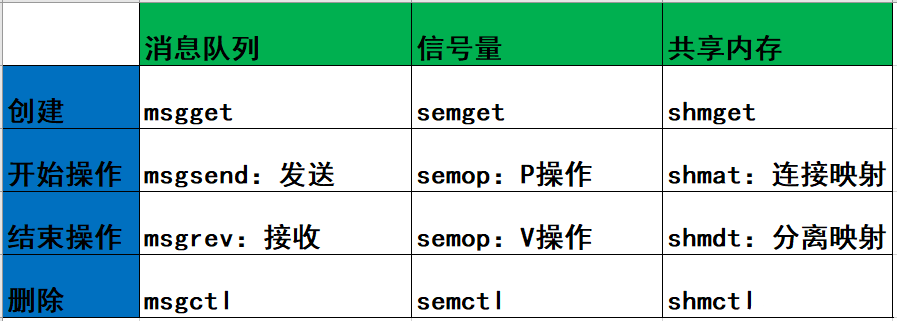

## 进程间通信（IPC）源码分析

本调研报告主要分析6.6内核版本的IPC源码部分。

**进程间通信（IPC，InterProcess Communication）**是指在不同进程之间传播或交换信息。IPC的方式通常有管道（包括无名管道和命名管道）、消息队列、信号量、共享存储、Socket、Streams等。其中 Socket和Streams支持不同主机上的两个进程IPC。

1. 管道pipe：管道是一种半双工的通信方式，数据只能单向流动，而且只能在具有亲缘关系的进程间使用。进程的亲缘关系通常是指父子进程关系。
2. 消息队列MessageQueue：消息队列是由消息的链表，存放在内核中并由消息队列标识符标识。消息队列克服了信号传递信息少、管道只能承载无格式字节流以及缓冲区大小受限等缺点。
3. 共享内存SharedMemory：共享内存就是映射一段能被其他进程所访问的内存，这段共享内存由一个进程创建，但多个进程都可以访问。共享内存是最快的 IPC 方式，它是针对其他进程间通信方式运行效率低而专门设计的。它往往与其他通信机制，如信号量，配合使用，来实现进程间的同步和通信。
4. 信号 ( signal ) ： 信号是一种比较复杂的通信方式，用于通知接收进程某个事件已经发生。
5. 信号量Semaphore：信号量是一个计数器，可以用来控制多个进程对共享资源的访问。它常作为一种锁机制，防止某进程正在访问共享资源时，其他进程也访问该资源。因此，主要作为进程间以及同一进程内不同线程之间的同步手段。
6. 套接字Socket：套接字也是一种进程间通信机制，与其他通信机制不同的是，它可用于不同及其间的进程通信

IPC（Inter-Process Communication，进程间通信）相关的代码主要位于内核源码树的`ipc`目录下（主要是信号量、共享内存以及消息队列），管道和命名管道的实现主要在`fs/pipe.c`文件中，套接字主要分布在`net`目录下。

### **IPC目录源码分析**：

**compat.c**：

- 这个文件包含了兼容性代码，确保IPC机制在不同版本的Linux内核或不同硬件架构上正常工作。

**ipc_sysctl.c**：

- 这个文件管理IPC的系统控制（sysctl）接口。Sysctl允许在运行时读取和修改内核参数，这个文件处理与IPC相关的参数。

**mq_sysctl.c**：

- 类似于`ipc_sysctl.c`，但专门用于消息队列（MQ）。它管理消息队列IPC机制的sysctl接口参数。

**mqueue.c**：

- 这个文件实现了消息队列功能。消息队列用于在进程之间发送和接收消息，提供一种IPC方法。

**msg.c**：

- 这个文件可能处理System V消息队列的实现，这是类Unix操作系统中另一种消息传递IPC机制。

**msgutil.c**：

- 包含消息队列的实用函数。这些函数可能协助完成消息队列的常见操作，例如创建、删除和管理消息缓冲区。

**namespace.c**：

- IPC命名空间，管理IPC命名空间的创建、销毁及相关操作。

- 核心函数：

  1、`inc_ipc_namespaces` 和 `dec_ipc_namespaces`

  这两个函数用于增加和减少IPC命名空间的引用计数，确保正确管理命名空间的生命周期。

  2、`create_ipc_ns`创建一个新的IPC命名空间，包括初始化相关的数据结构和资源

  3、`copy_ipcs`

  这个函数在创建新进程时复制IPC命名空间。如果`CLONE_NEWIPC`标志被设置，则创建新的命名空间，否则返回现有的命名空间。

  4、`free_ipcs`

  这个函数释放某个命名空间中的所有IPC资源。

  5、`free_ipc_ns`

  这个函数释放IPC命名空间，包括相关资源的清理工作。

  6、`put_ipc_ns`

  这个函数用于减少IPC命名空间的引用计数，并在引用计数为0时释放命名空间。

  7、`ipcns_get`, `ipcns_put`, `ipcns_install`, `ipcns_owner`

  这些函数是针对IPC命名空间的操作接口，提供了获取、释放、安装和获取所有者等功能。

**sem.c**：

- 这个文件实现了信号量功能，一种用于控制多个进程对共享资源访问的同步机制。

**shm.c**：

- 这个文件处理共享内存段，允许多个进程访问相同的内存空间进行IPC。共享内存是最快的IPC机制之一。

**syscall.c**：

- 实现了一个旧的SysV IPC系统调用多路复用器 `sys_ipc`，并提供了一个新的系统调用 `ksys_ipc` 来处理各种IPC操作。这些操作包括信号量、消息队列和共享内存的创建、控制和操作。代码还包含了兼容性处理，以支持32位和64位系统之间的交互。

- 核心函数：

  1、 `ksys_ipc` 函数

  `ksys_ipc` 是实际处理IPC请求的核心函数。它根据传入的 `call` 参数确定具体的IPC操作，并调用相应的内核函数来处理具体的IPC操作。

  2、`compat_ksys_ipc`函数

  与上面那个函数一样，不过是做了一些兼容性处理。

  3、这个宏定义了一个新的系统调用 `ipc`，它接收6个参数，并将这些参数传递给 `ksys_ipc` 函数进行处理。

  ```c
  SYSCALL_DEFINE6(ipc, unsigned int, call, int, first, unsigned long, second,
          unsigned long, third, void __user *, ptr, long, fifth)
  {
      return ksys_ipc(call, first, second, third, ptr, fifth);
  }
  ```

**util.c**：

- 包含在不同IPC机制中共享的实用函数。这些函数可能包括内存分配、错误处理或其他通用任务的辅助函数。用于初始化和管理 Linux 系统的 System V IPC（进程间通信）机制的一个模块。System V IPC 包括信号量（sem）、消息队列（msg）和共享内存（shm）。代码涉及 IPC 对象的创建、查找、权限检查、以及 ID 管理等操作。

- 核心函数:

  1、结构体定义

  ```c
  struct ipc_proc_iface {
  	const char *path;
  	const char *header;
  	int ids;
  	int (*show)(struct seq_file *, void *);
  };
  ```

  `ipc_proc_iface` 结构体定义了在 `/proc` 文件系统中显示 IPC 信息的接口。

  2、初始化函数

  ```c
  static int __init ipc_init(void) {
  	proc_mkdir("sysvipc", NULL);
  	sem_init();
  	msg_init();
  	shm_init();
  	return 0;
  }
  device_initcall(ipc_init);
  ```

  `ipc_init` 函数用于初始化 IPC 子系统，创建 `/proc/sysvipc` 目录，并调用信号量、消息队列和共享内存的初始化函数。

  3、哈希表参数

  ```c
  static const struct rhashtable_params ipc_kht_params = {
  	.head_offset = offsetof(struct kern_ipc_perm, khtnode),
  	.key_offset = offsetof(struct kern_ipc_perm, key),
  	.key_len = sizeof_field(struct kern_ipc_perm, key),
  	.automatic_shrinking = true,
  };
  ```

  `ipc_kht_params` 定义了 IPC 对象哈希表的参数，包括头部偏移、键偏移和键长度。

  4、IPC ID 初始化

  ```c
  void ipc_init_ids(struct ipc_ids *ids) {
  	ids->in_use = 0;
  	ids->seq = 0;
  	init_rwsem(&ids->rwsem);
  	rhashtable_init(&ids->key_ht, &ipc_kht_params);
  	idr_init(&ids->ipcs_idr);
  	ids->max_idx = -1;
  	ids->last_idx = -1;
  #ifdef CONFIG_CHECKPOINT_RESTORE
  	ids->next_id = -1;
  #endif
  }
  ```

  `ipc_init_ids` 函数初始化 IPC 标识符集，设置初始值并初始化哈希表和 ID 管理器。

  5、进程接口初始化

  ```c
  #ifdef CONFIG_PROC_FS
  static const struct proc_ops sysvipc_proc_ops;
  void __init ipc_init_proc_interface(const char *path, const char *header, int ids, int (*show)(struct seq_file *, void *)) {
  	struct proc_dir_entry *pde;
  	struct ipc_proc_iface *iface;
  
  	iface = kmalloc(sizeof(*iface), GFP_KERNEL);
  	if (!iface)
  		return;
  	iface->path = path;
  	iface->header = header;
  	iface->ids = ids;
  	iface->show = show;
  
  	pde = proc_create_data(path, S_IRUGO, NULL, &sysvipc_proc_ops, iface);
  	if (!pde)
  		kfree(iface);
  }
  #endif
  ```

  `ipc_init_proc_interface` 函数创建 `/proc` 文件系统中的 IPC 信息接口。

  6、查找 IPC 键

  ```c
  static struct kern_ipc_perm *ipc_findkey(struct ipc_ids *ids, key_t key) {
  	struct kern_ipc_perm *ipcp;
  
  	ipcp = rhashtable_lookup_fast(&ids->key_ht, &key, ipc_kht_params);
  	if (!ipcp)
  		return NULL;
  
  	rcu_read_lock();
  	ipc_lock_object(ipcp);
  	return ipcp;
  }
  ```

  `ipc_findkey` 函数在哈希表中查找给定键的 IPC 对象，并返回该对象。

  7、ID 分配

  ```c
  static inline int ipc_idr_alloc(struct ipc_ids *ids, struct kern_ipc_perm *new) {
  	int idx, next_id = -1;
  
  #ifdef CONFIG_CHECKPOINT_RESTORE
  	next_id = ids->next_id;
  	ids->next_id = -1;
  #endif
  
  	if (next_id < 0) {
  		int max_idx;
  
  		max_idx = max(ids->in_use*3/2, ipc_min_cycle);
  		max_idx = min(max_idx, ipc_mni);
  
  		idx = idr_alloc_cyclic(&ids->ipcs_idr, NULL, 0, max_idx, GFP_NOWAIT);
  
  		if (idx >= 0) {
  			if (idx <= ids->last_idx) {
  				ids->seq++;
  				if (ids->seq >= ipcid_seq_max())
  					ids->seq = 0;
  			}
  			ids->last_idx = idx;
  
  			new->seq = ids->seq;
  			idr_replace(&ids->ipcs_idr, new, idx);
  		}
  	} else {
  		new->seq = ipcid_to_seqx(next_id);
  		idx = idr_alloc(&ids->ipcs_idr, new, ipcid_to_idx(next_id), 0, GFP_NOWAIT);
  	}
  	if (idx >= 0)
  		new->id = (new->seq << ipcmni_seq_shift()) + idx;
  	return idx;
  }
  ```

  `ipc_idr_alloc` 函数将一个新的IPC对象添加到IDR中，并且分配新的 IPC ID和设置 IPC 对象的序列号。

  8、添加一个IPC对象

  ```c
  int ipc_addid(struct ipc_ids *ids, struct kern_ipc_perm *new, int limit) {
  	kuid_t euid;
  	kgid_t egid;
  	int idx, err;
  
  	refcount_set(&new->refcount, 1);
  
  	if (limit > ipc_mni)
  		limit = ipc_mni;
  
  	if (ids->in_use >= limit)
  		return -ENOSPC;
  
  	idr_preload(GFP_KERNEL);
  
  	spin_lock_init(&new->lock);
  	rcu_read_lock();
  	spin_lock(&new->lock);
  
  	current_euid_egid(&euid, &egid);
  	new->cuid = new->uid = euid;
  	new->gid = new->cgid = egid;
  
  	new->deleted = false;
  
  	idx = ipc_idr_alloc(ids, new);
  	idr_preload_end();
  
  	if (idx >= 0 && new->key != IPC_PRIVATE) {
  		err = rhashtable_insert_fast(&ids->key_ht, &new->khtnode, ipc_kht_params);
  		if (err < 0) {
  			idr_remove(&ids->ipcs_idr, idx);
  			idx = err;
  		}
  	}
  	if (idx < 0) {
  		new->deleted = true;
  		spin_unlock(&new->lock);
  		rcu_read_unlock();
  		return idx;
  	}
  
  	ids->in_use++;
  	if (idx > ids->max_idx)
  		ids->max_idx = idx;
  	return idx;
  }
  ```

  `ipc_addid` 函数将新的 IPC 对象添加到 IDR，并在哈希表中插入该对象。

  8、新建 IPC 对象

  ```c
  static int ipcget_new(struct ipc_namespace *ns, struct ipc_ids *ids, const struct ipc_ops *ops, struct ipc_params *params) {
  	int err;
  
  	down_write(&ids->rwsem);
  	err = ops->getnew(ns, params);
  	up_write(&ids->rwsem);
  	return err;
  }
  ```

  `ipcget_new` 函数创建一个新的 IPC 对象。

  9、检查 IPC 权限

  ```c
  static int ipc_check_perms(struct ipc_namespace *ns, struct kern_ipc_perm *ipcp, const struct ipc_ops *ops, struct ipc_params *params) {
  	int err;
  
  	if (ipcperms(ns, ipcp, params->flg))
  		err = -EACCES;
  	else {
  		err = ops->associate(ipcp, params->flg);
  		if (!err)
  			err = ipcp->id;
  	}
  
  	return err;
  }
  ```

  `ipc_check_perms` 函数检查 IPC 对象的权限。

  10、获取公共 IPC 对象

  ```c
  static int ipcget_public(struct ipc_namespace *ns, struct ipc_ids *ids, const struct ipc_ops *ops, struct ipc_params *params) {
  	struct kern_ipc_perm *ipcp;
  	int flg = params->flg;
  	int err;
  
  	down_write(&ids->rwsem);
  	ipcp = ipc_findkey(ids, params->key);
  	if (ipcp == NULL) {
  		if (!(flg & IPC_CREAT))
  			err = -ENOENT;
  		else
  			err = ops->getnew(ns, params);
  	} else {
  		if (flg & IPC_CREAT && flg & IPC_EXCL)
  			err = -EEXIST;
  		else
  			err = ipc_check_perms(ns, ipcp, ops, params);
  
  		ipc_unlock_object(ipcp);
  	}
  	up_write(&ids->rwsem);
  
  	return err;
  }
  
  ```

  `ipcget` 函数是 IPC 对象的入口函数，根据键值决定是获取现有对象还是创建新对象。

  11、从哈希表中移除ipc

  ```c
  static void ipc_kht_remove(struct ipc_ids *ids, struct kern_ipc_perm *ipcp)
  {
  	if (ipcp->key != IPC_PRIVATE)
  		WARN_ON_ONCE(rhashtable_remove_fast(&ids->key_ht, &ipcp->khtnode,
  				       ipc_kht_params));
  }
  ```

  `ipc_kht_remove`函数用于从哈希表移除ipc

  12、删除ipc

  ```c
  void ipc_rmid(struct ipc_ids *ids, struct kern_ipc_perm *ipcp)
  {
  	int idx = ipcid_to_idx(ipcp->id);
  
  	WARN_ON_ONCE(idr_remove(&ids->ipcs_idr, idx) != ipcp);
  	ipc_kht_remove(ids, ipcp);
  	ids->in_use--;
  	ipcp->deleted = true;
  
  	if (unlikely(idx == ids->max_idx)) {
  		idx = ids->max_idx-1;
  		if (idx >= 0)
  			idx = ipc_search_maxidx(ids, idx);
  		ids->max_idx = idx;
  	}
  }
  ```

  `ipc_rmid`函数用于移除ipc

  **其余函数未全部列出**

**util.h**：

- 与`util.c`相关的头文件。它声明了`util.c`中定义的函数和变量，使它们对IPC子系统的其他部分可访问

Linux 内核提供了多种 IPC 机制，其中System V IPC 包括：System V 信号量、System V消息队列、System V 共享内存。这三种通信机制有很多相似之处。



创建流程如下：


#### 消息队列

**消息队列**，是消息的链接表，存放在内核中。一个消息队列由一个标识符（即队列ID）来标识。

消息队列（Message Queue,简称MQ）是由内核管理的消息链接表，由消息队列标识符标识，标识符简称队列ID。消息队列提供了进程之间单向传送数据的方法，每个消息包含有一个正的长整型类型的数据段、一个非负的长度以及实际数据字节数（对应于长度），消息队列总字节数是有上限的，系统上消息队列总数也有上限。

MQ传递的是消息，也就是进程间需要传递的数据，系统内核中有很多MQ，这些MQ采用链表实现并由系统内核维护，每个MQ用消息队列描述符（qid)来区分，每个MQ 的pid具有唯一性。


##### 原型

```
#include <sys/msg.h>
// 创建或打开消息队列：成功返回队列ID，失败返回-1
int msgget(key_t key, int flag);
// 添加消息：成功返回0，失败返回-1
int msgsnd(int msqid, const void *ptr, size_t size, int flag);
// 读取消息：成功返回消息数据的长度，失败返回-1
int msgrcv(int msqid, void *ptr, size_t size, long type,int flag);
// 控制消息队列：成功返回0，失败返回-1
int msgctl(int msqid, int cmd, struct msqid_ds *buf);
```

在以下两种情况下，`msgget`将创建一个新的消息队列：

- 如果没有与键值key相对应的消息队列，并且flag中包含了`IPC_CREAT`标志位。
- key参数为`IPC_PRIVATE`。

函数`msgrcv`在读取消息队列时，type参数有下面几种情况：

- `type == 0`，返回队列中的第一个消息；
- `type > 0`，返回队列中消息类型为 type 的第一个消息；
- `type < 0`，返回队列中消息类型值小于或等于 type 绝对值的消息，如果有多个，则取类型值最小的消息。

##### 主要结构体

```c
/* one msq_queue structure for each present queue on the system */
struct msg_queue {
	struct kern_ipc_perm q_perm;
	time64_t q_stime;		/* last msgsnd time */
	time64_t q_rtime;		/* last msgrcv time */
	time64_t q_ctime;		/* last change time */
	unsigned long q_cbytes;		/* current number of bytes on queue */
	unsigned long q_qnum;		/* number of messages in queue */
	unsigned long q_qbytes;		/* max number of bytes on queue */
	struct pid *q_lspid;		/* pid of last msgsnd */
	struct pid *q_lrpid;		/* last receive pid */

	struct list_head q_messages;
	struct list_head q_receivers;
	struct list_head q_senders;
} __randomize_layout;

/* one msg_receiver structure for each sleeping receiver */
struct msg_receiver {
	struct list_head	r_list;
	struct task_struct	*r_tsk;

	int			r_mode;
	long			r_msgtype;
	long			r_maxsize;

	struct msg_msg		*r_msg;
};

/* one msg_sender for each sleeping sender */
struct msg_sender {
	struct list_head	list;
	struct task_struct	*tsk;
	size_t                  msgsz;
};
```

##### 核心函数

`msgget`函数实现负责创建或打开消息队列

```c
long ksys_msgget(key_t key, int msgflg)
{
	struct ipc_namespace *ns;
	static const struct ipc_ops msg_ops = {
		.getnew = newque,
		.associate = security_msg_queue_associate,
	};
	struct ipc_params msg_params;

	ns = current->nsproxy->ipc_ns;

	msg_params.key = key;
	msg_params.flg = msgflg;

	return ipcget(ns, &msg_ids(ns), &msg_ops, &msg_params);
}
```

`msgsnd`函数实际由`do_msgsnd`函数实现，负责对消息的发送。

```c
static long do_msgsnd(int msqid, long mtype, void __user *mtext,
		size_t msgsz, int msgflg)
{
	struct msg_queue *msq;
	struct msg_msg *msg;
	int err;
	struct ipc_namespace *ns;
	DEFINE_WAKE_Q(wake_q);

	ns = current->nsproxy->ipc_ns;

	if (msgsz > ns->msg_ctlmax || (long) msgsz < 0 || msqid < 0)
		return -EINVAL;
	if (mtype < 1)
		return -EINVAL;

	msg = load_msg(mtext, msgsz);
	if (IS_ERR(msg))
		return PTR_ERR(msg);

	msg->m_type = mtype;
	msg->m_ts = msgsz;

	rcu_read_lock();
	msq = msq_obtain_object_check(ns, msqid);
	if (IS_ERR(msq)) {
		err = PTR_ERR(msq);
		goto out_unlock1;
	}

	ipc_lock_object(&msq->q_perm);

	for (;;) {
		struct msg_sender s;

		err = -EACCES;
		if (ipcperms(ns, &msq->q_perm, S_IWUGO))
			goto out_unlock0;

		/* raced with RMID? */
		if (!ipc_valid_object(&msq->q_perm)) {
			err = -EIDRM;
			goto out_unlock0;
		}

		err = security_msg_queue_msgsnd(&msq->q_perm, msg, msgflg);
		if (err)
			goto out_unlock0;

		if (msg_fits_inqueue(msq, msgsz))
			break;

		/* queue full, wait: */
		if (msgflg & IPC_NOWAIT) {
			err = -EAGAIN;
			goto out_unlock0;
		}

		/* enqueue the sender and prepare to block */
		ss_add(msq, &s, msgsz);

		if (!ipc_rcu_getref(&msq->q_perm)) {
			err = -EIDRM;
			goto out_unlock0;
		}

		ipc_unlock_object(&msq->q_perm);
		rcu_read_unlock();
		schedule();

		rcu_read_lock();
		ipc_lock_object(&msq->q_perm);

		ipc_rcu_putref(&msq->q_perm, msg_rcu_free);
		/* raced with RMID? */
		if (!ipc_valid_object(&msq->q_perm)) {
			err = -EIDRM;
			goto out_unlock0;
		}
		ss_del(&s);

		if (signal_pending(current)) {
			err = -ERESTARTNOHAND;
			goto out_unlock0;
		}

	}

	ipc_update_pid(&msq->q_lspid, task_tgid(current));
	msq->q_stime = ktime_get_real_seconds();

	if (!pipelined_send(msq, msg, &wake_q)) {
		/* no one is waiting for this message, enqueue it */
		list_add_tail(&msg->m_list, &msq->q_messages);
		msq->q_cbytes += msgsz;
		msq->q_qnum++;
		percpu_counter_add_local(&ns->percpu_msg_bytes, msgsz);
		percpu_counter_add_local(&ns->percpu_msg_hdrs, 1);
	}

	err = 0;
	msg = NULL;

out_unlock0:
	ipc_unlock_object(&msq->q_perm);
	wake_up_q(&wake_q);
out_unlock1:
	rcu_read_unlock();
	if (msg != NULL)
		free_msg(msg);
	return err;
}
```

`msgrcv`函数实际由`do_msgr`cv函数实现，实现对消息的接收。

```c
static long do_msgrcv(int msqid, void __user *buf, size_t bufsz, long msgtyp, int msgflg,
	       long (*msg_handler)(void __user *, struct msg_msg *, size_t))
{
	int mode;
	struct msg_queue *msq;
	struct ipc_namespace *ns;
	struct msg_msg *msg, *copy = NULL;
	DEFINE_WAKE_Q(wake_q);

	ns = current->nsproxy->ipc_ns;

	if (msqid < 0 || (long) bufsz < 0)
		return -EINVAL;

	if (msgflg & MSG_COPY) {
		if ((msgflg & MSG_EXCEPT) || !(msgflg & IPC_NOWAIT))
			return -EINVAL;
		copy = prepare_copy(buf, min_t(size_t, bufsz, ns->msg_ctlmax));
		if (IS_ERR(copy))
			return PTR_ERR(copy);
	}
	mode = convert_mode(&msgtyp, msgflg);

	rcu_read_lock();
	msq = msq_obtain_object_check(ns, msqid);
	if (IS_ERR(msq)) {
		rcu_read_unlock();
		free_copy(copy);
		return PTR_ERR(msq);
	}

	for (;;) {
		struct msg_receiver msr_d;

		msg = ERR_PTR(-EACCES);
		if (ipcperms(ns, &msq->q_perm, S_IRUGO))
			goto out_unlock1;

		ipc_lock_object(&msq->q_perm);

		/* raced with RMID? */
		if (!ipc_valid_object(&msq->q_perm)) {
			msg = ERR_PTR(-EIDRM);
			goto out_unlock0;
		}

		msg = find_msg(msq, &msgtyp, mode);
		if (!IS_ERR(msg)) {
			/*
			 * Found a suitable message.
			 * Unlink it from the queue.
			 */
			if ((bufsz < msg->m_ts) && !(msgflg & MSG_NOERROR)) {
				msg = ERR_PTR(-E2BIG);
				goto out_unlock0;
			}
			/*
			 * If we are copying, then do not unlink message and do
			 * not update queue parameters.
			 */
			if (msgflg & MSG_COPY) {
				msg = copy_msg(msg, copy);
				goto out_unlock0;
			}

			list_del(&msg->m_list);
			msq->q_qnum--;
			msq->q_rtime = ktime_get_real_seconds();
			ipc_update_pid(&msq->q_lrpid, task_tgid(current));
			msq->q_cbytes -= msg->m_ts;
			percpu_counter_sub_local(&ns->percpu_msg_bytes, msg->m_ts);
			percpu_counter_sub_local(&ns->percpu_msg_hdrs, 1);
			ss_wakeup(msq, &wake_q, false);

			goto out_unlock0;
		}

		/* No message waiting. Wait for a message */
		if (msgflg & IPC_NOWAIT) {
			msg = ERR_PTR(-ENOMSG);
			goto out_unlock0;
		}

		list_add_tail(&msr_d.r_list, &msq->q_receivers);
		msr_d.r_tsk = current;
		msr_d.r_msgtype = msgtyp;
		msr_d.r_mode = mode;
		if (msgflg & MSG_NOERROR)
			msr_d.r_maxsize = INT_MAX;
		else
			msr_d.r_maxsize = bufsz;

		/* memory barrier not require due to ipc_lock_object() */
		WRITE_ONCE(msr_d.r_msg, ERR_PTR(-EAGAIN));

		/* memory barrier not required, we own ipc_lock_object() */
		__set_current_state(TASK_INTERRUPTIBLE);

		ipc_unlock_object(&msq->q_perm);
		rcu_read_unlock();
		schedule();

		/*
		 * Lockless receive, part 1:
		 * We don't hold a reference to the queue and getting a
		 * reference would defeat the idea of a lockless operation,
		 * thus the code relies on rcu to guarantee the existence of
		 * msq:
		 * Prior to destruction, expunge_all(-EIRDM) changes r_msg.
		 * Thus if r_msg is -EAGAIN, then the queue not yet destroyed.
		 */
		rcu_read_lock();

		/*
		 * Lockless receive, part 2:
		 * The work in pipelined_send() and expunge_all():
		 * - Set pointer to message
		 * - Queue the receiver task for later wakeup
		 * - Wake up the process after the lock is dropped.
		 *
		 * Should the process wake up before this wakeup (due to a
		 * signal) it will either see the message and continue ...
		 */
		msg = READ_ONCE(msr_d.r_msg);
		if (msg != ERR_PTR(-EAGAIN)) {
			/* see MSG_BARRIER for purpose/pairing */
			smp_acquire__after_ctrl_dep();

			goto out_unlock1;
		}

		 /*
		  * ... or see -EAGAIN, acquire the lock to check the message
		  * again.
		  */
		ipc_lock_object(&msq->q_perm);

		msg = READ_ONCE(msr_d.r_msg);
		if (msg != ERR_PTR(-EAGAIN))
			goto out_unlock0;

		list_del(&msr_d.r_list);
		if (signal_pending(current)) {
			msg = ERR_PTR(-ERESTARTNOHAND);
			goto out_unlock0;
		}

		ipc_unlock_object(&msq->q_perm);
	}

out_unlock0:
	ipc_unlock_object(&msq->q_perm);
	wake_up_q(&wake_q);
out_unlock1:
	rcu_read_unlock();
	if (IS_ERR(msg)) {
		free_copy(copy);
		return PTR_ERR(msg);
	}

	bufsz = msg_handler(buf, msg, bufsz);
	free_msg(msg);

	return bufsz;
}

long ksys_msgrcv(int msqid, struct msgbuf __user *msgp, size_t msgsz,
		 long msgtyp, int msgflg)
{
	return do_msgrcv(msqid, msgp, msgsz, msgtyp, msgflg, do_msg_fill);
}
```

`ksys_msgctl`函数负责控制消息队列，根据具体cmd选择不同的操作。

```c
static long ksys_msgctl(int msqid, int cmd, struct msqid_ds __user *buf, int version)
{
	struct ipc_namespace *ns;
	struct msqid64_ds msqid64;
	int err;

	if (msqid < 0 || cmd < 0)
		return -EINVAL;

	ns = current->nsproxy->ipc_ns;

	switch (cmd) {
	case IPC_INFO:
	case MSG_INFO: {
		struct msginfo msginfo;
		err = msgctl_info(ns, msqid, cmd, &msginfo);
		if (err < 0)
			return err;
		if (copy_to_user(buf, &msginfo, sizeof(struct msginfo)))
			err = -EFAULT;
		return err;
	}
	case MSG_STAT:	/* msqid is an index rather than a msg queue id */
	case MSG_STAT_ANY:
	case IPC_STAT:
		err = msgctl_stat(ns, msqid, cmd, &msqid64);
		if (err < 0)
			return err;
		if (copy_msqid_to_user(buf, &msqid64, version))
			err = -EFAULT;
		return err;
	case IPC_SET:
		if (copy_msqid_from_user(&msqid64, buf, version))
			return -EFAULT;
		return msgctl_down(ns, msqid, cmd, &msqid64.msg_perm,
				   msqid64.msg_qbytes);
	case IPC_RMID:
		return msgctl_down(ns, msqid, cmd, NULL, 0);
	default:
		return  -EINVAL;
	}
}
```


#### 信号量

**信号量（semaphore）**与已经介绍过的 IPC 结构不同，它是一个计数器。信号量用于实现进程间的互斥与同步，而不是用于存储进程间通信数据。

##### **特点**

1. 信号量用于进程间同步，若要在进程间传递数据需要结合*共享内存*。
2. 信号量基于操作系统的 PV 操作，程序对信号量的操作都是原子操作。
3. 每次对信号量的 PV 操作不仅限于对信号量值加 1 或减 1，而且可以加减任意正整数。
4. 支持信号量组。


##### **结构体**

最简单的信号量是只能取 0 和 1 的变量，这也是信号量最常见的一种形式，叫做**二值信号量（Binary Semaphore）**。而可以取多个正整数的信号量被称为通用信号量。

```c
/* One semaphore structure for each semaphore in the system. */
struct sem {
	int	semval;		/* current value */
	/*
	 * PID of the process that last modified the semaphore. For
	 * Linux, specifically these are:
	 *  - semop
	 *  - semctl, via SETVAL and SETALL.
	 *  - at task exit when performing undo adjustments (see exit_sem).
	 */
	struct pid *sempid;
	spinlock_t	lock;	/* spinlock for fine-grained semtimedop */
	struct list_head pending_alter; /* pending single-sop operations */
					/* that alter the semaphore */
	struct list_head pending_const; /* pending single-sop operations */
					/* that do not alter the semaphore*/
	time64_t	 sem_otime;	/* candidate for sem_otime */
} ____cacheline_aligned_in_smp;
/* One sem_array data structure for each set of semaphores in the system. */
struct sem_array {
	struct kern_ipc_perm	sem_perm;	/* permissions .. see ipc.h */
	time64_t		sem_ctime;	/* create/last semctl() time */
	struct list_head	pending_alter;	/* pending operations */
						/* that alter the array */
	struct list_head	pending_const;	/* pending complex operations */
						/* that do not alter semvals */
	struct list_head	list_id;	/* undo requests on this array */
	int			sem_nsems;	/* no. of semaphores in array */
	int			complex_count;	/* pending complex operations */
	unsigned int		use_global_lock;/* >0: global lock required */

	struct sem		sems[];
} __randomize_layout;
```

##### **核心函数**

`semget`函数

```c
long ksys_semget(key_t key, int nsems, int semflg)
{
	struct ipc_namespace *ns;
	static const struct ipc_ops sem_ops = {
		.getnew = newary,
		.associate = security_sem_associate,
		.more_checks = sem_more_checks,
	};
	struct ipc_params sem_params;

	ns = current->nsproxy->ipc_ns;

	if (nsems < 0 || nsems > ns->sc_semmsl)
		return -EINVAL;

	sem_params.key = key;
	sem_params.flg = semflg;
	sem_params.u.nsems = nsems;

	return ipcget(ns, &sem_ids(ns), &sem_ops, &sem_params);
}
```

`perform_atomic_semop`函数，尝试在给定的数组上进行信号量操作（PV操作），遍历两次队列确保整个操作顺利完成。

```c
/**
 * perform_atomic_semop[_slow] - Attempt to perform semaphore
 *                               operations on a given array.
 * @sma: semaphore array
 * @q: struct sem_queue that describes the operation
 *
 * Caller blocking are as follows, based the value
 * indicated by the semaphore operation (sem_op):
 *
 *  (1) >0 never blocks.
 *  (2)  0 (wait-for-zero operation): semval is non-zero.
 *  (3) <0 attempting to decrement semval to a value smaller than zero.
 *
 * Returns 0 if the operation was possible.
 * Returns 1 if the operation is impossible, the caller must sleep.
 * Returns <0 for error codes.
 */
static int perform_atomic_semop(struct sem_array *sma, struct sem_queue *q)
{
	int result, sem_op, nsops;
	struct sembuf *sop;
	struct sem *curr;
	struct sembuf *sops;
	struct sem_undo *un;

	sops = q->sops;
	nsops = q->nsops;
	un = q->undo;

	if (unlikely(q->dupsop))
		return perform_atomic_semop_slow(sma, q);

	/*
	 * We scan the semaphore set twice, first to ensure that the entire
	 * operation can succeed, therefore avoiding any pointless writes
	 * to shared memory and having to undo such changes in order to block
	 * until the operations can go through.
	 */
	for (sop = sops; sop < sops + nsops; sop++) {
		int idx = array_index_nospec(sop->sem_num, sma->sem_nsems);

		curr = &sma->sems[idx];
		sem_op = sop->sem_op;
		result = curr->semval;

		if (!sem_op && result)
			goto would_block; /* wait-for-zero */

		result += sem_op;
		if (result < 0)
			goto would_block;

		if (result > SEMVMX)
			return -ERANGE;

		if (sop->sem_flg & SEM_UNDO) {
			int undo = un->semadj[sop->sem_num] - sem_op;

			/* Exceeding the undo range is an error. */
			if (undo < (-SEMAEM - 1) || undo > SEMAEM)
				return -ERANGE;
		}
	}

	for (sop = sops; sop < sops + nsops; sop++) {
		curr = &sma->sems[sop->sem_num];
		sem_op = sop->sem_op;

		if (sop->sem_flg & SEM_UNDO) {
			int undo = un->semadj[sop->sem_num] - sem_op;

			un->semadj[sop->sem_num] = undo;
		}
		curr->semval += sem_op;
		ipc_update_pid(&curr->sempid, q->pid);
	}

	return 0;

would_block:
	q->blocking = sop;
	return sop->sem_flg & IPC_NOWAIT ? -EAGAIN : 1;
}
```

`ksys_semctl`函数，该函数用来控制信号量，它与共享内存的shmctl函数和消息队列的msgctl相似

```c
static long ksys_semctl(int semid, int semnum, int cmd, unsigned long arg, int version)
{
	struct ipc_namespace *ns;
	void __user *p = (void __user *)arg;
	struct semid64_ds semid64;
	int err;

	if (semid < 0)
		return -EINVAL;

	ns = current->nsproxy->ipc_ns;

	switch (cmd) {
	case IPC_INFO:
	case SEM_INFO:
		return semctl_info(ns, semid, cmd, p);
	case IPC_STAT:
	case SEM_STAT:
	case SEM_STAT_ANY:
		err = semctl_stat(ns, semid, cmd, &semid64);
		if (err < 0)
			return err;
		if (copy_semid_to_user(p, &semid64, version))
			err = -EFAULT;
		return err;
	case GETALL:
	case GETVAL:
	case GETPID:
	case GETNCNT:
	case GETZCNT:
	case SETALL:
		return semctl_main(ns, semid, semnum, cmd, p);
	case SETVAL: {
		int val;
#if defined(CONFIG_64BIT) && defined(__BIG_ENDIAN)
		/* big-endian 64bit */
		val = arg >> 32;
#else
		/* 32bit or little-endian 64bit */
		val = arg;
#endif
		return semctl_setval(ns, semid, semnum, val);
	}
	case IPC_SET:
		if (copy_semid_from_user(&semid64, p, version))
			return -EFAULT;
		fallthrough;
	case IPC_RMID:
		return semctl_down(ns, semid, cmd, &semid64);
	default:
		return -EINVAL;
	}
}
```


#### 共享内存

**共享内存（Shared Memory）**，指两个或多个进程共享一个给定的存储区。

##### **特点**

1. 共享内存是最快的一种 IPC，因为进程是直接对内存进行存取。
2. 共享内存操作默认不阻塞，如果多个进程同时读写共享内存，可能出现数据混乱，共享内存需要借助其他机制来保证进程间的数据同步，比如：信号量，共享内存内部没有提供这种机制。


##### **核心函数**

1. **创建共享内存段 (`shmget`)**：
   - `shmget` 系统调用创建新的共享内存段，分配对应的物理内存，并初始化相关的结构体信息。
2. **附加共享内存段 (`shmat`)**：
   - `shmat` 系统调用将共享内存段映射到调用进程的地址空间中，更新附加计数和时间戳。
3. **分离共享内存段 (`shmdt`)**：
   - `shmdt` 系统调用将共享内存段从调用进程的地址空间中解除映射，更新附加计数和时间戳。
4. **控制共享内存段 (`shmctl`)**：
   - `shmctl` 系统调用用于控制共享内存段，例如设置权限、删除共享内存段等。

##### **主要结构体**

结构体 `shmid_kernel`

共享内存段在内核中使用 `shmid_kernel` 结构体表示，该结构体定义如下：

```c
struct shmid_kernel {
	struct kern_ipc_perm shm_perm; /* 权限结构体 */
	struct file *shm_file;         /* 对应的文件 */
	size_t shm_segsz;              /* 段大小 */
	struct user_struct *shm_creator; /* 创建者 */
	struct user_struct *shm_last_attach; /* 最后一次附加的用户 */
	struct work_struct shm_rmid_work; /* 删除工作 */
	int shm_nattch;               /* 当前附加的进程数 */
	time64_t shm_atim;            /* 最后附加时间 */
	time64_t shm_dtim;            /* 最后分离时间 */
	time64_t shm_ctim;            /* 最后改变时间 */
	pid_t shm_cprid;              /* 创建者 PID */
	pid_t shm_lprid;              /* 最后附加或分离的 PID */
};
```

##### **详细分析**

实际源码中的函数名需要加上ksys_前缀，原因大概是为了区分内核内部调用和用户空间接口，ksys_shmget函数封装的一层后变成了shmget函数。

使用 `ksys_` 前缀可以清楚地将内核内部函数与用户空间系统调用接口区分开来。用户空间程序调用的是无前缀的系统调用（例如 `sys_open`），而内核内部模块或函数调用的是 `ksys_open`。

```c
SYSCALL_DEFINE3(shmget, key_t, key, size_t, size, int, shmflg)
{
	return ksys_shmget(key, size, shmflg);
}
```

**1、共享内存的创建**

创建共享内存段的主要函数是 `shmget`。

实际调用的函数是`ipcget()`。共享内存、信号量、消息队列三种对象创建的时候都会调用这个函数。

```c
long ksys_shmget(key_t key, size_t size, int shmflg)
{
	struct ipc_namespace *ns;
	static const struct ipc_ops shm_ops = {
		.getnew = newseg,
		.associate = security_shm_associate,
		.more_checks = shm_more_checks,
	};
	struct ipc_params shm_params;

	ns = current->nsproxy->ipc_ns;

	shm_params.key = key;
	shm_params.flg = shmflg;
	shm_params.u.size = size;

	return ipcget(ns, &shm_ids(ns), &shm_ops, &shm_params);
}
```

参数:

key: 类型 key_t 是个整形数，通过这个key可以创建或者打开一块共享内存，该参数的值一定要大于0

size: 创建共享内存的时候，指定共享内存的大小，如果是打开一块存在的共享内存，size 是没有意义的

shmflg：创建共享内存的时候指定的属性

- IPC_CREAT: 创建新的共享内存，如果创建共享内存，需要指定对共享内存的操作权限，比如：IPC_CREAT | 0664
- IPC_EXCL: 检测共享内存是否已经存在了，必须和 IPC_CREAT 一起使用

返回值：共享内存创建或者打开成功返回标识共享内存的唯一的 ID，失败返回 - 1.

我们回头来看看`shmget()`究竟干了啥，首先看一下`ipcget()`

```c
int ipcget(struct ipc_namespace *ns, struct ipc_ids *ids,
            const struct ipc_ops *ops, struct ipc_params *params)
{
    if (params->key == IPC_PRIVATE)
        return ipcget_new(ns, ids, ops, params);
    else
        return ipcget_public(ns, ids, ops, params);
}
```

如果传进来的参数是`IPC_PRIVATE`（这个宏的值是0）的话，无论是什么mode，都会创建一块新的共享内存。如果非0，则会去已有的共享内存中找有没有这个key的，有就返回，没有就新建。

**2、共享内存的关联**

关联共享内存段的主要函数是 `shmat`，它的逻辑全在`do_shmat()`中，所以我们直接看这个函数。

首先检查shmaddr的合法性并进行对齐，即调整为shmlba的整数倍。如果传入addr是0，前面检查部分只会加上一个MAP_SHARED标志，因为后面的mmap会自动为其分配地址。然后从那一段两行的注释开始，函数通过shmid尝试获取共享内存对象，并进行权限检查。然后修改shp中的一些数据，比如连接进程数加一。然后是通过`alloc_file_clone()`创建真正的要做mmap的file。在mmap之前还要对地址空间进行检查，检查是否和别的地址重叠，是否够用。实际的映射工作就在`do_mmap()`函数中做了。

```c
long do_shmat(int shmid, char __user *shmaddr, int shmflg,
	      ulong *raddr, unsigned long shmlba)
{
	struct shmid_kernel *shp;
	unsigned long addr = (unsigned long)shmaddr;
	unsigned long size;
	struct file *file, *base;
	int    err;
	unsigned long flags = MAP_SHARED;
	unsigned long prot;
	int acc_mode;
	struct ipc_namespace *ns;
	struct shm_file_data *sfd;
	int f_flags;
	unsigned long populate = 0;

	err = -EINVAL;
	if (shmid < 0)
		goto out;

	if (addr) {
		if (addr & (shmlba - 1)) {
			if (shmflg & SHM_RND) {
				addr &= ~(shmlba - 1);  /* round down */

				/*
				 * Ensure that the round-down is non-nil
				 * when remapping. This can happen for
				 * cases when addr < shmlba.
				 */
				if (!addr && (shmflg & SHM_REMAP))
					goto out;
			} else
#ifndef __ARCH_FORCE_SHMLBA
				if (addr & ~PAGE_MASK)
#endif
					goto out;
		}

		flags |= MAP_FIXED;
	} else if ((shmflg & SHM_REMAP))
		goto out;

	if (shmflg & SHM_RDONLY) {
		prot = PROT_READ;
		acc_mode = S_IRUGO;
		f_flags = O_RDONLY;
	} else {
		prot = PROT_READ | PROT_WRITE;
		acc_mode = S_IRUGO | S_IWUGO;
		f_flags = O_RDWR;
	}
	if (shmflg & SHM_EXEC) {
		prot |= PROT_EXEC;
		acc_mode |= S_IXUGO;
	}

	/*
	 * We cannot rely on the fs check since SYSV IPC does have an
	 * additional creator id...
	 */
	ns = current->nsproxy->ipc_ns;
	rcu_read_lock();
	shp = shm_obtain_object_check(ns, shmid);
	if (IS_ERR(shp)) {
		err = PTR_ERR(shp);
		goto out_unlock;
	}

	err = -EACCES;
	if (ipcperms(ns, &shp->shm_perm, acc_mode))
		goto out_unlock;

	err = security_shm_shmat(&shp->shm_perm, shmaddr, shmflg);
	if (err)
		goto out_unlock;

	ipc_lock_object(&shp->shm_perm);

	/* check if shm_destroy() is tearing down shp */
	if (!ipc_valid_object(&shp->shm_perm)) {
		ipc_unlock_object(&shp->shm_perm);
		err = -EIDRM;
		goto out_unlock;
	}

	/*
	 * We need to take a reference to the real shm file to prevent the
	 * pointer from becoming stale in cases where the lifetime of the outer
	 * file extends beyond that of the shm segment.  It's not usually
	 * possible, but it can happen during remap_file_pages() emulation as
	 * that unmaps the memory, then does ->mmap() via file reference only.
	 * We'll deny the ->mmap() if the shm segment was since removed, but to
	 * detect shm ID reuse we need to compare the file pointers.
	 */
	base = get_file(shp->shm_file);
	shp->shm_nattch++;
	size = i_size_read(file_inode(base));
	ipc_unlock_object(&shp->shm_perm);
	rcu_read_unlock();

	err = -ENOMEM;
	sfd = kzalloc(sizeof(*sfd), GFP_KERNEL);
	if (!sfd) {
		fput(base);
		goto out_nattch;
	}

	file = alloc_file_clone(base, f_flags,
			  is_file_hugepages(base) ?
				&shm_file_operations_huge :
				&shm_file_operations);
	err = PTR_ERR(file);
	if (IS_ERR(file)) {
		kfree(sfd);
		fput(base);
		goto out_nattch;
	}

	sfd->id = shp->shm_perm.id;
	sfd->ns = get_ipc_ns(ns);
	sfd->file = base;
	sfd->vm_ops = NULL;
	file->private_data = sfd;

	err = security_mmap_file(file, prot, flags);
	if (err)
		goto out_fput;

	if (mmap_write_lock_killable(current->mm)) {
		err = -EINTR;
		goto out_fput;
	}

	if (addr && !(shmflg & SHM_REMAP)) {
		err = -EINVAL;
		if (addr + size < addr)
			goto invalid;

		if (find_vma_intersection(current->mm, addr, addr + size))
			goto invalid;
	}

	addr = do_mmap(file, addr, size, prot, flags, 0, 0, &populate, NULL);
	*raddr = addr;
	err = 0;
	if (IS_ERR_VALUE(addr))
		err = (long)addr;
invalid:
	mmap_write_unlock(current->mm);
	if (populate)
		mm_populate(addr, populate);

out_fput:
	fput(file);

out_nattch:
	down_write(&shm_ids(ns).rwsem);
	shp = shm_lock(ns, shmid);
	shp->shm_nattch--;

	if (shm_may_destroy(shp))
		shm_destroy(ns, shp);
	else
		shm_unlock(shp);
	up_write(&shm_ids(ns).rwsem);
	return err;

out_unlock:
	rcu_read_unlock();
out:
	return err;
}
```

**3、共享内存的解除关联**

当进程不需要再操作共享内存，可以让进程和共享内存解除关联，另外如果没有执行该操作，进程退出之后，结束的进程和共享内存的关联也就自动解除了。

这个函数先找到传入的shmaddr对应的虚拟内存数据结构vma，检查它的地址是不是正确的，然后调用`do_vma_munmap()`函数断开对共享内存的连接。注意此操作并不会销毁共享内存，即使没有进程连接到它也不会，只有手动调用`shmctl(id, IPC_RMID, NULL)`才能销毁。

```c
COMPAT_SYSCALL_DEFINE3(shmat, int, shmid, compat_uptr_t, shmaddr, int, shmflg)
{
	unsigned long ret;
	long err;

	err = do_shmat(shmid, compat_ptr(shmaddr), shmflg, &ret, COMPAT_SHMLBA);
	if (err)
		return err;
	force_successful_syscall_return();
	return (long)ret;
}
#endif

/*
 * detach and kill segment if marked destroyed.
 * The work is done in shm_close.
 */
long ksys_shmdt(char __user *shmaddr)
{
	struct mm_struct *mm = current->mm;
	struct vm_area_struct *vma;
	unsigned long addr = (unsigned long)shmaddr;
	int retval = -EINVAL;
#ifdef CONFIG_MMU
	loff_t size = 0;
	struct file *file;
	VMA_ITERATOR(vmi, mm, addr);
#endif

	if (addr & ~PAGE_MASK)
		return retval;

	if (mmap_write_lock_killable(mm))
		return -EINTR;

	/*
	 * This function tries to be smart and unmap shm segments that
	 * were modified by partial mlock or munmap calls:
	 * - It first determines the size of the shm segment that should be
	 *   unmapped: It searches for a vma that is backed by shm and that
	 *   started at address shmaddr. It records it's size and then unmaps
	 *   it.
	 * - Then it unmaps all shm vmas that started at shmaddr and that
	 *   are within the initially determined size and that are from the
	 *   same shm segment from which we determined the size.
	 * Errors from do_munmap are ignored: the function only fails if
	 * it's called with invalid parameters or if it's called to unmap
	 * a part of a vma. Both calls in this function are for full vmas,
	 * the parameters are directly copied from the vma itself and always
	 * valid - therefore do_munmap cannot fail. (famous last words?)
	 */
	/*
	 * If it had been mremap()'d, the starting address would not
	 * match the usual checks anyway. So assume all vma's are
	 * above the starting address given.
	 */

#ifdef CONFIG_MMU
	for_each_vma(vmi, vma) {
		/*
		 * Check if the starting address would match, i.e. it's
		 * a fragment created by mprotect() and/or munmap(), or it
		 * otherwise it starts at this address with no hassles.
		 */
		if ((vma->vm_ops == &shm_vm_ops) &&
			(vma->vm_start - addr)/PAGE_SIZE == vma->vm_pgoff) {

			/*
			 * Record the file of the shm segment being
			 * unmapped.  With mremap(), someone could place
			 * page from another segment but with equal offsets
			 * in the range we are unmapping.
			 */
			file = vma->vm_file;
			size = i_size_read(file_inode(vma->vm_file));
			do_vma_munmap(&vmi, vma, vma->vm_start, vma->vm_end,
				      NULL, false);
			/*
			 * We discovered the size of the shm segment, so
			 * break out of here and fall through to the next
			 * loop that uses the size information to stop
			 * searching for matching vma's.
			 */
			retval = 0;
			vma = vma_next(&vmi);
			break;
		}
	}

	/*
	 * We need look no further than the maximum address a fragment
	 * could possibly have landed at. Also cast things to loff_t to
	 * prevent overflows and make comparisons vs. equal-width types.
	 */
	size = PAGE_ALIGN(size);
	while (vma && (loff_t)(vma->vm_end - addr) <= size) {
		/* finding a matching vma now does not alter retval */
		if ((vma->vm_ops == &shm_vm_ops) &&
		    ((vma->vm_start - addr)/PAGE_SIZE == vma->vm_pgoff) &&
		    (vma->vm_file == file)) {
			do_vma_munmap(&vmi, vma, vma->vm_start, vma->vm_end,
				      NULL, false);
		}

		vma = vma_next(&vmi);
	}

#else	/* CONFIG_MMU */
	vma = vma_lookup(mm, addr);
	/* under NOMMU conditions, the exact address to be destroyed must be
	 * given
	 */
	if (vma && vma->vm_start == addr && vma->vm_ops == &shm_vm_ops) {
		do_munmap(mm, vma->vm_start, vma->vm_end - vma->vm_start, NULL);
		retval = 0;
	}

#endif

	mmap_write_unlock(mm);
	return retval;
}
```

参数：shmat () 函数的返回值，共享内存的起始地址

返回值：关联解除成功返回 0，失败返回 - 1

**4、删除共享内存**

shmctl () 函数是一个多功能函数，可以设置、获取共享内存的状态也可以将共享内存标记为删除状态。当共享内存被标记为删除状态之后，并不会马上被删除，直到所有的进程全部和共享内存解除关联，共享内存才会被删除。因为通过 shmctl () 函数只是能够标记删除共享内存，所以在程序中多次调用该操作是没有关系的。

```c
// 共享内存控制函数
int shmctl(int shmid, int cmd, struct shmid_ds *buf);

// 参数 struct shmid_ds 结构体原型          
struct shmid_ds {
    struct ipc_perm shm_perm;    /* Ownership and permissions */
    size_t          shm_segsz;   /* Size of segment (bytes) */
    time_t          shm_atime;   /* Last attach time */
    time_t          shm_dtime;   /* Last detach time */
    time_t          shm_ctime;   /* Last change time */
    pid_t           shm_cpid;    /* PID of creator */
    pid_t           shm_lpid;    /* PID of last shmat(2)/shmdt(2) */
    // 引用计数, 多少个进程和共享内存进行了关联
    shmatt_t        shm_nattch;  /* 记录了有多少个进程和当前共享内存进行了管联 */
    ...
};
```

参数:

shmid: 要操作的共享内存的 ID, 是 shmget () 函数的返回值

cmd: 要做的操作，比如

IPC_STAT: 得到当前共享内存的状态

IPC_SET: 设置共享内存的状态

IPC_RMID: 标记共享内存要被删除了

buf:

cmd==IPC_STAT, 作为传出参数，会得到共享内存的相关属性信息

cmd==IPC_SET, 作为传入参，将用户的自定义属性设置到共享内存中

cmd==IPC_RMID, buf 就没意义了，这时候 buf 指定为 NULL 即可

返回值：函数调用成功返回值大于等于 0，调用失败返回 - 1

##### 现有安全保护机制

**1、权限控制**

`ipc_perm` 结构包含了用户 ID、组 ID 以及权限位，可以用来控制谁可以访问、修改或删除共享内存段。

**2、安全模块（LSM）框架**

Linux 内核中的安全模块（LSM）框架提供了钩子（hook），可以在各种系统调用和内核事件中插入自定义的安全检查。（在内核源码树/security/security.c中）例如，`shmat` 系统调用中的安全检查：

```
int security_shmat(struct shmid_kernel *shp, char __user *shmaddr, int shmflg)
{
    return call_int_hook(shmat, 0, shp, shmaddr, shmflg);
}
```

**3、命名空间隔离**

使用命名空间（Namespace）来隔离 IPC 资源。每个 IPC 命名空间都有自己的共享内存段、消息队列和信号量集合。这可以防止不同容器或进程组之间的 IPC 资源冲突或未授权访问

**4、地址空间随机化（ASLR）**

**5、内存保护机制**

使用内存保护机制，如不可执行（non-executable，NX）位和只读（read-only）保护，来防止代码注入和数据篡改。

### 其它IPC相关源码

#### 1. 管道（Pipe）和命名管道（Named Pipe）

管道和命名管道的实现主要在`fs/pipe.c`文件中。

**功能**：

- 管道提供单向的数据流，适用于父子进程之间的通信。
- 命名管道（FIFO）类似于管道，但它存在于文件系统中，可以用于任意进程间的通信。

**实现分析**：

- 使用循环缓冲区实现数据的读写。
- 提供了创建、读、写、关闭等系统调用接口。

**相关文件**：

- `fs/pipe.c`
- `include/linux/pipe_fs_i.h`

#### 2. 套接字（Socket）

套接字是网络通信和进程间通信的重要机制，其实现涉及多个文件，分布在`net`目录下。

**功能**：

- 套接字用于通过网络进行进程间通信，支持多种协议（如TCP、UDP）。
- 也可以用于本地进程间通信（UNIX域套接字）。

**实现分析**：

- 套接字的核心实现包括协议族（如AF_INET、AF_UNIX）的具体实现。
- 提供创建、绑定、监听、接受、发送、关闭等系统调用接口。

**相关文件**：

- `net/socket.c`
- `net/unix/af_unix.c`
- `include/net/sock.h`

#### 3. 信号（Signal）

信号是用于异步通知进程的一种机制。

**功能**：

- 向进程发送异步通知，用于中断、终止、定时等操作。

**实现分析**：

- 内核维护信号队列，当进程处于适当状态时，处理挂起的信号。
- 提供信号的发送、处理、阻塞、忽略等功能。

**相关文件**：

- `kernel/signal.c`
- `include/linux/signal.h`

### IPC安全增强方法

要对进程间通信（IPC）机制进行安全增强，需要考虑多方面的安全威胁，并采取相应的安全措施。这些措施可以从以下几个方面来实现：

1. **访问控制和权限管理**

- **使用权限控制**：对共享内存、消息队列、信号量等 IPC 资源进行严格的权限控制，确保只有授权的进程可以访问。
- **用户和组权限**：通过设置 IPC 对象的所有者、所属组和访问权限（读、写、执行），控制哪些用户和组可以访问这些 IPC 资源。

2. **数据加密**

- **加密传输的数据**：对于在 IPC 通道中传输的数据，使用加密技术（如 AES、RSA 等）进行加密，防止数据在传输过程中被窃取或篡改。
- **加密共享内存**：在写入共享内存的数据之前对其进行加密，并在读取时解密。

3. **数据完整性**

- **数据校验**：使用哈希函数（如 SHA-256）或消息认证码（MAC）来校验数据的完整性，确保数据在传输过程中未被篡改。
- **数字签名**：对重要数据进行数字签名，验证数据的来源和完整性。

4. **防止资源滥用**

- **限制资源使用**：设置合理的资源限制（如共享内存大小、消息队列长度、信号量数量），防止进程滥用资源导致系统崩溃或性能下降。
- **超时机制**：对 IPC 操作设置超时，避免进程因等待资源而无限阻塞。

5. **审计和日志记录**

- **记录操作日志**：对所有 IPC 操作进行日志记录，记录操作的时间、类型、发起进程和目标进程等信息，以便在发生安全事件时进行追踪和分析。
- **定期审计**：定期检查和分析日志，发现异常或可疑的行为，及时采取措施。

6. **隔离和沙箱**

- **进程隔离**：使用容器（如 Docker）或虚拟化技术，将进程隔离在不同的沙箱中，限制其访问系统资源的能力。
- **安全上下文**：在安全上下文中运行进程，限制其权限和资源访问能力，防止其对系统造成破坏。

### **参考资料：**

http://39.105.211.21:8080/132K3/kernel/src/branch/OLK-6.6-dev-k1/ipc

[linux/ipc at v6.6 · torvalds/linux (github.com)](https://github.com/torvalds/linux/tree/v6.6/ipc)

[【Linux编程】进程间通信（IPC）  (songlee24.github.io)](https://songlee24.github.io/2015/04/21/linux-IPC/)

[理解 Linux Kernel (11) - 进程间通信 (ffutop.com)](https://www.ffutop.com/posts/2019-05-27-understand-kernel-11/)

[阅读 Linux 内核源码——共享内存 - SegmentFault](https://segmentfault.com/a/1190000003860236)

[Linux - 进程间通信（IPC）共享内存(cnblogs.com)](https://www.cnblogs.com/zhuchunlin/p/17032854.html)

[信号量(cnblogs.com)](https://www.cnblogs.com/zhuchunlin/p/17034191.html)

[Linux - 进程间通信（IPC）消息队列](https://www.cnblogs.com/zhuchunlin/p/17034190.html)
