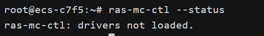
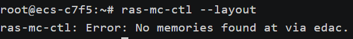

# 内存故障检测和处理

实验内容： 

1. 模拟内存硬件错误，在x86上验证hwpoison“内存毒化”功能和EDAC（Error Detection And  Correction）的检错和纠错功能
2. 使用Rasdaemon捕获错误位置，并在操作系统级别完成错误内存的软下线

评分标准（折算为百分制）

1. （20分）在X86平台上模拟内存错误 （内存故障 injection）
2. （20分）在X86平台上捕获内存错误的日志信息
3. （20分）在X86平台上验证EDAC的检测和纠错功能
4. （30分）在X86平台上根据捕获的内存错误信息，完成对应内存页或多个临近内存页的软下线
5. （10分）书面&口头实验报告

平台不限，选择其一，调研edac在不同硬件暴露的信息类别和量级都不一样（接口），找出内存出错位置，做内存隔离，Linux有一套完整的内存隔离机制

## 实验环境

采用VMware虚拟机

操作系统：ubuntu 20.04

内核版本：5.15.0

## hwpoison

`hwpoison` 是 Linux 内核中的一种机制，用于处理硬件内存错误。其主要功能是检测并隔离有缺陷的内存页，以防止这些缺陷对系统稳定性和数据完整性产生负面影响。

### 具体功能和工作原理

1. **检测硬件错误**：`hwpoison` 依赖于硬件错误检测机制，例如 ECC（错误校正码）内存或现代 CPU 的内存控制器。这些硬件组件能够检测内存错误，如位翻转等。
2. **报告和标记错误页面**：当硬件检测到内存错误时，会向操作系统报告。Linux 内核中的 `hwpoison` 机制会收到这些报告，并标记受影响的内存页为“损坏”（poisoned）。
3. **隔离损坏页面**：标记为损坏的内存页将被隔离，不再被系统使用。对于正在使用的页面，内核会尝试将其内容迁移到健康的内存区域，并确保应用程序能够继续运行而不会读取到损坏的数据。
4. **通知用户空间应用**：内核还可以通过信号机制（如 SIGBUS）通知用户空间应用程序，让它们可以采取相应的措施，如保存工作状态或尝试恢复数据。

### hwpoison 的工作流程

1. **错误检测**：内存控制器（Memory Controller）检测到内存错误，并生成错误报告。
2. **错误报告处理**：错误报告通过机器检查异常（MCE，Machine Check Exception）或其他硬件机制传递给操作系统内核。
3. 标记有毒页: hwpoison模块接收到错误报告后，将出错的内存页标记为有毒，具体操作包括：
   - 从页表中移除该页。
   - 将该页添加到内存故障隔离列表中。
4. **内存隔离**：有毒页不再被分配给任何进程或用于内核分配，确保系统不再使用出错的内存。
5. **错误记录与通知**：错误信息被记录在系统日志中，并通知用户态应用程序进行进一步处理。

### 使用场景

`hwpoison` 主要用于以下几种场景：

- **服务器环境**：在高可靠性要求的服务器中，`hwpoison` 可以帮助检测和隔离内存硬件错误，确保服务器的长期稳定运行。
- **数据中心**：对于数据中心中的大规模服务器集群，`hwpoison` 有助于维护整个系统的稳定性和数据完整性。
- **关键任务应用**：在一些对稳定性要求极高的关键任务应用中，如金融系统、航空控制系统等，`hwpoison` 能提供额外的一层保护。

### 内核参数和配置

在实际应用中，可以通过以下命令和参数来配置和使用 `hwpoison`：

### 检查内核模块

某些功能可能需要加载特定的内核模块。你可以尝试加载相关模块：

```
sudo modprobe hwpoison-inject
```

检查模块是否加载成功：

```
lsmod | grep hwpoison
```

你的内核配置已经启用了 `CONFIG_MEMORY_FAILURE` 和 `CONFIG_DEBUG_FS`。但是，如果你仍然找不到 `/sys/kernel/debug/hwpoison/corrupt-pfn`，请按照以下步骤检查和解决问题。

### 检查 hwpoison 子目录

挂载 DebugFS 后，检查是否存在 `hwpoison` 子目录：

```
ls /sys/kernel/debug/hwpoison
```

你应该看到类似 `corrupt-pfn` 的文件。如果没有，可能是内核版本或配置问题。

### 检查内核日志

如果 `hwpoison` 目录仍然不存在，检查内核日志，看看是否有相关信息：

```
dmesg | grep hwpoison
```

### 验证内存毒化功能

一般来说，用户态程序导致的页错误（如访问无效内存地址）会触发 SIGSEGV 信号，而不是直接导致内核对该页面进行内存毒化。内存毒化通常是为了处理硬件内存错误，而不是普通的页错误。

为了验证内存毒化功能，还是需要通过特定方法制造可以被内核识别并处理的内存错误，以下是制作内存错误的一些方法。

#### 内存错误注入

- 1、使用内核模块强制制造内存错误。编写一个内核模块，强制将某个物理页面标记为硬件毒化。

  ```
  #include <linux/module.h>
  #include <linux/kernel.h>
  #include <linux/init.h>
  #include <linux/mm.h>
  
  static unsigned long pfn = 0;
  module_param(pfn, ulong, 0);
  MODULE_PARM_DESC(pfn, "Page Frame Number");
  
  static int __init hwpoison_test_init(void)
  {
      pr_info("Injecting hwpoison to PFN: %lx\n", pfn);
      if (memory_failure(pfn, 0))
          pr_err("Failed to inject hwpoison to PFN: %lx\n", pfn);
      else
          pr_info("Successfully injected hwpoison to PFN: %lx\n", pfn);
      return 0;
  }
  
  static void __exit hwpoison_test_exit(void)
  {
      pr_info("hwpoison_test module exited\n");
  }
  
  module_init(hwpoison_test_init);
  module_exit(hwpoison_test_exit);
  
  MODULE_LICENSE("GPL");
  MODULE_DESCRIPTION("HWPoison Test Module");
  MODULE_AUTHOR("Lijun");
  ```

  1. 保存代码为 `hwpoison_test.c`。

  2. 创建一个 `Makefile`：

     ```makefile
     obj-m += hwpoison_test.o
     
     all:
     	make -C /lib/modules/$(shell uname -r)/build M=$(PWD) modules
     
     clean:
     	make -C /lib/modules/$(shell uname -r)/build M=$(PWD) clean
     ```

  3. 编译内核模块：

     ```
     make
     ```

  4. 加载内核模块，并传递一个有效的 PFN（Page Frame Number）。可以通过之前获取物理页框号的方法获取有效的 PFN：

     ```
     sudo insmod hwpoison_test.ko pfn=0x12345
     ```

- 2、**使用 `madvise` 触发内存错误**

  在用户空间，使用 `madvise` 系统调用可以请求内核对内存页执行特定的操作，例如毒化内存页。

  ```c
  #include <stdio.h>
  #include <stdlib.h>
  #include <sys/mman.h>
  #include <unistd.h>
  #include <fcntl.h>
  #include <string.h>
  #include <errno.h>
  
  #define PAGE_SIZE 4096
  
  void trigger_hwpoison(void *addr) {
      if (madvise(addr, PAGE_SIZE, MADV_HWPOISON) != 0) {
          perror("madvise");
      } else {
          printf("Memory poisoning triggered at address %p\n", addr);
      }
  }
  
  int main() {
      void *addr;
  
      addr = mmap(NULL, PAGE_SIZE, PROT_READ | PROT_WRITE, MAP_PRIVATE | MAP_ANONYMOUS, -1, 0);
      if (addr == MAP_FAILED) {
          perror("mmap");
          return 1;
      }
  
      printf("Allocated memory at address %p\n", addr);
  
      // Fill the allocated memory with some data
      memset(addr, 0xAA, PAGE_SIZE);
  
      // Trigger memory poisoning
      trigger_hwpoison(addr);
  
      // Access the poisoned memory to cause a fault
      printf("Accessing poisoned memory at address %p\n", addr);
      *((char *)addr) = 0xBB;
  
      // Cleanup
      munmap(addr, PAGE_SIZE);
  
      return 0;
  }
  ```

- 3、**编写和运行 C 程序获取物理页框号，再使用命令注入内存错误**

  ```c
  #include <stdio.h>
  #include <stdlib.h>
  #include <fcntl.h>
  #include <unistd.h>
  #include <stdint.h>
  
  #define PAGE_SHIFT 12
  #define PAGE_SIZE (1UL << PAGE_SHIFT)
  
  int main() {
      unsigned long virt_addr = 0;
      unsigned long page_addr;
      unsigned long page_offset;
      unsigned long *ptr;
      int fd;
      uint64_t page_entry;
  
      ptr = malloc(PAGE_SIZE);
      if (!ptr) {
          perror("malloc");
          return 1;
      }
      virt_addr = (unsigned long)ptr;
  
      fd = open("/proc/self/pagemap", O_RDONLY);
      if (fd < 0) {
          perror("open");
          return 1;
      }
  
      if (lseek(fd, (virt_addr >> PAGE_SHIFT) * sizeof(uint64_t), SEEK_SET) < 0) {
          perror("lseek");
          return 1;
      }
  
      if (read(fd, &page_entry, sizeof(uint64_t)) < 0) {
          perror("read");
          return 1;
      }
  
      close(fd);
  
      if (!(page_entry & (1ULL << 63))) {
          fprintf(stderr, "Page not present\n");
          return 1;
      }
  
      page_addr = (page_entry & ((1ULL << 55) - 1)) << PAGE_SHIFT;
      page_offset = virt_addr & (PAGE_SIZE - 1);
      unsigned long pfn = page_addr >> PAGE_SHIFT;
  
      printf("Virtual address: 0x%lx\n", virt_addr);
      printf("Physical page frame number: 0x%lx\n", pfn);
  
      free(ptr);
  
      return 0;
  }
  ```

  编译并运行该程序：

  ```bash
  gcc -o get_pfn get_pfn.c
  ./get_pfn
  ```

  该程序将输出虚拟地址和物理页框号:

  ```bash
  Virtual address: 0x55556e3ac2a0
  Physical page frame number: 0x0
  ```

  使用获取到的物理页框号注入内存错误：

  ```bash
  hacker@ubuntu:~/Desktop$ echo 0x0 | sudo tee /sys/kernel/debug/hwpoison/corrupt-pfn
  0x0
  tee: /sys/kernel/debug/hwpoison/corrupt-pfn: Memory page has hardware error
  ```

4、直接使用命令注入

```bash
# 将物理地址转换为页帧号 (PFN)
physical_address=0x12345678
pfn=$(($physical_address >> 12))

# 注入 hwpoison
echo $pfn | sudo tee /sys/kernel/debug/hwpoison/corrupt-pfn
```


#### 验证内存毒化功能

检查内核日志以确认内存错误已被检测和处理：

```bash
[ 2481.576496] Injecting memory failure at pfn 0x0
[ 2481.576516] Memory failure: 0x0: already hardware poisoned
[ 2392.437856] Injecting memory failure at pfn 0x12345
[ 2392.439018] Memory failure: 0x12345: recovery action for clean LRU page: Recovered
```

总的来说，`hwpoison` 是一个用于提高系统稳定性和可靠性的关键机制，特别是在需要处理硬件内存错误的环境中。

#### 恢复内存毒化页面

1、使用 echo写入 /sys/kernel/debug/hwpoison/unpoison-pfn

- 在PFN的Software-unpoison页面对应到这个文件。这样，一个页面可以再次被复用。这只对Linux注入的故障起作用，对真正的内存故障不起作用。

```bash
echo 0x12345 > /sys/kernel/mm/page_poison/unpoison-pfn
```

2、使用madvice系统调用

- madvise 系统调用可用于通知内核某些内存页面的期望使用方式，但不能直接解除 hwpoison 状态。然而，结合 madvise 和重启系统，可以间接帮助恢复内存状态。

3、或者通过内核模块恢复毒化的内存页

```c
#include <linux/module.h>
#include <linux/kernel.h>
#include <linux/mm.h>
#include <linux/page-flags.h>

static unsigned long pfn = 0;
module_param(pfn, ulong, 0);
MODULE_PARM_DESC(pfn, "Page Frame Number to be unpoisoned");

static int __init unpoison_page_init(void)
{
    struct page *page;
    if (pfn == 0) {
        pr_err("Invalid PFN\n");
        return -EINVAL;
    }

    page = pfn_to_page(pfn);
    if (!page) {
        pr_err("Invalid page\n");
        return -EINVAL;
    }

    pr_info("Unpoisoning page at PFN: 0x%lx\n", pfn);
    ClearPageHWPoison(page);

    return 0;
}

static void __exit unpoison_page_exit(void)
{
    pr_info("unpoison_page module exited\n");
}

module_init(unpoison_page_init);
module_exit(unpoison_page_exit);

MODULE_LICENSE("GPL");
MODULE_AUTHOR("Your Name");
MODULE_DESCRIPTION("A simple module to unpoison a memory page");
```

编译和加载内核模块

1. 保存代码为 `unpoison_page.c`。

2. 创建一个 `Makefile`：

   ```ma
   obj-m += unpoison_page.o
   
   all:
   	make -C /lib/modules/$(shell uname -r)/build M=$(PWD) modules
   
   clean:
   	make -C /lib/modules/$(shell uname -r)/build M=$(PWD) clean
   
   ```

3. 编译内核模块

   ```bash
   make
   ```

4. 加载内核模块，并传递需要恢复的 PFN（从之前获取的 PFN）：

   ```bash
   sudo insmod unpoison_page.ko pfn=0x12345
   ```

**验证内核日志**

通过 `dmesg` 命令查看内核日志，确认内存页是否已恢复：

```bash
dmesg | grep poison
[ 1234.567890] Unpoisoning page at PFN: 0x12345
```

## EDAC

EDAC (Error Detection and Correction) 是一种硬件和软件结合的技术，用于检测和纠正计算机内存中的错误。它特别适用于服务器和其他高可靠性计算环境。EDAC 通过检测内存中的错误并在可能的情况下自动纠正这些错误，帮助确保系统稳定性和数据完整性。

### EDAC 的主要功能

1. **错误检测：**
   - EDAC 能够检测内存中的错误，例如单比特错误（Single-Bit Errors，SBE）和多比特错误（Multi-Bit Errors，MBE）。
2. **错误纠正：**
   - 对于单比特错误，EDAC 通常能够自动纠正。
     - 对于多比特错误，EDAC 会记录错误并发出警告，提醒管理员采取进一步行动。
3. **错误报告：**
   - EDAC 会记录并报告检测到的内存错误，提供详细的错误信息，包括错误类型、发生时间和位置等。
4. **硬件支持**：依赖于硬件，通常需要支持ECC（Error Correction Code）内存或其他类型的错误检测和纠正机制。

### EDAC-util的使用(EDAC-utils已经被弃用)

1、**确认系统支持 EDAC：**

- 确保你的硬件和操作系统支持 EDAC。现代的服务器和一些高端工作站通常支持 ECC（Error-Correcting Code）内存，这是 EDAC 功能的基础，下面检测电脑是否支持ECC内存

```bash
root@ecs-c7f5:~# dmidecode -t memory
# dmidecode 3.4
Getting SMBIOS data from sysfs.
SMBIOS 2.8 present.

Handle 0x1000, DMI type 16, 23 bytes
Physical Memory Array
        Location: Other
        Use: System Memory
        Error Correction Type: Multi-bit ECC
        Maximum Capacity: 16 GB
        Error Information Handle: Not Provided
        Number Of Devices: 1
```

- 查询系统所支持的EDAC模块，选择与机器硬件所适配的EDAC模块安装。

```bash
hacker@ubuntu:~/Desktop$ ls /lib/modules/{对应的内核版本}/kernel/drivers/edac/
amd64_edac.ko    i3000_edac.ko  i5400_edac.ko    ie31200_edac.ko  skx_edac.ko
e752x_edac.ko    i3200_edac.ko  i7300_edac.ko    igen6_edac.ko    x38_edac.ko
edac_mce_amd.ko  i5000_edac.ko  i7core_edac.ko   pnd2_edac.ko
i10nm_edac.ko    i5100_edac.ko  i82975x_edac.ko  sb_edac.ko
```

2、**加载EDAC模块**：

在现代的Linux内核中，EDAC模块通常已经包含在内核中。你可以通过以下命令加载相应的模块：

```bash
sudo modprobe i7core_edac
```

3、**安装和配置 EDAC 工具：**

- 在 Linux 系统上，可以使用 `edac-utils` 来管理和监控 EDAC。安装方法如下

  ```bash
  sudo apt-get install edac-utils
  ```

4、**检查 EDAC 状态：**

- 使用以下命令检查 EDAC 状态：

  ```bash
  sudo edac-util --status
  ```

5、**模拟内存错误：**

- 在没有实际硬件支持的情况下，模拟内存错误是比较困难的。一般情况下，可以通过修改内核参数或使用一些专门的工具来模拟内存错误。以下是一些可能的方法：
- **通过内核调试功能：**
  - 有些系统允许通过内核调试功能来插入内存错误。这通常需要编写内核模块或者使用一些内核调试工具。
- **使用内存测试工具：**
  - 像 `memtest86+` 这样的工具可以用于测试内存是否存在错误，但它们通常不会主动模拟错误。

6、**验证 EDAC 的工作：**

- 在模拟内存错误后，可以通过 `dmesg` 命令查看内核日志，确认 EDAC 是否检测到错误并进行纠正。例如：

  ```bash
  dmesg | grep -i edac
  ```

## Rasdaemon(目前主流的检错纠错工具)

`Rasdaemon` (Reliability, Availability, and Serviceability daemon) 是一个开源的系统服务，用于捕获和报告硬件错误事件，特别是与内存、处理器和其他关键硬件相关的错误。它支持 Linux 系统，能够监控和记录硬件错误，提供详细的错误信息，有助于系统管理员进行诊断和故障排除。Rasdaemon 利用硬件提供的错误报告机制，通过内核事件追踪 (kernel trace) 系统收集硬件错误事件。

### Rasdaemon 的主要功能

1. **错误监控和报告**：
   - 捕获和记录内存错误、处理器错误、PCIe 错误等。
   - 提供详细的错误信息，包括错误类型、发生时间、位置等。
2. **与 EDAC 集成**：
   - 兼容 EDAC (Error Detection And Correction) 框架，能够捕获内存控制器错误。
3. **数据持久性**：
   - 将错误事件持久化存储到数据库中，便于后续分析。
4. **用户空间工具**：
   - 提供用户空间工具，用于查询和分析错误数据。

### Rasdaemon 的使用（需要EDAC支持）

**1、安装rasdaemon**

```
sudo apt install rasdaemon
```

**2、配置rasdaemon**

- 启动rasdaemon

```bash
root@ecs-c7f5:~# rasdaemon --enable
rasdaemon: ras:mc_event event enabled
rasdaemon: ras:aer_event event enabled
rasdaemon: mce:mce_record event enabled
rasdaemon: ras:extlog_mem_event event enabled
```

- 需要启动两个systemd服务: `ras-mc-ctl.service` 和 `rasdaemon.service` :

```bash
root@ecs-c7f5:~# systemctl enable ras-mc-ctl.service
root@ecs-c7f5:~# systemctl enable rasdaemon.service
root@ecs-c7f5:~# systemctl start ras-mc-ctl.service
root@ecs-c7f5:~# systemctl start rasdaemon.service

Synchronizing state of rasdaemon.service with SysV service script with /lib/systemd/systemd-sysv-install.
Executing: /lib/systemd/systemd-sysv-install enable rasdaemon
```

**3、检查 `rasdaemon` 状态**

```
systemctl status rasdaemon

systemctl status ras-mc-ctl
```

输出信息:

```
# rasdaemon 服务状态

● rasdaemon.service - RAS daemon to log the RAS events
   Loaded: loaded (/usr/lib/systemd/system/rasdaemon.service; enabled; vendor preset: disabled)
   Active: active (running) since Tue 2023-11-28 11:22:16 CST; 5s ago
  Process: 181029 ExecStartPost=/usr/sbin/rasdaemon --enable (code=exited, status=0/SUCCESS)
 Main PID: 181014 (rasdaemon)
   Memory: 8.0M
   CGroup: /system.slice/rasdaemon.service
           └─181014 /usr/sbin/rasdaemon -f -r

Nov 28 11:22:16 alipay-srm011233163091.et15 rasdaemon[181014]: Enabled event ras:aer_event
Nov 28 11:22:16 alipay-srm011233163091.et15 rasdaemon[181014]: Family 6 Model 55 CPU: only decoding architectural errors
Nov 28 11:22:16 alipay-srm011233163091.et15 rasdaemon[181014]: mce:mce_record event enabled
Nov 28 11:22:16 alipay-srm011233163091.et15 rasdaemon[181014]: Enabled event mce:mce_record
Nov 28 11:22:16 alipay-srm011233163091.et15 rasdaemon[181014]: ras:extlog_mem_event event enabled
Nov 28 11:22:16 alipay-srm011233163091.et15 rasdaemon[181014]: Enabled event ras:extlog_mem_event
Nov 28 11:22:16 alipay-srm011233163091.et15 rasdaemon[181014]: rasdaemon: Recording mc_event events
Nov 28 11:22:16 alipay-srm011233163091.et15 rasdaemon[181014]: rasdaemon: Recording aer_event events
Nov 28 11:22:16 alipay-srm011233163091.et15 rasdaemon[181014]: rasdaemon: Recording extlog_event events
Nov 28 11:22:16 alipay-srm011233163091.et15 rasdaemon[181014]: rasdaemon: Recording mce_record events

# ras-mc-ctl 服务状态

● ras-mc-ctl.service - Initialize EDAC v3.0.0 Drivers For Machine Hardware
     Loaded: loaded (/lib/systemd/system/ras-mc-ctl.service; enabled; vendor preset: enabled)
     Active: active (exited) since Tue 2023-11-28 11:31:22 CST; 9min ago
   Main PID: 2772415 (code=exited, status=0/SUCCESS)
        CPU: 53ms

Nov 28 11:31:22 zcloud.staging.huatai.me systemd[1]: Starting Initialize EDAC v3.0.0 Drivers For Machine Hardware...
Nov 28 11:31:22 zcloud.staging.huatai.me ras-mc-ctl[2772415]: ras-mc-ctl: Error: No dimm labels for HP model ProLiant DL360 Gen9
Nov 28 11:31:22 zcloud.staging.huatai.me systemd[1]: Finished Initialize EDAC v3.0.0 Drivers For Machine Hardware.
```

这里有一个错误提示: `ras-mc-ctl: Error: No dimm labels for XXXX` ，实际上在各种服务器上初始时都能看到，需要进一步配置。

**4、检查EDAC信息**（如果使用ECC内存）： 可以使用`ras-mc-ctl`工具（通常包含在`rasdaemon`包中）来检查详细的EDAC信息：

```bash
sudo ras-mc-ctl --status
```



```bash
ras-mc-ctl --layout
```



5、**使用rasdaemon**

- 在后台运行`rasdaemon`，直接输入rasdaemon就行。

```bash
rasdaemon
```

- 在前台运行`rasdaemon`，此时输出显示 rasdaemon 初始化并监听事件，此时就可以等待出现的硬件异常。

```bash
rasdaemon -f
```

如果希望同时将错误记录到数据库(编译时使用了参数 `--enable-sqlite3`)，则可以增加一个 `-r` 参数:

```bash
rasdaemon -f -r
```

配置 DIMM labels

 ras-mc-ctl 是RAS内存控制器管理工具，用于执行一些针对EDAC(Error Detection and Correction)驱动的RAS管理任务。

- `ras-mc-ctl` 可以查询检测到的错误，例如 `--error-count` 可以获取主机错误计数:

- `ras-mc-ctl` 使用 `--error-count` 获取错误计数

  ```bash
  # ras-mc-ctl --error-count
  Label                 CE      UE
  mc#0csrow#2channel#0  0   0
  mc#0csrow#2channel#1  0   0
  mc#0csrow#3channel#1  0   0
  mc#0csrow#3channel#0  0   0
  ```

- 使用 `ras-mc-ctl` 打印出被记录的所有错误。

  ```bash
  # ras-mc-ctl --summary
  Memory controller events summary:
    Corrected on DIMM Label(s): 'DIMM_B1' location: 0:2:0:-1 errors: 5
  
  PCIe AER events summary:
    1 Uncorrected (Non-Fatal) errors: BIT21
  
  No Extlog errors.
  
  No devlink errors.
  Disk errors summary:
    0:0 has 6646 errors
  No MCE errors.
  ```

### 利用Rasdaemon实现错误内存的软下线

**由于缺乏ecc内存，导致edac模块无法正常运行，所以rasdaemon也无法正常捕获到错误，因此我们只做了对指定页面的软下线。**

1. **使用 Rasdaemon 监控和处理错误**

   Rasdaemon 会自动监控和记录内存错误，并在检测到内存错误时，尝试对相关页面进行软下线。

   ```
   sudo ras-mc-ctl --errors | grep <error_address>
   ```

2. **检查日志**

   你可以查看 Rasdaemon 生成的日志，以确认内存错误和软下线事件：

   ```bash
   sudo ras-mc-ctl --summary
   sudo journalctl -u rasdaemon
   ```

3. **编写内核模块对页面进行软下线**

   ```c
   #include <linux/module.h>
   #include <linux/kernel.h>
   #include <linux/init.h>
   #include <linux/mm.h>
   #include <linux/mmzone.h>
   #include <linux/pfn.h>
   
   static unsigned long target_pfn = 0x12345; // 替换为你要下线的页框号
   
   static int __init soft_offline_page_init(void)
   {
       struct page *page;
       unsigned long flags;
       int ret = 0;
   
       pr_info("Soft offline page at PFN %lu\n", target_pfn);
   
       page = pfn_to_page(target_pfn);
   
       if (!PageReserved(page)) {
           // 获取所在的内存区域（zone）
           struct zone *zone = page_zone(page);
   
           spin_lock_irqsave(&zone->lock, flags);
           SetPageReserved(page);
           spin_unlock_irqrestore(&zone->lock, flags);
   
           pr_info("Page at PFN %lu successfully offlined\n", target_pfn);
       } else {
           pr_warn("Page at PFN %lu is already reserved, cannot offline\n", target_pfn);
           ret = -EBUSY;
       }
   
       return ret;
   }
   
   static void __exit soft_offline_page_exit(void)
   {
       pr_info("Module unloaded\n");
   }
   
   module_init(soft_offline_page_init);
   module_exit(soft_offline_page_exit);
   
   MODULE_LICENSE("GPL");
   MODULE_AUTHOR("Lijun");
   MODULE_DESCRIPTION("Soft offline specified page frame number");
   ```

   

## 问题汇总：

1、apt install 报错

```
hacker@ubuntu:~/Desktop$ sudo apt-get install edac-utils
E: Could not get lock /var/lib/dpkg/lock-frontend. It is held by process 4700 (unattended-upgr)
N: Be aware that removing the lock file is not a solution and may break your system.
E: Unable to acquire the dpkg frontend lock (/var/lib/dpkg/lock-frontend), is another process using it?
```

解决方法：删除锁定文件

在某些情况下，根本原因可能是锁文件。锁文件阻止两个或多个进程访问相同的数据。当您运行 apt 或 apt-get 命令时，通常会创建一个锁文件。但是，如果最新的 apt 命令没有成功执行(即突然终止)，锁文件将继续存在并阻止任何后续的 apt 或 apt-get 实例。

解决 “Could not get lock /var/lib/apt/lists/lock”错误

```awk
$ sudo rm /var/lib/apt/lists/lock
```

解决 “Could not get lock /var/lib/dpkg/lock”错误

```awk
$ sudo rm /var/lib/dpkg/lock
```

其他时候，您可能会遇到 “/var/lib/dpkg/lock-frontend error”的错误。这意味着当前正在运行使用 APT / DPKG 的图形应用程序，这可能是使用 Gdebi 或 Synaptic 包管理器造成的。

即时的补救措施是退出或关闭程序，并再次尝试。如果没有效果，可是尝试删除 /var/lib/dpkg/lock-frontend 文件。

```awk
$ sudo rm /var/lib/dpkg/lock-frontend
```

删除 lock-frontend 文件可能会再次导致“Could not get lock /var/lib/dpkg/lock”错误，因此，您将不得不继续删除相关锁定文件。

```awk
$ sudo rm /var/lib/dpkg/lock
```

如果您碰巧会出现有关 apt-cache lock 的错误，例如 /var/cache/apt/archives/lock，请删除相关锁定文件。

```awk
$ sudo rm /var/cache/apt/archives/lock
$ sudo rm /var/lib/dpkg/lock
```

2、edac-util无法使用

```bash
hacker@ubuntu:~/Desktop$ edac-util -v
edac-util: Error: No memory controller data found.
```

原因可能是我的电脑不支持ecc()，一般来说内存条的Datawidth比Totalwidth小才支持ecc。在Windows下运行以下命令可查看是否支持ecc，Linux下可用`sudo dmidecode -t memory`命令查看

```bash
#Windows下
C:\Users\L>wmic memorychip get datawidth,totalwidth
DataWidth  TotalWidth
64         64
#Linux下
hacker@ubuntu:~/Desktop$ sudo dmidecode -t memory
# dmidecode 3.2
Getting SMBIOS data from sysfs.
SMBIOS 2.7 present.

Handle 0x0084, DMI type 5, 46 bytes
Memory Controller Information
	Error Detecting Method: None
	Error Correcting Capabilities:
		None
```

## 相关知识

### **Error correction code (ECC)** 

纠错码 （ECC） 是一种用于检测和纠正由于环境干扰和物理缺陷导致的内存数据错误的机制。ECC 内存用于无法容忍因数据损坏而导致故障的高可靠性应用，例如医疗设备、飞机控制系统或银行数据库服务器。

大多数内存错误是由软错误（例如宇宙射线、α 射线、电磁干扰）引起的单个（1 位）错误，但有些可能是由于硬件故障（例如行锤故障）引起的。对于在较高高度运行的系统（例如商用飞机）而言，软错误更为普遍。据说，在大约10公里的高度，诱导宇宙射线的比特误差要高出300倍。

这种单位错误可以通过ECC存储器系统来纠正。多位错误也可以被检测和/或纠正，这取决于错误符号的数量。

内存错误的症状包括数据损坏、系统崩溃和/或安全漏洞，使非特权代码能够访问内核。众所周知，内存错误是导致大型数据中心机器崩溃的最常见硬件原因之一。

### EDAC和Rasdaemon的关系

EDAC（Error Detection and Correction）和 `rasdaemon` 在功能上有密切的关系，`rasdaemon` 是一个用户空间的工具，用于收集和记录由内核的EDAC子系统以及其他硬件错误检测子系统报告的错误。

具体来说：

1. **EDAC 子系统**：这是Linux内核中的一个模块，专门用于检测和报告ECC（Error-Correcting Code）内存错误。EDAC能够捕捉和记录内存错误信息，如可纠正错误（CE，Correctable Errors）和不可纠正错误（UE，Uncorrectable Errors）。
2. **rasdaemon**：这是一个用户空间的守护进程，利用内核中的RAS（Reliability, Availability, and Serviceability）功能来收集和记录硬件错误，包括内存错误、CPU错误、PCIe错误等。`rasdaemon` 可以从内核的EDAC子系统获取内存错误数据，并将这些数据记录到系统日志或数据库中，便于进一步分析和监控。

以下是EDAC和`rasdaemon`的工作流程：

1. **硬件错误检测**：当ECC内存检测到错误时，EDAC子系统会捕获这些错误并记录下来。
2. **错误上报**：EDAC子系统将错误信息上报给内核日志系统。
3. **错误收集**：`rasdaemon` 作为用户空间的工具，从内核日志系统中收集这些错误信息。
4. **错误记录和报告**：`rasdaemon` 将收集到的错误信息记录到系统日志中，并且可以选择将这些信息存储在数据库中或通过其他方式进行报告。

## 参考资料：

[EDAC 诊断系统硬件故障 — Cloud Atlas beta 文档 (cloud-atlas.readthedocs.io)](https://cloud-atlas.readthedocs.io/zh-cn/latest/linux/server/hardware/edac.html)

[服务器内存故障预测居然可以这样做！ - vivo互联网技术 - 博客园 (cnblogs.com)](https://www.cnblogs.com/vivotech/p/16516881.html)

[Error Detection And Correction (EDAC) Devices — The Linux Kernel documentation](https://www.kernel.org/doc/html/v6.6/driver-api/edac.html)

[notes/kernel/hwpoison.md at master · wangxiaoq/notes (github.com)](https://github.com/wangxiaoq/notes/blob/master/kernel/hwpoison.md)

[hwpoison — The Linux Kernel v4.20.0 文档 (kernel-doc.readthedocs.io)](https://kernel-doc.readthedocs.io/zh-cn/latest/vm/hwpoison.html)

[hwpoison — The Linux Kernel documentation](https://www.kernel.org/doc/html/next/translations/zh_CN/mm/hwpoison.html)

[Linux EDAC modules on Server Systems - ION Server Blog (ioncomputer.com)](https://blog.ioncomputer.com/2019/05/06/linux-edac-modules-on-server-systems/)

[MemTest86 - ECC Technical Details](https://www.memtest86.com/ecc.htm)

[mchehab/rasdaemon)](https://github.com/mchehab/rasdaemon)