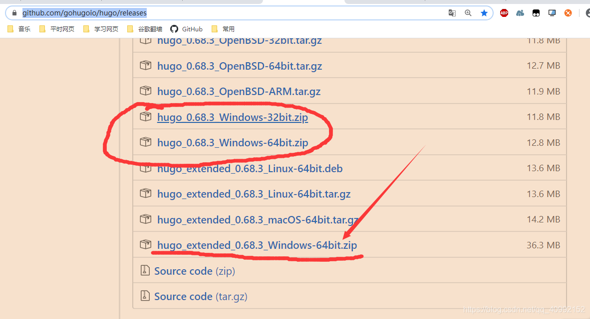
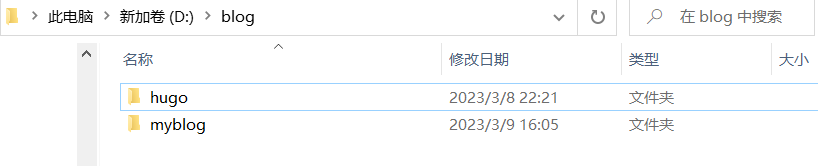

## Hugo介绍

Hugo是由Go语言实现的静态网站生成器。简单、易用、高效、易扩展、快速部署。

Hugo中文文档地址： https://www.gohugo.org

## Hugo安装

- 下载地址：https://github.com/gohugoio/hugo/releases

- 找到对应系统的下载文件(win10为例，建议选择extended版本，有些主题需要extended版本才能正常使用)

  

+ 建立blog文件夹，并将下载好的zip文件解压到该文件夹下(建议不要有中文和空格)

+ 再将hogu.exe的路径添加到环境变量中(不会则请STFW)

+ 在cmd中查看命令是否成功

  ```
  输入下面命令查看是否成功
  $ hugo version
  输出结果：
  Hugo Static Site Generator v0.68.3/extended windows/amd64 BuildDate: unknown
  说明安装成功
  ```

+ 设置站点

  ```
  hugo new site myBlog
  ```

  生成myblog文件夹

  

## Hugo主题下载

官方网址：https://www.gohugo.org/theme/

我这里下载的是：[CaiJimmy/hugo-theme-stack: Card-style Hugo theme designed for bloggers (github.com)](https://github.com/CaiJimmy/hugo-theme-stack)

建议安装方法：

- 将下载好的主题解压放入之前new出来的文件夹(我这里是myblog)文件夹下的themes下

- 并在myblog/config.toml里加一行 theme=xxxx（解压后的主题文件夹的名称）

- 把主题中的config.yaml或toml文件复制放到myblog文件夹下

- 启动站点

  ``` shell
  hugo server
  ```

+ 请注意倒数第二行（ Web Server is available at //localhost:1313/ (bind address 127.0.0.1) ）说明启动成功了

  ``` shell
  Building sites … WARN 2020/04/07 17:51:51 Markup type mmark is deprecated and will be removed in a future release. See https://gohugo.io//content-management/formats/#list-of-content-formats
  
                     | EN
  -------------------+-----
    Pages            | 74
    Paginator pages  |  0
    Non-page files   | 21
    Static files     |  8
    Processed images | 28
    Aliases          | 14
    Sitemaps         |  1
    Cleaned          |  0
  
  Built in 1103 ms
  Watching for changes in F:\blog\myBlog\{archetypes,content,data,layouts,static,themes}
  Watching for config changes in F:\blog\myBlog\config.toml, F:\blog\myBlog\config\_default
  Environment: "development"
  Serving pages from memory
  Running in Fast Render Mode. For full rebuilds on change: hugo server --disableFastRender
  Web Server is available at //localhost:1313/ (bind address 127.0.0.1)
  Press Ctrl+C to stop
  
  ```

  

+ 在浏览器中输入 localhost:1313，就可以看到效果了

注意事项：如果启动站点失败，可以先将主题删除，再启动站点，看是否报错，若没报错则是主题配置问题。

## 创建文章

创建第一篇文章，放到 `post` 目录，方便之后生成聚合页面。(注意命名时不可以空格，可以用-代替)

```shell
hugo post/first.md
```

然后就可以使用 hugo server 来查看效果啦！

(注意：如果没出现新文章，则可能开启了draft模式，使用hogu server -D)

## 部署到服务器

我们将使用github.io来代替服务器以及域名：[推荐参考教程](https://blog.csdn.net/cbb944131226/article/details/82940224)

几个注意事项：

1. Git要上传或执行的文件可以在文件夹中，右键空白地区点git bash here从而实现目录内操作。
2. 在linux操作中（比如git）粘贴操作是shift+insert或单击鼠标的滚轮。而复制只要选中即可。
3. github的域名地址与用户名必须一致，比如你的github名字叫sakura，那么域名必须是sakura.github.io。
4. hugo命令 `hugo --baseURL="https://你的github名字.github.io/"`执行完后，会生成一个public文件夹。
5. 用git推送的时候 `git pull --rebase origin master`语句可能会出错显示没有文件，不用担心，这是因为此时目标仓库是空的，直接下一步最后，你只需要输入对应网址，即可看到博客了！
5. 如果想将默认语言设置为中文，只要在config中设置一下defaultContentLanguage="zh-cn"就行了，但可能会不生效，最好将其放在config.toml的第一行

## 更新博客

1. 在博客目录下使用 hugo --BaseURL="https://你的github名字.github.io/"覆盖原来的public文件夹

   ```
   hugo --BaseURL="https://chenyuan1125.github.io"
   ```

   

2. 进入public文件夹右键git bash
   分别执行

   ``` shell
   git add .
   git commit -m ‘first commit’
   git push origin master
   ```

   可能存在的问题：

   + github上存放文件的仓库是否只有一个分支（创建时不要勾选生成README.md)
   + 正常public上传github仓库后会只有一个分支，且包含了public内的所有文件
     文章看不到,检查是否格式正确，使用了hugo new xxxx.md,检查是否包含了 draft: true，若有则删除或使用 hugo server -D，若草稿模式开启是看不到文章的
   + git push不成功,此时大概率是网络通信有问题，可以关掉git终端后科学上网；重启git 终端后（windows需要，linux系统不需要）再进行push大概率就可以解决问题了；此时无需再进行git init 等初始化操作因为之前已经做完。

## 添加评论功能

可参考这篇博客：[使用vercel搭建属于自己的waline评论系统 | 叉七的叨叨哔 (xseven.top)](https://blog.xseven.top/posts/vercel-deploy-waline.html)

如果评论无法正常显示，则可能是引文vercel.app被DNS污染导致无法使用，需要自行配置域名，具体解决方案可查看这篇博客。

[Waline国内IP无法评论的解决方案(LeanCloud国际版/Vercel) | 泉子的理想乡 (izumi.vip)](https://izumi.vip/2022/11/12/Waline国内IP无法评论的解决方案/index.html)

<iframe src="//player.bilibili.com/player.html?isOutside=true&aid=113639365280345&bvid=BV1Bzq8YEESh&cid=27304332061&p=1" scrolling="no" border="0" frameborder="no" framespacing="0" allowfullscreen="true"></iframe>

## 参考资料

[从零到一，用 Hugo 打造你的个人网站 (brume.top)](https://brume.top/p/build-your-personal-blog-with-hugo/#下载并安装-hugo)

[如何用 GitHub Pages + Hugo 搭建个人博客 · KrislinBlog (krislinzhao.github.io)](https://krislinzhao.github.io/docs/create-a-wesite-using-github-pages-and-hugo/)
