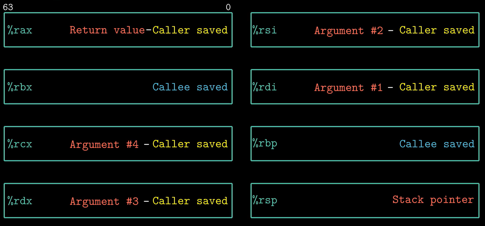
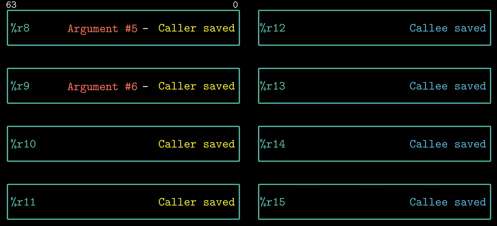

# Bomb实验

## 题目解析

注意：本人所写的注释可能有些错误，有问题还请大家批评指正，注释中*的用法和C语言类似，有些寄存器名称没有带%

题目只给了一个main函数，我们可以大致看出来，它的模式是从某个地方读取字符串，然后作为参数输入每个关卡`phase_`，进行验证。具体的情况没有显示，说明我们需要通过某种手段去进行探查：

```shell
objdump -d bomb > bomb.s
```

同时看到`bomb.c`中：

```c
/* When run with no arguments, the bomb reads its input lines 
     * from standard input. */
if (argc == 1) {  
    infile = stdin;
}
```

说明可以通过文件读取的方式进行读取。

寄存器说明：





### Phase_1

关键代码

```text
0000000000400ee0 <phase_1>:
  400ee0:	48 83 ec 08          	sub    $0x8,%rsp   //将栈指针减少8，也就是入栈
  400ee4:	be 00 24 40 00       	mov    $0x402400,%esi
  400ee9:	e8 4a 04 00 00       	call   401338 <strings_not_equal> /*test指令同逻辑与and运算，但只设置条件码寄存器，不改变目的寄存器的值，test %eax,%eax用于测试寄存器%eax是否为空，由于寄存器%rax一般存放函数的返回值，此处应该存放的是函数 strings_not_equal的值，而%eax是%rax的低32位表示，所以不难分析出，当%eax值为0时，test的两个操作数相同且都为0，条件码ZF置位为1，即可满足下一行代码的跳转指令*/
  400eee:	85 c0                	test   %eax,%eax
  400ef0:	74 05                	je     400ef7 <phase_1+0x17>  //当ZF位为0时，跳转到400ef7处
  400ef2:	e8 43 05 00 00       	call   40143a <explode_bomb>  //调用explode-bomb函数，爆炸
  400ef7:	48 83 c4 08          	add    $0x8,%rsp     //出栈
  400efb:	c3                   	ret     
```

仅从函数调用的角度来看，`phase_1`的参数存在1st argument寄存器中：`%rdi`，然后这个参数作为第一个参数，与`0x402400`作为第二个参数一起被传入到`strings_not_equal`中，进行一些判定操作。

`0x402400`像一个地址，使用gdb对程序进行debug，设置断点查看``0x402400`的值，发现是`Border relations with Canada have never been better.`，答案已找到

### Phase_2

关键代码如下：

```text
0000000000400efc <phase_2>:
  400efc:	55                   	push   %rbp
  400efd:	53                   	push   %rbx
  400efe:	48 83 ec 28          	sub    $0x28,%rsp    //入栈，栈指针减少40
  400f02:	48 89 e6             	mov    %rsp,%rsi     //将%rsp赋给%rsi(第二个参数寄存器)
  400f05:	e8 52 05 00 00       	call   40145c <read_six_numbers>
  400f0a:	83 3c 24 01          	cmpl   $0x1,(%rsp)   //将(%rsp)与1比较
  400f0e:	74 20                	je     400f30 <phase_2+0x34>    //若相等，则跳转到0x400f30
  400f10:	e8 25 05 00 00       	call   40143a <explode_bomb>    //若不相等，则爆炸
  400f15:	eb 19                	jmp    400f30 <phase_2+0x34>
  400f17:	8b 43 fc             	mov    -0x4(%rbx),%eax   //(%rbx-4)取值后赋给eax寄存器
  400f1a:	01 c0                	add    %eax,%eax         //eax=eax+eax
  400f1c:	39 03                	cmp    %eax,(%rbx)       //比较%eax和(%rbx)的值
  400f1e:	74 05                	je     400f25 <phase_2+0x29>   //如果相等，跳转到0x400f25
  400f20:	e8 15 05 00 00       	call   40143a <explode_bomb>   //如果不相等，就爆炸
  400f25:	48 83 c3 04          	add    $0x4,%rbx         //rbx寄存器+4
  400f29:	48 39 eb             	cmp    %rbp,%rbx         //%rbx与%rbp比较
  400f2c:	75 e9                	jne    400f17 <phase_2+0x1b>   //如果不相等，跳转到0x400f17
  400f2e:	eb 0c                	jmp    400f3c <phase_2+0x40>   //跳转到400f3c
  400f30:	48 8d 5c 24 04       	lea    0x4(%rsp),%rbx     //(%rsp+4)后赋值给%rbx
  400f35:	48 8d 6c 24 18       	lea    0x18(%rsp),%rbp    //(%rsp+18)后再赋值给%rbp
  400f3a:	eb db                	jmp    400f17 <phase_2+0x1b>    //跳转到0x40f17
  400f3c:	48 83 c4 28          	add    $0x28,%rsp         //出栈，栈指针增加40
  400f40:	5b                   	pop    %rbx
  400f41:	5d                   	pop    %rbp
  400f42:	c3                   	ret    
```

可以看出这个阶段读取六个数字，并通过一个循环将其与对应的值对比，这些对应值的规律就是`1 2 4 8 16 32`，答案已出。

（`lea 0x18(%rsp),%rbp`指令是将%rsp+40传给%rbp，lea指令用于计算有效地址，以及加法和有限的乘法运算，而其余如mov    -0x4(%rbx),%eax则是取(%rbx-4)的值再传给%eax）

### Phase_3

关键代码如下：

```text
0000000000400f43 <phase_3>:
  400f43:	48 83 ec 18          	sub    $0x18,%rsp //入栈，栈指针减少24
  400f47:	48 8d 4c 24 0c       	lea    0xc(%rsp),%rcx //%rsp+12赋给%rcx 
  400f4c:	48 8d 54 24 08       	lea    0x8(%rsp),%rdx //%rsp+8赋给%rdx 
  400f51:	be cf 25 40 00       	mov    $0x4025cf,%esi //将0x4025cf赋给%esi 第二个参数寄存器
  400f56:	b8 00 00 00 00       	mov    $0x0,%eax //将0x0赋给%eax
  400f5b:	e8 90 fc ff ff       	call   400bf0 <__isoc99_sscanf@plt> //调用scanf输入函数
  400f60:	83 f8 01             	cmp    $0x1,%eax //比较返回值和0x1的大小,sscanf的返回值是成功解析和存储的参数数目。
  400f63:	7f 05                	jg     400f6a <phase_3+0x27> //如果大于则跳转到0x400f6a
  400f65:	e8 d0 04 00 00       	call   40143a <explode_bomb> //否则，爆炸
  400f6a:	83 7c 24 08 07       	cmpl   $0x7,0x8(%rsp) //比较0x7和(%rsp+8)值的大小
  400f6f:	77 3c                	ja     400fad <phase_3+0x6a> //如果 (%rsp+8)>7 跳转到0x400fad即爆炸
  400f71:	8b 44 24 08          	mov    0x8(%rsp),%eax //当(%rsp+8)<=7时，将(%rsp+8)的值放入%eax中
  400f75:	ff 24 c5 70 24 40 00 	jmp    *0x402470(,%rax,8) //跳转到存放在%rax*8+0x402470内存位置上的指令，即%eax*8+0x402470
  400f7c:	b8 cf 00 00 00       	mov    $0xcf,%eax //将0xcf赋给%eax
  400f81:	eb 3b                	jmp    400fbe <phase_3+0x7b> //跳转到0x400fbe
  400f83:	b8 c3 02 00 00       	mov    $0x2c3,%eax
  400f88:	eb 34                	jmp    400fbe <phase_3+0x7b>
  400f8a:	b8 00 01 00 00       	mov    $0x100,%eax
  400f8f:	eb 2d                	jmp    400fbe <phase_3+0x7b>
  400f91:	b8 85 01 00 00       	mov    $0x185,%eax
  400f96:	eb 26                	jmp    400fbe <phase_3+0x7b>
  400f98:	b8 ce 00 00 00       	mov    $0xce,%eax
  400f9d:	eb 1f                	jmp    400fbe <phase_3+0x7b>
  400f9f:	b8 aa 02 00 00       	mov    $0x2aa,%eax
  400fa4:	eb 18                	jmp    400fbe <phase_3+0x7b>
  400fa6:	b8 47 01 00 00       	mov    $0x147,%eax
  400fab:	eb 11                	jmp    400fbe <phase_3+0x7b>
  400fad:	e8 88 04 00 00       	call   40143a <explode_bomb>
  400fb2:	b8 00 00 00 00       	mov    $0x0,%eax
  400fb7:	eb 05                	jmp    400fbe <phase_3+0x7b>
  400fb9:	b8 37 01 00 00       	mov    $0x137,%eax
  400fbe:	3b 44 24 0c          	cmp    0xc(%rsp),%eax //比较(%rsp+12)和%eax的值
  400fc2:	74 05                	je     400fc9 <phase_3+0x86> //如果相等，则跳转到0x400fc9
  400fc4:	e8 71 04 00 00       	call   40143a <explode_bomb> //如果不相等，就爆炸
  400fc9:	48 83 c4 18          	add    $0x18,%rsp //出栈，栈指针增加24
  400fcd:	c3                   	ret    
```

`注意：jg指令是后面的操作数大于前面的操作数，不要弄反了`

首先根据sscanf函数确定有两个参数，刚好%rsp+8和%rsp+12没有赋值，于是推测这两个值对应这两个变量，接着由于sscanf函数返回参数的数目，所以必须输入两个数，并且第一个参数要小于等于7，最后根据下面这条关键指令判断第二个参数取决于第一个参数的值，使用gdb遍历打印相应的跳转地址的值，得到以下列表。

最关键的指令是：

`400f75:	ff 24 c5 70 24 40 00 	jmp    *0x402470(,%rax,8)`

```shell
(gdb) x/ *0x402470  第一个参数为0，第二个参数为0xcf 
0x400f7c <phase_3+57>:  "\270"
(gdb) x/s *0x402478  第一个参数为1，第二个参数为0x137 311
0x400fb9 <phase_3+118>: "\270\067\001"
(gdb) x/ *0x402480  第一个参数为2，第二个参数为0x2c3
0x400f83 <phase_3+64>:  "\270\303\002"
(gdb) x/ *0x402488   第一个参数为3，第二个参数为0x100
0x400f8a <phase_3+71>:  "\270"
(gdb) x/ *0x402490  第一个参数为4，第二个参数为0x185
0x400f91 <phase_3+78>:  "\270\205\001"
(gdb) x/ *0x402498  第一个参数为5，第二个参数为0xce
0x400f98 <phase_3+85>:  "\270"
(gdb) x/ *0x4024a0  第一个参数为6，第二个参数为0x2aa
0x400f9f <phase_3+92>:  "\270\252\002"
(gdb) x/ *0x4024a8  第一个参数为7，第二个参数为0x147
0x400fa6 <phase_3+99>:  "\270G\001"
```

### Phase_4

```text
000000000040100c <phase_4>:
  40100c:	48 83 ec 18          	sub    $0x18,%rsp  //入栈，栈指针减少18
  401010:	48 8d 4c 24 0c       	lea    0xc(%rsp),%rcx  //rcx=rsp+12
  401015:	48 8d 54 24 08       	lea    0x8(%rsp),%rdx  //rdx=rsp+8
  40101a:	be cf 25 40 00       	mov    $0x4025cf,%esi  //esi=0x4025cf
  40101f:	b8 00 00 00 00       	mov    $0x0,%eax       //eax=0
  401024:	e8 c7 fb ff ff       	call   400bf0 <__isoc99_sscanf@plt> 
  401029:	83 f8 02             	cmp    $0x2,%eax  //比较eax和2
  40102c:	75 07                	jne    401035 <phase_4+0x29> //如果不相等，跳转到0x401035即爆炸
  40102e:	83 7c 24 08 0e       	cmpl   $0xe,0x8(%rsp)  //相等则比较(%rsp+8)的内存值和14
  401033:	76 05                	jbe    40103a <phase_4+0x2e>  //如果(%rsp+8)<=14,跳转到0x40103a
  401035:	e8 00 04 00 00       	call   40143a <explode_bomb>  //否则，爆炸
  40103a:	ba 0e 00 00 00       	mov    $0xe,%edx  //edx=14 参数3
  40103f:	be 00 00 00 00       	mov    $0x0,%esi  //esi=0  参数2
  401044:	8b 7c 24 08          	mov    0x8(%rsp),%edi  //edi=*(rsp+8) 参数1
  401048:	e8 81 ff ff ff       	call   400fce <func4>  //调用func4函数
  40104d:	85 c0                	test   %eax,%eax  //判断返回值是否为0
  40104f:	75 07                	jne    401058 <phase_4+0x4c>  //如果不等于0，跳转到401058即爆炸
  401051:	83 7c 24 0c 00       	cmpl   $0x0,0xc(%rsp)    //比较*(rsp+12)和0
  401056:	74 05                	je     40105d <phase_4+0x51> //如果相等，跳转到40105d
  401058:	e8 dd 03 00 00       	call   40143a <explode_bomb>
  40105d:	48 83 c4 18          	add    $0x18,%rsp  //出栈
  401061:	c3                   	ret    
```

很明显要通过此关必须在调用func4后返回0，而且第二个参数要等于0，所以只需通过调整第一个参数的值来使得func4函数返回0

```
0000000000400fce <func4>:
  400fce:	48 83 ec 08          	sub    $0x8,%rsp  //入栈
  400fd2:	89 d0                	mov    %edx,%eax  //eax=edx=14 rsi=0 edi=第一个参数
  400fd4:	29 f0                	sub    %esi,%eax  //eax=eax-esi=14
  400fd6:	89 c1                	mov    %eax,%ecx  //ecx=eax=14
  400fd8:	c1 e9 1f             	shr    $0x1f,%ecx  //ecx逻辑右移31位 ecx=0
  400fdb:	01 c8                	add    %ecx,%eax  //eax=eax+ecx=14
  400fdd:	d1 f8                	sar    %eax       //eax算数右移一位 eax=7
  400fdf:	8d 0c 30             	lea    (%rax,%rsi,1),%ecx //ecx=rsi+rax=7
  400fe2:	39 f9                	cmp    %edi,%ecx  //比较edi和ecx=7
  400fe4:	7e 0c                	jle    400ff2 <func4+0x24> //若edi>=ecx 跳转到0x400ff2
  400fe6:	8d 51 ff             	lea    -0x1(%rcx),%edx  //否则，edx=rcx-1=6
  400fe9:	e8 e0 ff ff ff       	call   400fce <func4>  //调用func4函数 edi esi=0 edx=13
  400fee:	01 c0                	add    %eax,%eax  //eax=eax*2
  400ff0:	eb 15                	jmp    401007 <func4+0x39> 跳转到0x401007
  400ff2:	b8 00 00 00 00       	mov    $0x0,%eax  //eax=0
  400ff7:	39 f9                	cmp    %edi,%ecx  //比较edi和ecx=7
  400ff9:	7d 0c                	jge    401007 <func4+0x39> //若ecx>=edi 跳转到0x401007
  400ffb:	8d 71 01             	lea    0x1(%rcx),%esi //若ecx<edi，esi=rcx+1=8 
  400ffe:	e8 cb ff ff ff       	call   400fce <func4>  //调用func4函数 edi esi=8 edx=14
  401003:	8d 44 00 01          	lea    0x1(%rax,%rax,1),%eax  //eax=rax+rax+1 不能经过这条指令，edi必须小于等于7
  401007:	48 83 c4 08          	add    $0x8,%rsp  //出栈
  40100b:	c3                   	ret 
```

首先edi寄存器也就是我们输入的第一个参数必须小于等于7，

`lea 0x1(%rax,%rax,1),%eax`这条指令不能执行，一旦执行这条执行，那么eax寄存器就不可能等于0，同时我们观察到两个判断语句都有等于条件，于是我们把第一个参数设置为7，很顺利地使eax寄存器等于0，当然还有其它的可能性，可以一一去试。

```
7 0 |
```

### Phase_5

```text
0000000000401062 <phase_5>:
  401062:	53                   	push   %rbx  //保存调用者寄存器
  401063:	48 83 ec 20          	sub    $0x20,%rsp  //入栈，栈指针减少32
  401067:	48 89 fb             	mov    %rdi,%rbx  //rbx=rdi 第一个参数
  40106a:	64 48 8b 04 25 28 00 	mov    %fs:0x28,%rax  //将 %fs 段寄存器中偏移地址为 0x28 的内容加载到 %rax 寄存器中。
  401071:	00 00                                       //%fs 是一个段寄存器，通常用于访问线程本地存储（Thread Local Storage, TLS）
  401073:	48 89 44 24 18       	mov    %rax,0x18(%rsp)  //将其放在栈上 *(rsp+24)=rax
  401078:	31 c0                	xor    %eax,%eax   // eax=0
  40107a:	e8 9c 02 00 00       	call   40131b <string_length> 
  40107f:	83 f8 06             	cmp    $0x6,%eax  //字符串的长度与6比较
  401082:	74 4e                	je     4010d2 <phase_5+0x70>  //若字符串的长度等于6，跳转到0x4010d2
  401084:	e8 b1 03 00 00       	call   40143a <explode_bomb>  //否则，爆炸
  401089:	eb 47                	jmp    4010d2 <phase_5+0x70>  

  40108b:	0f b6 0c 03          	movzbl (%rbx,%rax,1),%ecx  //从(rax+rbx)处读取的1字节数据零扩展到ecx中  ecx=0x69   eax=0
  40108f:	88 0c 24             	mov    %cl,(%rsp)       //将cl的值存入rsp所指的地址中(rcx的低8位) *(%rsp)=0x69
  401092:	48 8b 14 24          	mov    (%rsp),%rdx      //rdx=*(rsp)=0x69
  401096:	83 e2 0f             	and    $0xf,%edx        //edx=edx&0xf=9
  401099:	0f b6 92 b0 24 40 00 	movzbl 0x4024b0(%rdx),%edx  //从(rdx+0x4024b0)处读取的1字节数据零扩展到edx,edx=0xb9
  4010a0:	88 54 04 10          	mov    %dl,0x10(%rsp,%rax,1)  //将dl(edx的低8位)存入((rax+rsp)+16)地址中 *(rsp+16+rax)=0xb9
  4010a4:	48 83 c0 01          	add    $0x1,%rax         //rax=rax+1=1
  4010a8:	48 83 f8 06          	cmp    $0x6,%rax         //比较rax和6
  4010ac:	75 dd                	jne    40108b <phase_5+0x29>  //若rax!=6，则跳转到0x40108b
  这部分的循环相当于以下C程序：
        for(int rax=0;rax!=6;rax++){
            target[rax]=array[input[rax]&0xf];
        }   *(rsp+16)=0xb9 *(rsp+17)=0xbf *(rsp+18)=0xbe *(rsp+19)=0xb5 *(rsp+20)=0xb6 *(rsp+21)=0xb7

  4010ae:	c6 44 24 16 00       	movb   $0x0,0x16(%rsp)       //否则，将字节0x0存入(rsp+22)地址中
  4010b3:	be 5e 24 40 00       	mov    $0x40245e,%esi       //esi=0x40245e
  4010b8:	48 8d 7c 24 10       	lea    0x10(%rsp),%rdi      //rdi=rsp+16  *(rsp+16)=0xbb
  4010bd:	e8 76 02 00 00       	call   401338 <strings_not_equal>  
  4010c2:	85 c0                	test   %eax,%eax  //判断返回值是否为0
  4010c4:	74 13                	je     4010d9 <phase_5+0x77>  //返回值为0，则跳转到0x4010d9
  4010c6:	e8 6f 03 00 00       	call   40143a <explode_bomb>  //否则，爆炸
  4010cb:	0f 1f 44 00 00       	nopl   0x0(%rax,%rax,1)   
  4010d0:	eb 07                	jmp    4010d9 <phase_5+0x77>
  4010d2:	b8 00 00 00 00       	mov    $0x0,%eax         //eax=0
  4010d7:	eb b2                	jmp    40108b <phase_5+0x29>   //跳转到0x40108b
  4010d9:	48 8b 44 24 18       	mov    0x18(%rsp),%rax   //rax=*(rsp+24)
  4010de:	64 48 33 04 25 28 00 	xor    %fs:0x28,%rax   //rax与%fs段寄存器中偏移地址为0x28的内容异或来检查内容是否被修改
  4010e5:	00 00 
  4010e7:	74 05                	je     4010ee <phase_5+0x8c>  //如果相等，则跳转到0x4010ee
  4010e9:	e8 42 fa ff ff       	call   400b30 <__stack_chk_fail@plt>  //否则调用错误处理历程
  4010ee:	48 83 c4 20          	add    $0x20,%rsp  //出栈，栈指针增加32
  4010f2:	5b                   	pop    %rbx
  4010f3:	c3                   	ret    
```

关键代码：

```text
40108b:	0f b6 0c 03          	movzbl (%rbx,%rax,1),%ecx  //从(rax+rbx)处读取的1字节数据零扩展到ecx中  ecx=0x69   eax=0
  40108f:	88 0c 24             	mov    %cl,(%rsp)       //将cl的值存入rsp所指的地址中(rcx的低8位) *(%rsp)=0x69
  401092:	48 8b 14 24          	mov    (%rsp),%rdx      //rdx=*(rsp)=0x69
  401096:	83 e2 0f             	and    $0xf,%edx        //edx=edx&0xf=9
  401099:	0f b6 92 b0 24 40 00 	movzbl 0x4024b0(%rdx),%edx  //从(rdx+0x4024b0)处读取的1字节数据零扩展到edx,edx=0xb9
  4010a0:	88 54 04 10          	mov    %dl,0x10(%rsp,%rax,1)  //将dl(edx的低8位)存入((rax+rsp)+16)地址中 *(rsp+16+rax)=0xb9
  4010a4:	48 83 c0 01          	add    $0x1,%rax         //rax=rax+1=1
  4010a8:	48 83 f8 06          	cmp    $0x6,%rax         //比较rax和6
  4010ac:	75 dd                	jne    40108b <phase_5+0x29>  //若rax!=6，则跳转到0x40108b
  这部分的循环相当于以下C程序：
        for(int rax=0;rax!=6;rax++){
            target[rax]=array[input[rax]&0xf];
        }  
```

就是要使得所输入的字符串的十六进制取后四位，并作为array数组的下标，让array数组与目标字符串相等。

目标字符串在0x40245e内存地址中，即0x666c79657273 "flyers"

array数组在0x4024b0内存地址中,如下所示。

```sh
(gdb) x/16c 0x4024b0
0x4024b0 <array.3449>:  109 'm' 97 'a'  100 'd' 117 'u' 105 'i' 101 'e' 114 'r' 115 's'
0x4024b8 <array.3449+8>:        110 'n' 102 'f' 111 'o' 116 't' 118 'v' 98 'b'  121 'y' 108 'l'
(gdb) x/s 0x40245e
0x40245e:       "flyers"

0x4024b9 f
0x4024bf l
0x4024be y
0x4024b5 e
0x4024b6 r
0x4024b7 s
```

array数组的表格如下

| array[i]的i | 对应的char | input[rax] |
| :---------: | :--------: | :--------: |
|      0      |     m      |    0x*0    |
|      1      |     a      |    0x*1    |
|      2      |     d      |    0x*2    |
|      3      |     u      |    0x*3    |
|      4      |     i      |    0x*4    |
|      5      |     e      |    0x*5    |
|      6      |     r      |    0x*6    |
|      7      |     s      |    0x*7    |
|      8      |     n      |    0x*8    |
|      9      |     f      |    0x*9    |
|      a      |     o      |    0x*a    |
|      b      |     t      |    0x*b    |
|      c      |     v      |    0x*c    |
|      d      |     b      |    0x*d    |
|      e      |     y      |    0x*e    |
|      f      |     l      |    0x*f    |

所以输入的字符串只需找到表格中对应flyers字符串的input[rax]任意组合即可，比如ionefg(0x69 0x6f 0x6e 0x65 0x66 0x67)

### Phase_6

```text
00000000004010f4 <phase_6>:
  4010f4:	41 56                	push   %r14
  4010f6:	41 55                	push   %r13
  4010f8:	41 54                	push   %r12
  4010fa:	55                   	push   %rbp
  4010fb:	53                   	push   %rbx
  4010fc:	48 83 ec 50          	sub    $0x50,%rsp //入栈，栈指针减少80
  401100:	49 89 e5             	mov    %rsp,%r13  //r13=rsp 
  401103:	48 89 e6             	mov    %rsp,%rsi  //rsi=rsp
  401106:	e8 51 03 00 00       	call   40145c <read_six_numbers> //读取6个数字
  40110b:	49 89 e6             	mov    %rsp,%r14    //r14=rsp
  40110e:	41 bc 00 00 00 00    	mov    $0x0,%r12d   //r12d=0

  401114:	4c 89 ed             	mov    %r13,%rbp    //rbp=r13  rsp  rsp+4
  401117:	41 8b 45 00          	mov    0x0(%r13),%eax  //eax=*(r13)
  40111b:	83 e8 01             	sub    $0x1,%eax     //eax=eax-1
  40111e:	83 f8 05             	cmp    $0x5,%eax      //eax与5比较
  401121:	76 05                	jbe    401128 <phase_6+0x34>  //若eax<=5，跳转到0x401128 
  401123:	e8 12 03 00 00       	call   40143a <explode_bomb>   //否则，爆炸
  401128:	41 83 c4 01          	add    $0x1,%r12d      //r12d=r12d+1=1 2
  40112c:	41 83 fc 06          	cmp    $0x6,%r12d      //r12d与6比较
  401130:	74 21                	je     401153 <phase_6+0x5f>  //若r12d=6，则跳转到0x401153
  401132:	44 89 e3             	mov    %r12d,%ebx      //ebx=r12d=1 2
  401135:	48 63 c3             	movslq %ebx,%rax       //rax=ebx 1 2
  401138:	8b 04 84             	mov    (%rsp,%rax,4),%eax   //eax=*(rsp+rax*4)
  40113b:	39 45 00             	cmp    %eax,0x0(%rbp)    
  40113e:	75 05                	jne    401145 <phase_6+0x51>  //若*(rbp)!=*(rsp+rax*4),跳转到0x401145 
  401140:	e8 f5 02 00 00       	call   40143a <explode_bomb>  //否则，爆炸
  401145:	83 c3 01             	add    $0x1,%ebx              //ebx++ 2 
  401148:	83 fb 05             	cmp    $0x5,%ebx              
  40114b:	7e e8                	jle    401135 <phase_6+0x41>  //若ebx<=5,跳转到0x401135
  40114d:	49 83 c5 04          	add    $0x4,%r13       //r13+=4
  401151:	eb c1                	jmp    401114 <phase_6+0x20>   //跳转到0x401114
  #这段代码的目的就是让所有参数要小于等于6，并且不得重复

  401153:	48 8d 74 24 18       	lea    0x18(%rsp),%rsi    //rsi=rsp+24
  401158:	4c 89 f0             	mov    %r14,%rax      //rax=r14 rsp
  40115b:	b9 07 00 00 00       	mov    $0x7,%ecx      //ecx=7
  401160:	89 ca                	mov    %ecx,%edx      //edx=ecx=7
  401162:	2b 10                	sub    (%rax),%edx    //edx=edx-*(rax)  7-*(rsp)
  401164:	89 10                	mov    %edx,(%rax)    //*(rax)=edx  *(rsp)=7-*(rsp)
  401166:	48 83 c0 04          	add    $0x4,%rax      //rax=rax+4  rsp+4
  40116a:	48 39 f0             	cmp    %rsi,%rax      //rax与rsi比较 
  40116d:	75 f1                	jne    401160 <phase_6+0x6c>   //若rax!=rsi，则跳转到0x401160 六次循环
  #这段代码就是处理参数
  #相当于for(int i=0;i<6;i++){
    #input[i]=7-input[i];
  #}

  40116f:	be 00 00 00 00       	mov    $0x0,%esi        //esi=0
  401174:	eb 21                	jmp    401197 <phase_6+0xa3>   //跳转到0x401197

  401176:	48 8b 52 08          	mov    0x8(%rdx),%rdx    //rdx=*(rdx+8) *(0x6032d0+8)
  40117a:	83 c0 01             	add    $0x1,%eax     //eax++ 2
  40117d:	39 c8                	cmp    %ecx,%eax     //比较ecx和eax的大小 *(rsp)与2大小
  40117f:	75 f5                	jne    401176 <phase_6+0x82>  //若ecx!=eax，则跳转到0x401176 
  401181:	eb 05                	jmp    401188 <phase_6+0x94>  //跳转到0x401188

  401183:	ba d0 32 60 00       	mov    $0x6032d0,%edx         //edx=0x6032d0  
  401188:	48 89 54 74 20       	mov    %rdx,0x20(%rsp,%rsi,2)  //*(rsp+rsi*2+32)=rdx
  40118d:	48 83 c6 04          	add    $0x4,%rsi     //rsi=rsi+4  4
  401191:	48 83 fe 18          	cmp    $0x18,%rsi    //rsi与24比较
  401195:	74 14                	je     4011ab <phase_6+0xb7>   //若rsi=24，跳转到0x4011ab
  401197:	8b 0c 34             	mov    (%rsp,%rsi,1),%ecx   //ecx=*(rsp+rsi) 指针偏移，依次获取6个数 *(rsp) *(rsp+4)
  40119a:	83 f9 01             	cmp    $0x1,%ecx        //比较ecx与1的大小
  40119d:	7e e4                	jle    401183 <phase_6+0x8f>  //若ecx<=1，跳转到0x401183 即当处理后的*(rsp)=1时
  40119f:	b8 01 00 00 00       	mov    $0x1,%eax      //eax=1
  4011a4:	ba d0 32 60 00       	mov    $0x6032d0,%edx  //edx=0x6032d0
  4011a9:	eb cb                	jmp    401176 <phase_6+0x82>  //跳转到0x401176
  #这段代码不太好着手，根据我们输入的1 2 3 4 5 6带入运行，经过之前的处理后编程了6 5 4 3 2 1，
  #这段代码的关键在于0x6032d0这个地址代表的含义，
  #在处理第一个参数6时，发现在不断嵌套使用地址，优点像链表，利用gdb查看，这个地址的值发现：
  #(gdb) x/24w 0x6032d0
    #0x6032d0 <node1>:       0x0000014c      0x00000001      0x006032e0      0x00000000
    #0x6032e0 <node2>:       0x000000a8      0x00000002      0x006032f0      0x00000000
    #0x6032f0 <node3>:       0x0000039c      0x00000003      0x00603300      0x00000000
    #0x603300 <node4>:       0x000002b3      0x00000004      0x00603310      0x00000000
    #0x603310 <node5>:       0x000001dd      0x00000005      0x00603320      0x00000000
    #0x603320 <node6>:       0x000001bb      0x00000006      0x00000000      0x00000000
  #在这里，我的输入是1 2 3 4 5 6
  #我们看到打印出来的结果，每个node里第2个四字节的部分和我们的输入吻合；
  #而第三个四字节的部分则是下一个node的起始地址，最后一个四字节的部分则为0，
  #考虑到内存对齐，我们大概能推测出，这应该是一个链表，而我们的输入的数字与在第二个四字节的地方的数据有关，
  #第一个四字节的内容表示的是什么待确定
  # 这个结构体有点类似链表：
    # struct {
  #  int sth; // 某四字节内容
  #  int input; // 与我们的输入有关
  #  node* next; // 下一个node地址
    # } node;
  #这么看下来这段代码就是将处理后参数所对应node的起始地址存储到首地址为rsp+0x20，尾地址为rsp+0x50的地方
  #(gdb) x/12w $rsp+0x20
    #0x7fffffffd8c0: 0x00603320      0x00000000      0x00603310      0x00000000
    #0x7fffffffd8d0: 0x00603300      0x00000000      0x006032f0      0x00000000
    #0x7fffffffd8e0: 0x006032e0      0x00000000      0x006032d0      0x00000000

  4011ab:	48 8b 5c 24 20       	mov    0x20(%rsp),%rbx   //rbx=*(rsp+0x20) 0x00603320
  4011b0:	48 8d 44 24 28       	lea    0x28(%rsp),%rax   //rax=(rsp+0x28)  
  4011b5:	48 8d 74 24 50       	lea    0x50(%rsp),%rsi   //rsi=(rsp+0x50)  
  4011ba:	48 89 d9             	mov    %rbx,%rcx    //rcx=rbx=*(rsp+0x20)  0x00603320
  4011bd:	48 8b 10             	mov    (%rax),%rdx  //rdx=*(rax)=*(rsp+0x28) 0x00603310
  4011c0:	48 89 51 08          	mov    %rdx,0x8(%rcx) //*(rcx+8)=rdx *(*(rsp+0x20)+8)=*(rsp+0x28) 															//*0x00603328=0x00603310 *0x00603318=0x603300
  4011c4:	48 83 c0 08          	add    $0x8,%rax    //rax+=8 (rsp+0x30)
  4011c8:	48 39 f0             	cmp    %rsi,%rax    
  4011cb:	74 05                	je     4011d2 <phase_6+0xde> //若rax=rsi,跳转到0x4011d2
  4011cd:	48 89 d1             	mov    %rdx,%rcx    //rcx=rdx *(rsp+0x28)
  4011d0:	eb eb                	jmp    4011bd <phase_6+0xc9>  //跳转到0x4011bd
  #这段代码可以简化为一个for循环，这个循环用来将链表的结点重新调整至第一个参数的结点为头节点，
  #后面的参数依次链接在这个头结点后的链表：
    #for(int i=0;i<6;i++){
      #node[i]->next=node[i+1];
    #}
  #结果如下  
  #(gdb) x/24w 0x6032d0
    #0x6032d0 <node1>:       0x0000014c      0x00000001      0x006032e0      0x00000000
    #0x6032e0 <node2>:       0x000000a8      0x00000002      0x006032d0      0x00000000
    #0x6032f0 <node3>:       0x0000039c      0x00000003      0x006032e0      0x00000000
    #0x603300 <node4>:       0x000002b3      0x00000004      0x006032f0      0x00000000
    #0x603310 <node5>:       0x000001dd      0x00000005      0x00603300      0x00000000
    #0x603320 <node6>:       0x000001bb      0x00000006      0x00603310      0x00000000

  4011d2:	48 c7 42 08 00 00 00 	movq   $0x0,0x8(%rdx)   ///*(rdx+8)=0 
  4011d9:	00 
  4011da:	bd 05 00 00 00       	mov    $0x5,%ebp    //ebp=5
  4011df:	48 8b 43 08          	mov    0x8(%rbx),%rax //rax=*(rbx+8)=头结点的下一个结点rbx=*(rsp+0x20)
  4011e3:	8b 00                	mov    (%rax),%eax   //eax=*(rax) 下一结点的sth内容
  4011e5:	39 03                	cmp    %eax,(%rbx)    //当前结点的sth与下一结点的sth内容比较
  4011e7:	7d 05                	jge    4011ee <phase_6+0xfa>   //若*(rbx)>=eax，则跳转到0x4011ee
  4011e9:	e8 4c 02 00 00       	call   40143a <explode_bomb>   //否则，爆炸
  4011ee:	48 8b 5b 08          	mov    0x8(%rbx),%rbx    //rbx=*(rbx+8) 指向下一个结点
  4011f2:	83 ed 01             	sub    $0x1,%ebp    //ebp--
  4011f5:	75 e8                	jne    4011df <phase_6+0xeb>  //若不等于0，则跳转到0x4011df
  4011f7:	48 83 c4 50          	add    $0x50,%rsp    //出栈，栈指针增加80
  #这段代码主要是比较每个结点和下一个结点的sth值(结点的首四字节内容)，当前结点的sth要大于等于下一结点的sth，
  #所以我们需要将sth的值排序从大到小排序,排序后所结点对应序号的序列就是我们要输入的参数值和对应顺序，
  #即4 3 2 1 6 5 注意参数被处理过，不要写成3 4 5 6 1 2

  4011fb:	5b                   	pop    %rbx 
  4011fc:	5d                   	pop    %rbp
  4011fd:	41 5c                	pop    %r12
  4011ff:	41 5d                	pop    %r13
  401201:	41 5e                	pop    %r14
  401203:	c3                   	ret    
```

**注释中一般都只写了第一次循环各寄存器所对应的值，若有多个值则是循环了多次，一般循环两三次就能看出整个函数的用意。整个phase_6调试所输入的参数为1 2 3 4 5 6**

### Bonus

```text
00000000004015c4 <phase_defused>:
  4015c4:	48 83 ec 78          	sub    $0x78,%rsp
  4015c8:	64 48 8b 04 25 28 00 	mov    %fs:0x28,%rax
  4015cf:	00 00 
  4015d1:	48 89 44 24 68       	mov    %rax,0x68(%rsp)
  4015d6:	31 c0                	xor    %eax,%eax
  4015d8:	83 3d 81 21 20 00 06 	cmpl   $0x6,0x202181(%rip)        # 603760 <num_input_strings>
  4015df:	75 5e                	jne    40163f <phase_defused+0x7b>
  4015e1:	4c 8d 44 24 10       	lea    0x10(%rsp),%r8
  4015e6:	48 8d 4c 24 0c       	lea    0xc(%rsp),%rcx
  4015eb:	48 8d 54 24 08       	lea    0x8(%rsp),%rdx
  4015f0:	be 19 26 40 00       	mov    $0x402619,%esi #地址的值是"%d %d %s"
  4015f5:	bf 70 38 60 00       	mov    $0x603870,%edi #地址的值是"7 0"这正是第4关的key，推测从这关进入彩蛋
  4015fa:	e8 f1 f5 ff ff       	call   400bf0 <__isoc99_sscanf@plt>
  4015ff:	83 f8 03             	cmp    $0x3,%eax
  401602:	75 31                	jne    401635 <phase_defused+0x71>  #eax!=3，就跳转到末尾
  401604:	be 22 26 40 00       	mov    $0x402622,%esi     #esi=0x402622 该地址对应"DrEvil"
  401609:	48 8d 7c 24 10       	lea    0x10(%rsp),%rdi    #rdi=*(rsp+16)
  40160e:	e8 25 fd ff ff       	call   401338 <strings_not_equal>   #判断字符串是否相等
  401613:	85 c0                	test   %eax,%eax
  401615:	75 1e                	jne    401635 <phase_defused+0x71>   #如果不等，就跳转到末尾
  401617:	bf f8 24 40 00       	mov    $0x4024f8,%edi
  40161c:	e8 ef f4 ff ff       	call   400b10 <puts@plt>
  401621:	bf 20 25 40 00       	mov    $0x402520,%edi
  401626:	e8 e5 f4 ff ff       	call   400b10 <puts@plt>
  40162b:	b8 00 00 00 00       	mov    $0x0,%eax
  401630:	e8 0d fc ff ff       	call   401242 <secret_phase>   #因此进入彩蛋需要在第4关的答案后面添上"DrEvil"字符串
  401635:	bf 58 25 40 00       	mov    $0x402558,%edi
  40163a:	e8 d1 f4 ff ff       	call   400b10 <puts@plt>
  40163f:	48 8b 44 24 68       	mov    0x68(%rsp),%rax
  401644:	64 48 33 04 25 28 00 	xor    %fs:0x28,%rax
  40164b:	00 00 
  40164d:	74 05                	je     401654 <phase_defused+0x90>
  40164f:	e8 dc f4 ff ff       	call   400b30 <__stack_chk_fail@plt>
  401654:	48 83 c4 78          	add    $0x78,%rsp
  401658:	c3                   	ret    

0000000000401204 <fun7>:
  401204:	48 83 ec 08          	sub    $0x8,%rsp
  401208:	48 85 ff             	test   %rdi,%rdi  
  40120b:	74 2b                	je     401238 <fun7+0x34>  #若rdi=0，则跳转
  40120d:	8b 17                	mov    (%rdi),%edx  #edx=*(rdi)=0x24
  40120f:	39 f2                	cmp    %esi,%edx    
  401211:	7e 0d                	jle    401220 <fun7+0x1c>  #若edx<=esi，则跳转 
  401213:	48 8b 7f 08          	mov    0x8(%rdi),%rdi   #rdi=*(rdi+8)
  401217:	e8 e8 ff ff ff       	call   401204 <fun7>  func7(0x00603110,input)
  40121c:	01 c0                	add    %eax,%eax
  40121e:	eb 1d                	jmp    40123d <fun7+0x39>
  401220:	b8 00 00 00 00       	mov    $0x0,%eax   #eax=0
  401225:	39 f2                	cmp    %esi,%edx   
  401227:	74 14                	je     40123d <fun7+0x39>  #若edx=esi，则跳转  input不能等于0x24
  401229:	48 8b 7f 10          	mov    0x10(%rdi),%rdi  #rdi=*(rdi+16) 
  40122d:	e8 d2 ff ff ff       	call   401204 <fun7>   
  401232:	8d 44 00 01          	lea    0x1(%rax,%rax,1),%eax  #eax=rax+rax+1
  401236:	eb 05                	jmp    40123d <fun7+0x39>  #跳转
  401238:	b8 ff ff ff ff       	mov    $0xffffffff,%eax
  40123d:	48 83 c4 08          	add    $0x8,%rsp
  401241:	c3                   	ret    
  #等价c语言：
  int fun7(int input, Node* addr){
  if(addr == 0){
    return -1;
  }
  int v = addr->value;
  if (v == input){
    return 0;
  }else if( v < input){
        return 1 + 2*fun7(input, addr->right);
  }else{
    return 2*func7(input, addr->left);
  }
}
  #纵观eax值的设置，一共有三处，esi<edx时，eax=2*eax； esi=edx时，eax=0；esi>edx时，eax=rax+rax+1，在它们的前面还会嵌套调用func7
  #若想让eax=2，那么只有让最深层的func7调用eax=0，然后调用eax=rax+rax+1，最后最外面这层func7函数调用eax=2*eax，这样刚好等于2
  #所以input<0x24  input>0x8  input=0x16
  #这里的设置与phase_6的设置有些类似，涉及到了地址嵌套调用，使用gdb查看相应的内存地址范围的值，一目了然。
  #(gdb) x/120w 0x6030f0
	#0x6030f0 <n1>:  0x00000024      0x00000000      0x00603110      0x00000000
	#0x603100 <n1+16>:       0x00603130      0x00000000      0x00000000      0x00000000
	#0x603110 <n21>: 0x00000008      0x00000000      0x00603190      0x00000000
	#0x603120 <n21+16>:      0x00603150      0x00000000      0x00000000      0x00000000
	#0x603130 <n22>: 0x00000032      0x00000000      0x00603170      0x00000000
	#0x603140 <n22+16>:      0x006031b0      0x00000000      0x00000000      0x00000000
	#0x603150 <n32>: 0x00000016      0x00000000      0x00603270      0x00000000
	#0x603160 <n32+16>:      0x00603230      0x00000000      0x00000000      0x00000000
	#0x603170 <n33>: 0x0000002d      0x00000000      0x006031d0      0x00000000
	#0x603180 <n33+16>:      0x00603290      0x00000000      0x00000000      0x00000000
	#0x603190 <n31>: 0x00000006      0x00000000      0x006031f0      0x00000000
	#0x6031a0 <n31+16>:      0x00603250      0x00000000      0x00000000      0x00000000
	#0x6031b0 <n34>: 0x0000006b      0x00000000      0x00603210      0x00000000
	#0x6031c0 <n34+16>:      0x006032b0      0x00000000      0x00000000      0x00000000
	#0x6031d0 <n45>: 0x00000028      0x00000000      0x00000000      0x00000000
	#0x6031e0 <n45+16>:      0x00000000      0x00000000      0x00000000      0x00000000
	#0x6031f0 <n41>: 0x00000001      0x00000000      0x00000000      0x00000000
	#0x603200 <n41+16>:      0x00000000      0x00000000      0x00000000      0x00000000
	#0x603210 <n47>: 0x00000063      0x00000000      0x00000000      0x00000000
	#0x603220 <n47+16>:      0x00000000      0x00000000      0x00000000      0x00000000
	#0x603230 <n44>: 0x00000023      0x00000000      0x00000000      0x00000000
	#0x603240 <n44+16>:      0x00000000      0x00000000      0x00000000      0x00000000
	#0x603250 <n42>: 0x00000007      0x00000000      0x00000000      0x00000000
	#0x603260 <n42+16>:      0x00000000      0x00000000      0x00000000      0x00000000
	#0x603270 <n43>: 0x00000014      0x00000000      0x00000000      0x00000000
	#0x603280 <n43+16>:      0x00000000      0x00000000      0x00000000      0x00000000
	#0x603290 <n46>: 0x0000002f      0x00000000      0x00000000      0x00000000
	#0x6032a0 <n46+16>:      0x00000000      0x00000000      0x00000000      0x00000000
	#0x6032b0 <n48>: 0x000003e9      0x00000000      0x00000000      0x00000000
	#0x6032c0 <n48+16>:      0x00000000      0x00000000      0x00000000      0x00000000


0000000000401242 <secret_phase>:
  401242:	53                   	push   %rbx
  401243:	e8 56 02 00 00       	call   40149e <read_line>
  401248:	ba 0a 00 00 00       	mov    $0xa,%edx  #edx=10 第三个参数
  40124d:	be 00 00 00 00       	mov    $0x0,%esi  #esi=0  第二个参数  
  401252:	48 89 c7             	mov    %rax,%rdi  #rdi=rax 第一个参数
  401255:	e8 76 f9 ff ff       	call   400bd0 <strtol@plt>  #将字符串转为长整型
  40125a:	48 89 c3             	mov    %rax,%rbx  #rbx=rax
  40125d:	8d 40 ff             	lea    -0x1(%rax),%eax  #eax=rax-1
  401260:	3d e8 03 00 00       	cmp    $0x3e8,%eax  #eax与1000比较
  401265:	76 05                	jbe    40126c <secret_phase+0x2a>  #若eax<=1000,则跳转到0x40126c
  401267:	e8 ce 01 00 00       	call   40143a <explode_bomb>  #否则，爆炸
  40126c:	89 de                	mov    %ebx,%esi      #esi=ebx   第二个参数为转化后的长整型数字
  40126e:	bf f0 30 60 00       	mov    $0x6030f0,%edi  #edi=0x6930f0 第一个参数
  401273:	e8 8c ff ff ff       	call   401204 <fun7>  
  401278:	83 f8 02             	cmp    $0x2,%eax  #比较eax和2
  40127b:	74 05                	je     401282 <secret_phase+0x40>  #若eax=2，跳转到0x401282,所以func7函数返回值必须要等于2
  40127d:	e8 b8 01 00 00       	call   40143a <explode_bomb>  #否则，爆炸
  401282:	bf 38 24 40 00       	mov    $0x402438,%edi     #edi=0x402438
  401287:	e8 84 f8 ff ff       	call   400b10 <puts@plt>  
  40128c:	e8 33 03 00 00       	call   4015c4 <phase_defused>
  401291:	5b                   	pop    %rbx
```

注意：彩蛋要在输入6个关卡的答案后才会出现。


